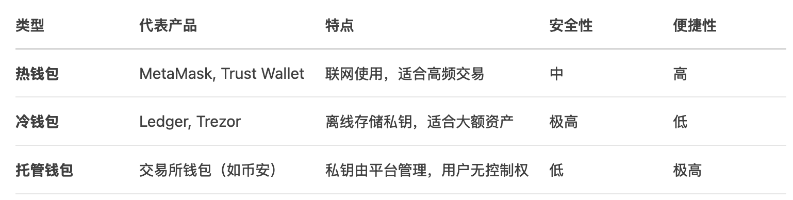

# 第二部分：Web3 行业知识

## 一、 区块链岗位类型与职能简介

技术岗：区块链开发、智能合约开发
非技术岗：产品运营、社区运营、合规法务、研究分析等
Web3 行业岗位与技能列表（附职业路径参考）
职业成长路线图建议（初级→中级→高级）

> 随着区块链技术的发展和Web3概念的普及，越来越多的企业与开发者开始投身于这一去中心化的未来网络中。但是与传统互联网产业不同，Web3 不仅重塑了数据所有权与价值分配的模式，也催生出一系列新的岗位形态，既包括技术端的创新岗位，如智能合约工程师，也涵盖了产品、运营、社区管理等多种非技术职能。

> 我们将围绕 Web3 领域中常见的岗位类型进行详细介绍，涵盖前端、后端、智能合约等技术岗位，以及产品运营、社区管理、研究分析等非技术岗位，帮助有志于进入 Web3 行业的同学更清晰地了解各类岗位的职责与技能要求。无论你是具备编程背景的工程师，还是对产品策略、用户运营或行业研究更感兴趣的同学，都可以在 Web3 找到属于自己的发展路径。

> 想找到合适的区块链实习，我们不要一上来就开始盲目的看网络上那一堆杂乱无章的教程，我们要遵从第一性原理，追根溯源，让我们从我们这次学习的终点开始，从JD（job description）开始，了解我们要达到一个什么样的要求才可以找到一份web3实习。按技术岗和非技术岗来分类，我们从技术岗的JD开始讲起。

### 1.1 技术岗

技术岗和传统的互联网的职位差不多，前端，后端，只不过有一种新的岗位叫做智能合约工程师，他们其实可以简单地看成是一种把数据存储在链上的后端工程师。

---

#### 1.1.1 前端工程师

##### 职位描述：

1. 负责 Web 应用界面开发与维护（使用 TypeScript、Next.js、React 等技术栈）；
2. 与后端及设计团队协作，推动项目落地；

##### 职位要求：

1. 熟练掌握 HTML5、CSS3、JavaScript（ES6+）、React / Vue / Angular 等主流框架；
2. 熟悉 TypeScript、Next.js、React 原理及 Hooks 机制；

其实大家可以发现 Web3 前端的要求和 Web2 的可以说是一模一样，所以我也认为，这是最适合我们学生去实习的岗位。唯一的区别就是平时前端调用的是后端的接口，现在除了后端还需要调用智能合约的接口，用到的库有 Ethers.js / Web3.js / viem，最新最流行的是 viem，大家可以都看一看。

---

#### 1.1.2 后端工程师

##### 职位描述：

1. 负责 Web3 产品的后端开发，包括业务逻辑处理、数据存储、API 设计等方面；
2. 基于现有的后端框架（如 Spring、Django 等），开发和维护后端代码；
3. 与前端开发人员和产品团队紧密合作，确保产品的功能和用户体验达到最佳水平；
4. 参与项目开发的需求分析、设计和实现，提供后端技术方案和实现意见。

##### 职位要求：

1. 熟悉 Java、Python 等后端开发语言，熟悉 Spring、Django 等主流后端框架；
2. 具备良好的代码编写习惯和文档编写能力。

---

#### 1.1.3 智能合约工程师

##### 职位描述：

1. 在 EVM 上设计、开发和部署安全高效的智能合约。
2. 与跨职能团队合作，确保智能合约与用户界面、后端和其他系统组件无缝集成。
3. 编写详细的测试计划和用例，以确保智能合约的可靠性、安全性和性能。
4. 对现有智能合约进行代码审计，提供改进和优化的建议。

##### 职位要求：

1. 熟练掌握 Solidity 的开发和优化，对区块链技术有深入了解。
2. 熟练掌握可升级合约技术，对其最佳实践有深入了解。
3. 熟练使用 Remix、Foundry / Hardhat、Phalcon / Tenderly 等开发工具。
4. 深度掌握 Uniswap V2、MasterChef V2、Compound Governance 的代码。
5. 对智能合约安全有一定了解，熟悉常见漏洞。

---

### 1.2 非技术岗

接下来我们来看看非技术岗的工作，适合没有计算机背景的同学们。

---

#### 1.2.1 产品与运营

##### 职位描述：

- 在 Web3 产品生命周期中负责协调产品发布、用户反馈收集和持续改进流程，以提升用户体验和产品迭代效率。
- 执行以用户获取、留存和参与度提升为目标的增长战略，并监控实施效果。
- 与产品、技术、市场及合规团队紧密合作，确保产品上市（go-to-market）策略与各部门需求保持一致。
- 持续分析运营数据，跟踪关键绩效指标（KPIs），并根据数据提出优化建议。

##### 职位要求：

- 熟悉产品上线（Go-to-market）全流程，擅长跨部门资源协调与项目推进。
- 具备扎实的数据分析能力，能熟练使用 SQL、Excel 或其他数据工具进行数据统计和洞察提炼。
- 优秀的沟通与跨团队协作能力，能在快节奏环境中高效管理多项任务。

---

#### 1.2.2 社区管理

##### 职位描述：

- 构建并管理 Telegram、Twitter（X）、Discord 等社交平台的社区，实现持续的用户互动与增长。
- 组织线上 AMA（问答）、活动、竞赛等形式多样的社区互动，以提升用户活跃度和品牌粘性。
- 跟踪社区健康度指标和情感分析，定期向管理层汇报洞察与优化建议。
- 与营销团队协作，制定并执行内容日历，发布社区公告和运营手册。

##### 职位要求：

- Web3、DAO 或 NFT 社区管理经验，深刻理解去中心化应用生态。
- 出色的文案撰写与沟通能力，能够有效引导社区讨论并快速响应用户反馈。
- 熟练使用社区数据分析工具，能够监测并解读用户行为与舆情动态。
- 具备活动策划与执行能力，能够独立组织线上及线下社区活动。

---

#### 1.2.3 研究分析

##### 职位描述：

- 收集、整理并分析 Web3 行业市场与用户数据，编写可行性研究报告，为产品与运营提供决策支持。
- 跟踪区块链协议技术演进及生态动态，撰写深度研究报告或白皮书。
- 进行竞争对手分析，评估市场趋势与用户行为模式，为战略规划提供数据驱动的建议。
- 支持项目的加密经济模型设计与博弈论分析，以保证项目的经济激励合理性。

##### 职位要求：

- 熟练使用 Excel、SPSS 或 Python 等数据分析工具，具备定量和定性研究方法经验。
- 深入了解区块链生态、DeFi 协议及加密经济学原理。
- 优秀的报告撰写与演示能力，能够清晰传达研究结论与建议。
- 精通链上数据分析工具（Glassnode、Token Terminal）。

## 二、智能合约实习岗位知识模块

> 本章将围绕 Web3 行业中的智能合约工程师所需的技能进行介绍，首先介绍去中心化应用（dApp）的基本架构，重点分析其与传统应用的不同之处。接着，我们将详细讨论开发 dApp 的流程，从需求分析、智能合约的编写、前端与后端的设计，到最终部署和上线，帮助读者理解整个开发生命周期。


### 2.1 Dapp 架构和开发流程

去中心化应用（Dapp）是与传统集中式应用不同的全新应用模式，通常运行在区块链或分布式网络上。与传统应用相比，dApp 的核心特点在于去中心化，意味着应用的逻辑和数据不由单一实体控制，而是由多个参与者共同维护。因此，开发 Dapp 需要理解和掌握去中心化技术栈、智能合约编程以及前端与区块链的交互方式。

#### 2.1.1 Dapp 架构

Dapp 的架构主要由三个核心部分组成：

.png)

1. **前端（User Interface）**：
    
    前端是 Dapp 与用户交互的界面，通常由 HTML、CSS 和 JavaScript（如 React、Vue 等框架）构建。与传统 Web 应用不同，dApp 前端会连接区块链来调用智能合约，呈现数据和执行交易。
    
    前端还需要集成区块链钱包（如 MetaMask）来进行身份验证和签署交易，确保用户的隐私和安全。
    
2. **智能合约（Smart Contracts）**：
    
    智能合约是 Dapp 的核心，它定义了应用的业务逻辑，并部署在区块链上。智能合约通过执行自动化的规则来确保交易和操作的透明性与不可篡改性。
    
    在以太坊平台上，智能合约通常使用 **Solidity** 编程语言编写，并通过 **Ethereum Virtual Machine (EVM)** 执行。
    
3. **区块链和去中心化存储（Blockchain & Decentralized Storage）**：
    
    区块链用于存储智能合约的状态数据及交易记录。去中心化存储如 **IPFS**（InterPlanetary File System）或 **Arweave**，用于存储大规模的非结构化数据（如图片、文档等），确保数据不易丢失和篡改。
    
    通过使用去中心化存储，Dapp 确保所有数据在多个节点上备份，保证数据的持久性和去中心化特性。
    

#### 2.1.2 Dapp 开发流程

Dapp 的开发流程可以分为以下几个阶段：


##### 1. **需求分析与规划**

在开发 Dapp 之前，首先需要进行需求分析和规划，明确应用的目标和功能。此阶段包括：

- **确定功能需求**：需要定义用户可以进行的操作，比如转账、查询余额、创建投票等。
- **选择区块链平台**：决定在哪个平台上构建 Dapp（如以太坊、Solana、Polygon 等），这通常取决于目标用户群、交易成本、可扩展性等因素。
- **设计用户体验（UX）**：定义 Dapp 的界面设计和交互流程，确保用户能够轻松使用应用并与区块链交互。

##### 2. **智能合约开发**

智能合约是 Dapp 的核心，负责执行去中心化的业务逻辑和存储重要的数据。在这一阶段，开发者需要：

- **编写智能合约**：使用 **Solidity** 或其他智能合约语言编写合约，确保合约的功能满足需求分析中定义的要求。
- **编写测试用例**：为智能合约编写单元测试，确保合约逻辑正确、无漏洞。
- **审计和优化**：对合约进行安全审计，确保合约的安全性，避免常见漏洞（如重入攻击、整数溢出等）。

##### 3. **前端开发**

前端是用户与 Dapp 交互的主要界面，因此开发前端时需要：

- **选择前端框架**：可以使用现代前端框架（如 **React**、**Vue**）来构建 UI。前端将通过 JavaScript 与智能合约进行交互。
- **连接钱包**：通过集成 **MetaMask** 等 Web3 钱包，用户可以连接到 dApp，并授权其与智能合约交互。
- **显示区块链数据**：前端需要从区块链获取数据（如账户余额、交易记录），并通过用户界面展示。
- **处理交易签名与确认**：当用户发起交易时，前端需要与钱包进行交互，获取用户的签名并将交易发送到区块链。

##### 4. **与区块链交互**

前端和智能合约通过 **Web3.js**、**Ethers.js** 或 **Viem** 等库进行交互。这些库允许前端与以太坊或其他区块链进行通信，实现读取和写入操作：

- **读取数据**：前端通过智能合约的公共函数读取区块链上的状态数据（如余额、合约信息）。
- **发送交易**：当用户发起交易时，前端需要通过钱包签署交易并发送到区块链，执行合约中的某个功能（如转账）。

##### 5. **部署与上线**

一旦开发完成，Dapp 进入部署阶段。具体步骤包括：

- **部署智能合约**：通过工具（如 **Hardhat** 或 **Truffle**）将智能合约部署到测试网（如 **Sepolia**）或主网。
- **前端部署**：将前端应用部署到去中心化平台（如 **IPFS**、**Fleek**）或传统的 Web 主机。
- **发布和维护**：将 Dapp 上线，进行用户反馈收集，定期更新合约和前端，修复潜在问题。

#### 2.1.3 小结

Dapp 的开发流程从需求分析、智能合约编写、前端开发，到最终部署，涵盖了多个技术栈的综合应用。通过了解 dApp 的架构和开发流程，开发者可以更好地把握去中心化应用的核心概念，并有效地进行开发和部署。

开发 Dapp 时，区块链技术的透明性、不可篡改性以及智能合约的自动执行能力为应用提供了去中心化的基础，但与此同时，开发者需要应对与传统 Web 应用不同的挑战，如用户体验、交易处理以及安全性问题。掌握这些技术和概念，能够帮助开发者构建更强大和可靠的去中心化应用。

### 2.2 **以太坊开发环境搭建**

**Hardhat** 是一个非常强大的开发框架，用于构建以太坊智能合约。它提供了一个灵活的开发环境，支持合约编译、部署、测试以及交互等功能，极大地简化了以太坊智能合约的开发流程。

本指南将带领你从安装开始，直到如何使用 Hardhat 创建、测试和部署智能合约。

#### 2.2.1 环境准备

##### 1. 安装 Node.js 和 npm

Hardhat 是基于 Node.js 的开发框架，因此你需要确保机器上安装了 Node.js 和 npm。

1. 下载并安装 Node.js：[Node.js 官网](https://nodejs.org/)
2. 安装完成后，可以通过以下命令检查安装是否成功：

```bash
node -v
npm -v
```

如果成功安装，你应该能够看到当前的 Node.js 和 npm 版本号。


##### 2. 创建一个新的项目

为了使用 Hardhat，我们首先需要创建一个新的项目文件夹，并初始化一个新的 npm 项目：

```bash
mkdir my-hardhat-project
cd my-hardhat-project
npm init -y
```

这会在你的项目文件夹中生成一个 `package.json` 文件，用于管理项目的依赖项。

##### 3. 安装 Hardhat

接下来，安装 Hardhat 作为开发依赖：

```bash
npm install --save-dev hardhat
```

安装完成后，你的 `node_modules` 目录中会包含 Hardhat 的核心库。

#### 2.2.2 初始化 Hardhat 项目

##### 1. 初始化项目

在项目目录下，运行以下命令来初始化 Hardhat 项目：

```bash
npx hardhat
```

你会看到一个提示，询问你是要创建一个基本的示例项目，还是一个空的项目。选择 **Create a basic sample project**，Hardhat 将为你创建一个简单的项目结构，并包含一个示例合约、测试和一些基本配置。

该命令会自动为你安装一些额外的依赖，如：

- **ethers.js**：与区块链交互的 JavaScript 库
- **hardhat-waffle**：用于智能合约测试的 Waffle 插件

如果选择了 **Create a basic sample project**，项目目录会包括以下内容：

- **contracts/**：存放智能合约的目录。
- **scripts/**：用于部署合约的脚本。
- **test/**：包含示例合约测试的目录。
- **hardhat.config.js**：Hardhat 项目的配置文件。

##### 2. 目录结构说明

- `contracts/`：此目录存放你的 Solidity 合约文件。默认情况下会有一个 `Greeter.sol` 文件作为示例合约。
- `scripts/`：包含用于部署合约的 JavaScript 脚本文件。默认会有一个 `deploy.js` 文件。
- `test/`：存放测试文件。默认会有一个示例测试文件 `sample-test.js`，用于测试示例合约。
- `hardhat.config.js`：这是 Hardhat 的配置文件，你可以在其中配置网络、Solidity 编译器版本等。

---

#### 2.2.3 编写和部署智能合约

##### 1. 创建一个新的合约

在 `contracts/` 目录下创建一个新的 Solidity 合约文件。例如，创建一个简单的 `SimpleStorage.sol` 合约：

```solidity
// contracts/SimpleStorage.sol
// SPDX-License-Identifier: MIT
pragma solidity ^0.8.0;

contract SimpleStorage {
    uint256 private value;

    function set(uint256 newValue) public {
        value = newValue;
    }

    function get() public view returns (uint256) {
        return value;
    }
}
```

##### 2. 编写部署脚本

在 `scripts/` 目录下创建一个部署脚本，帮助我们将合约部署到区块链：

```jsx
// scripts/deploy.js
async function main() {
    // 获取合约工厂实例
    const [deployer] = await ethers.getSigners();

    console.log("Deploying contracts with the account:", deployer.address);

    // 获取合约工厂
    const SimpleStorage = await ethers.getContractFactory("SimpleStorage");

    // 部署合约
    const simpleStorage = await SimpleStorage.deploy();

    console.log("SimpleStorage contract deployed to:", simpleStorage.address);
}

main()
    .then(() => process.exit(0))
    .catch((error) => {
        console.error(error);
        process.exit(1);
    });
```

该脚本使用 Hardhat 提供的 `ethers.js` 库与智能合约进行交互，首先获取账户的签名，然后部署 `SimpleStorage` 合约。

##### 3. 部署合约

在终端中运行以下命令来部署合约到本地 Hardhat 网络：

```bash
npx hardhat run scripts/deploy.js --network localhost
```

此命令会启动 Hardhat 网络，部署你的智能合约，并输出部署后的合约地址。

---

#### 2.2.4 测试智能合约

##### 1. 编写测试

Hardhat 使用 Waffle 和 Mocha 测试框架进行合约的单元测试。在 `test/` 目录下创建一个新的测试文件 `simpleStorage-test.js`：

```jsx
// test/simpleStorage-test.js
const { expect } = require("chai");

describe("SimpleStorage", function () {
    it("Should return the new value once it's set", async function () {
        const [owner] = await ethers.getSigners();
        const SimpleStorage = await ethers.getContractFactory("SimpleStorage");
        const simpleStorage = await SimpleStorage.deploy();

        await simpleStorage.set(42);
        expect(await simpleStorage.get()).to.equal(42);
    });
});
```

该测试将合约部署到一个新的账户，设置一个新的存储值，然后验证 `get()` 函数返回的值是否为 42。

##### 2. 运行测试

运行测试，确保合约按预期工作：

```bash
npx hardhat test
```

测试结果将显示在终端中。如果测试通过，你会看到类似如下的输出：

```
SimpleStorage
    ✓ Should return the new value once it's set (X seconds)
```

---

#### 2.2.5 配置网络和部署到测试网

##### 1. 配置网络

在 `hardhat.config.js` 文件中，你可以配置不同的网络（如 Rinkeby 或 Sepolia 测试网）进行部署。例如，添加以下内容来配置 Rinkeby 测试网：

```jsx
require("@nomiclabs/hardhat-ethers");

module.exports = {
  solidity: "0.8.0",
  networks: {
    rinkeby: {
      url: `https://rinkeby.infura.io/v3/YOUR_INFURA_PROJECT_ID`,
      accounts: [`0x${YOUR_PRIVATE_KEY}`]
    }
  }
};

```

##### 2. 部署到测试网

你需要通过 Infura 或 Alchemy 提供的节点 URL 进行网络连接，并使用钱包私钥进行签名。部署到 Rinkeby 测试网的命令如下：

```bash
npx hardhat run scripts/deploy.js --network rinkeby

```

---

#### 2.2.6 高级配置技巧

##### **1. 主网分叉测试**

```jsx
// hardhat.config.js
module.exports = {
  networks: {
    hardhat: {
      forking: {
        url: process.env.ALCHEMY_MAINNET_URL,
        blockNumber: 19874500  // 指定区块高度
      }
    }
  }
};

```

##### **2. 多钱包配置**

```jsx
accounts: {
  mnemonic: process.env.MNEMONIC,
  count: 10  // 生成10个测试账户
}

```

##### **3. 性能优化配置**

```bash
# Foundry 并行测试
forge test --parallel --match-contract MyContract

```

---

#### 2.2.8 学习资源推荐

1. [**Hardhat 官方教程**](https://hardhat.org/tutorial) - 含视频指导
2. [**Solidity 官方文档**](https://docs.soliditylang.org/) - 最新语法规范
3. [**Chainlink 测试环境**](https://docs.chain.link/resources/link-token-contracts) - 预言机集成指南
4. [**GitHub 模板仓库**](https://github.com/paulrberg/hardhat-template) - 最佳实践项目结构

---

通过以上完整配置流程，开发者将获得：

✅ 本地开发/测试网/主网三环境支持

✅ 安全可靠的密钥管理体系

✅ 合约开发-测试-部署完整工作流

✅ 主流工具链深度整合能力

建议每完成一个配置步骤立即执行验证测试，确保环境正确性。遇到问题时，可优先检查 Node.js 版本、网络连通性和环境变量加载情况。

### 2.3 Solidity 智能合约编程（简单介绍）

Solidity 是一种面向合约的高级编程语言，专门用于在以太坊虚拟机（EVM）上编写智能合约。它具有静态类型、支持继承、库和复杂的用户定义类型等特性。

#### 2.3.1 基础语法与开发范式

##### 1. 版本声明

每个 Solidity 文件必须以版本声明开始：

```solidity
solidity
pragma solidity ^0.8.0;
```

##### 2. 数据类型

基本数据类型

| 类型 | 描述 | 示例 | 默认值 |
| --- | --- | --- | --- |
| bool | 布尔值 | true/false | false |
| uint8 | 8位无符号整数 | 0 ~ 255 | 0 |
| uint16 | 16位无符号整数 | 0 ~ 65535 | 0 |
| uint256/unit | 256位无符号整数 | 0 ~ (2^256 - 1) | 0 |
| int8 | 8位有符号整数 | -128 - 127 | 0 |
| int256/int | 256位有符号整数 | -2^255 ~ (2^255 - 1) | 0 |
| address | 以太坊地址 | 0x…. | 0 |
| bytes1-bytes32 | 固定长度字节数组 | bytes32 data = “Hello” | 0x00 |
| bytes | 动态字节数组 | bytes memory data = “Hello World” | “” |
| string | UTF-8 编码字符串 | string name = “Alice” | “” |

复合数据类型

| 类型 | 语法 | 描述 | 示例 |
| --- | --- | --- | --- |
| 静态数组 | T[k] | 固定长度数组 | uint[5] numbers |
| 动态数组 | T[] | 可变长度数组 | uint[] memory list |
| 映射 | mapping(K => V) | 键值对存储 | mapping(address => uint256) balances |
| 结构体 | struct | 自定义数据结构 | struct Person { string name; uint age; } |
| 枚举 | enum | 枚举类型 | enum Status { Pending, Active, Inactive } |

##### 3. 函数修饰符

可见性修饰符表

| 修饰符 | 可见范围 | 描述 | 使用场景 |
| --- | --- | --- | --- |
| public | 内部 + 外部 | 任何地方都可以调用 | 对外提供的公共接口 |
| external | 仅外部 | 只能从合约外部调用 | 外部用户接口，gas 效率更高 |
| internal | 内部 + 继承 | 当前合约和子合约可调用 | 内部逻辑函数，需要被继承 |
| private | 仅内部 | 只有当前合约可调用 | 私有实现细节 |

状态修饰符表

| 修饰符 | 状态读取 | 状态修改 | Gas 消耗 | 描述 |
| --- | --- | --- | --- | --- |
| pure | ❌ | ❌ | 低 | 不读取也不修改状态的函数 |
| view | ✅ | ❌ | 低 | 只读取状态，不修改状态 |
| payable | ✅ | ✅ | 正常 | 可以接收以太币的函数 |
| 无修饰符 | ✅ | ✅ | 正常 | 可以读取和修改状态 |

##### 4. 开发范式

- **状态机模式**
    
    智能合约本质上是一个状态机，通过交易改变合约状态。
    
- **事件驱动编程**
    
    使用事件（Events）记录重要的状态变化，便于前端监听和日志记录。
    
- **模块化设计**
    
    通过继承和库（Library）实现代码复用和模块化。
    

#### 2.3.2 合约结构详解

##### 1. 基本结构

1. ‘//’为注释符号，// SPDX-License-Identifier: MIT 
2. 关键字pragma声明solidity需要的编译版本
3. contract关键字，用于声明一个合约， contract XXX {…};
4. 合约内部由状态变量、构造函数、普通函数三个基础部份组成；

```solidity
// SPDX-License-Identifier: MIT
pragma solidity ^0.8.0;

contract MyContract {
    // 状态变量
    uint256 public myNumber;

    // 构造函数
    constructor() {
        myNumber = 100;
    }

    // 函数
    function setNumber(uint256 _number) public {
        myNumber = _number;
    }
}
```

##### 2. 状态变量

状态变量是永久存储在区块链上的数据，构成了合约的状态。

```solidity
contract MyContract {
    /*
    * 可以通过内部与外部函数更改变量
    * public可以通过前端代码访问
    */
    uint256 public totalSupply;
    mapping(address => uint256) private balances;
    address public owner;
    
    // 常量
    uint256 public constant MAX_SUPPLY = 1000000;
    
    // 不可变量（构造函数中设置一次）
    uint256 public immutable deploymentTime;
    
    constructor() {
        owner = msg.sender;
        deploymentTime = block.timestamp;
        totalSupply = 0;
    }
}
```

##### 3. 函数

函数是合约中执行逻辑的核心组件。

**函数声明格式**

```solidity
function <函数名>(<参数列表>)
    <可见性>
    <状态可变性>
    <修饰符列表>
    <虚拟/重写关键字>
    returns (<返回值列表>)
{
    // 函数体
}
```

**函数可见性**

```solidity
contract VisibilityExample {	
		// 仅当前合约可访问
    function privateFunc() private pure returns(uint) { return 1; }
    // 当前合约和继承合约可访问
    function internalFunc() internal pure returns(uint) { return 2; }
    // 所有人可访问
    function publicFunc() public pure returns(uint) { return 3; }
    // 仅外部调用
    function externalFunc() external pure returns(uint) { return 4; }
}
```

**函数状态修饰符**

```solidity
contract StateModifiers {
    uint public count = 0;

    // view: 只读函数，不修改状态
    function getCount() public view returns(uint) {
        return count;
    }

    // pure: 纯函数，不读取也不修改状态
    function add(uint a, uint b) public pure returns(uint) {
        return a + b;
    }

    // payable: 可接收以太币
    function deposit() public payable {
        // msg.value 是发送的以太币数量
    }

    // 默认：可修改状态
    function increment() public {
        count++;
    }
}
```

**函数参数和返回值**

```solidity
// 多个返回值
function getPersonInfo() public pure returns(string memory name, uint age) {
    name = "Alice";
    age = 25;
}

// 命名返回值
function calculate(uint a, uint b) public pure returns(uint sum, uint product) {
    sum = a + b;
    product = a * b;
    // 自动返回命名变量
}

// 调用带多返回值的函数
function callExample() public pure {
    (string memory name, uint age) = getPersonInfo();
    // 或者忽略某些返回值
    (, uint productOnly) = calculate(5, 3);
}
```

**修饰符（Modifiers）**

会先执行修饰符内容，可理解为每个函数执行前进行一些条件判断，来检查是否执行该函数；

```solidity
contract ModifierExample {
    address public owner;
    bool public paused = false;

    constructor() {
        owner = msg.sender;
    }

    // 自定义修饰符
    modifier onlyOwner() {
        require(msg.sender == owner, "Not the owner");
        _;  // 继续执行被修饰的函数
    }

    modifier whenNotPaused() {
        require(!paused, "Contract is paused");
        _;
    }

    function togglePause() public onlyOwner {
        paused = !paused;
    }
    
    // 使用多个修饰符
    function criticalFunction() public onlyOwner whenNotPaused {
        // 函数逻辑
    }
}
```

**继承**

```solidity
// 基础合约
contract Animal {
    string public name;

    constructor(string memory _name) {
        name = _name;
    }

    function speak() public virtual returns(string memory) {
        return "Some sound";
    }
}

// 继承合约
contract Dog is Animal {
    constructor(string memory _name) Animal(_name) {}

    // 重写父类函数
    function speak() public pure override returns(string memory) {
        return "Woof!";
    }
}

// 多重继承
contract Pet is Animal {
    address public owner;

    constructor(string memory _name, address _owner) Animal(_name) {
        owner = _owner;
    }
}

contract Labrador is Dog, Pet {
    constructor(string memory _name, address _owner)
        Dog(_name)
        Pet(_name, _owner) {}
}
```

**接口和抽象合约**

```solidity
// 接口定义
interface IERC20 {
    function transfer(address to, uint256 amount) external returns (bool);
    function balanceOf(address account) external view returns (uint256);
}

// 抽象合约
abstract contract AbstractToken {
    string public name;

    // 抽象函数，必须在子类中实现
    function totalSupply() public virtual returns (uint256);
}
```

**事件**

事件是合约与外部世界通信的重要机制，用于记录重要的状态变化和提供日志功能

```solidity
contract EventExample {
    // 定义事件
    event Transfer(address indexed from, address indexed to, uint256 amount);
    event Approval(address indexed owner, address indexed spender, uint256 amount);

    mapping(address => uint256) public balances;

    function transfer(address to, uint256 amount) public {
        require(balances[msg.sender] >= amount, "Insufficient balance");

        balances[msg.sender] -= amount;
        balances[to] += amount;

        // 触发事件
        // 可以在区块链浏览器查找到当前事件记录
        emit Transfer(msg.sender, to, amount);
    }
}
```

#### 2.3.3 安全实践

常见攻击手段

| 风险点 | 攻击机理 | 典型防护措施 |
| --- | --- | --- |
| Reentrancy | 恶意合约在 transfer / call 回调中再次进入受害函数，导致重复提款 | 1. **Checks-Effects-Interactions**2. `ReentrancyGuard`（OpenZeppelin）3. 使用 `transfer`/`send` 或限制 gas（已不推荐，仅旧代码） |
| 访问控制 (Access Control) | 未受保护的管理函数可被任何人调用 | 1. `Ownable`：`onlyOwner` 修饰符2. `AccessControl`：基于角色的权限（`DEFAULT_ADMIN_ROLE`, `MINTER_ROLE` 等）3. 及时转移 / 多签管理 |
| 整数溢出 (Integer Overflow/Underflow) | 旧版本 `<0.8` 加法/减法越界产生错误数值 | 1. Solidity 0.8+ 默认内置溢出检查2. 对老版本使用 `SafeMath` 库3. 精简不必要的 `unchecked` 区块 |

##### 1. 重入攻击（Reentrancy）防护

重入攻击是智能合约最常见的安全漏洞之一。

**漏洞代码**

```solidity
contract VulnerableContract {
    mapping(address => uint256) public balances;
    
    function withdraw() external {
        uint256 amount = balances[msg.sender];
        require(amount > 0, "No balance");
        
        // 危险：先转账，后更新状态
        (bool success,) = msg.sender.call{value: amount}("");
        require(success, "Transfer failed");
        
        balances[msg.sender] = 0; // 状态更新在转账之后
    }
}
```

**防护措施**

1. 检查-生效-交互模式（CEI Pattern）

```solidity
contract SecureContract {
    mapping(address => uint256) public balances;
    
    function withdraw() external {
        uint256 amount = balances[msg.sender];
        require(amount > 0, "No balance");
        
        // 先更新状态
        balances[msg.sender] = 0;
        
        // 后进行外部调用
        (bool success,) = msg.sender.call{value: amount}("");
        require(success, "Transfer failed");
    }
}
```

1. 重入锁（Reentrancy Guard）

```solidity
contract ReentrancyGuard {
    bool private locked;
    
    modifier noReentrant() {
        require(!locked, "Reentrant call");
        locked = true;
        _;
        locked = false;
    }
}

contract SecureWithGuard is ReentrancyGuard {
    mapping(address => uint256) public balances;
    
    function withdraw() external noReentrant {
        uint256 amount = balances[msg.sender];
        require(amount > 0, "No balance");
        
        balances[msg.sender] = 0;
        (bool success,) = msg.sender.call{value: amount}("");
        require(success, "Transfer failed");
    }
}
```

##### 2. 访问控制（Access Control）

严格的访问控制确保只有授权用户能执行敏感操作。

```solidity
/**
 * @title BadVault
 * @dev 缺少访问控制，任何人都能调用 withdraw() 取走全部 ETH
 */
contract BadVault {
    mapping(address => uint256) public balance;

    // 用户存钱
    function deposit() external payable {
        balance[msg.sender] += msg.value;
    }

    // ❌ anyone can withdraw ALL funds!
    function withdraw() public {
        payable(msg.sender).transfer(address(this).balance);
    }
}

```

增加访问权限保证安全

require(msg.sender == owner, "Not owner");增加权限

```solidity
/**
 * @title SafeVault
 * @dev 仅部署者 (owner) 可以提取资金，简单显式访问控制
 */
contract SafeVault {
    address public immutable owner;           // 部署者地址
    mapping(address => uint256) public balance;

    // 构造函数：记录 owner
    constructor() {
        owner = msg.sender;
    }

    // 存款函数：任何人都可以存
    function deposit() external payable {
        balance[msg.sender] += msg.value;
    }

    // ✔️ 只有 owner 能提取全部余额
    function withdraw() external {
        // 进行访问权限判断
        require(msg.sender == owner, "Not owner");
        uint256 amount = address(this).balance;
        require(amount > 0, "Nothing to withdraw");

        // 注意 Checks-Effects-Interactions 顺序
        (bool ok, ) = owner.call{value: amount}("");
        require(ok, "Transfer failed");
    }
}
```

##### 3. 整数溢出防护(Integer Overflow)

在 Solidity 0.8.0 之前，整数溢出是一个严重问题。

```solidity
pragma solidity ^0.7.6;          // ⚠️ 0.7 版本不会自动检查溢出

/**
 * @title BadCounter
 * @dev 用户每调用一次 `inc()`，计数器加 1；当计数器达到 10 停止奖励。
 *      但整数溢出可让攻击者将计数器绕回 0，再无限领奖。
 */
contract BadCounter {
    mapping(address => uint256) public counter;
    mapping(address => bool)    public rewarded;

    // 计数 +1
    function inc() external {
    
        counter[msg.sender] += 1;        // 若已 2**256-1 则回到 0
    }

    // 满 10 次领取 1 wei
    function claim() external {
        require(counter[msg.sender] >= 10, "not enough actions");
        require(!rewarded[msg.sender],    "already claimed");
        rewarded[msg.sender] = true;
        msg.sender.transfer(1);           // 为演示简化为 1 wei
    }

    // 向合约注入少量 ETH 供演示
    receive() external payable {}
}
```

**防止数据溢出处理**

```solidity
/**
 * @title SafeCounter
 * @dev 方案：在 inc() 中直接固定「最高 11」，超过即拒绝。
 *      溢出永远不会发生，也杜绝了重复领奖。
 */
contract SafeCounter {
    mapping(address => uint256) public counter;

    uint8 constant MAX_ACTIONS = 11;   // 上限 11，留 1 个缓冲

    /// 受控递增：达到 10 后就不准再加
    function inc() external {
        require(counter[msg.sender] < MAX_ACTIONS, "limit reached");
        counter[msg.sender] += 1;
    }

    /// 领取奖励
    function claim() external {
        require(counter[msg.sender] >= 10, "≥10 actions required");
        counter[msg.sender] = 0;                   // 重置为 0
        (bool ok, ) = msg.sender.call{value: 1}("");
        require(ok, "transfer failed");
    }

    /// 注资
    receive() external payable {}
}
```

### 2.4 智能合约实战项目

#### 2.4.1 环境准备

Remix https://remix.ethereum.org/

Remix 是一个浏览器的IDE, 便于新手直接上手编译与部署合约代码


#### 2.4.2 合约代码

该合约代码实现一个留言功能，每个地址都可以在链上进行留言，并且留言信息可以一直在链上存在

```solidity
// SPDX-License-Identifier: MIT
pragma solidity ^0.8.0;

contract MessageBoard {
    // 保存所有人的留言记录
    mapping(address => string[]) public messages;

    // 留言事件，便于链上追踪
    event NewMessage(address indexed sender, string message);

    // 构造函数，在部署时留言一条欢迎词
    constructor() {
        string memory initMsg = "Hello ETH Pandas";
        messages[msg.sender].push(initMsg);
        emit NewMessage(msg.sender, initMsg);
    }

    // 发送一条留言
    function leaveMessage(string memory _msg) public {
        messages[msg.sender].push(_msg);     // 添加到发言记录
        emit NewMessage(msg.sender, _msg);   // 发出事件
    }

    // 查询某人第n条留言（从0开始）
    function getMessage(address user, uint index) public view returns (string memory) {
        return messages[user][index];
    }

    // 查询某人一共发了多少条
    function getMessageCount(address user) public view returns (uint) {
        return messages[user].length;
    }
}

```

#### 2.4.3 新建合约文件

右侧点击 FILE EXPORE，点击新建文件夹，新建一个名位 messageboard.sol 的文件把上述代码拷贝到文件中。


#### 2.4.4 编译

点击右侧 Solidity Complier，进入编译面板。在 COMPILER 下拉栏可以选择不同的编译版本，选择与代码的编译版本一样即可。点击 Complie messageboard.sol 按钮即可进行编译，编译成功右侧 Solidity Complier 会显示一个✅的下标符号。若出现错误，则在编译器命令行会显示相关错误信息，进行修改后再进一步选择编译。


#### 2.4.5 部署

点击右侧 Deploy & run transactions，可以将智能合约部署到本地或者测试链以及公链，在本次例子中仅使用默认选项进行部署。IDE 会给出一个默认的地址，里面有 100 ether 可以进行部署 gas 费，以及接口调用等费用。


点击 Deploy 按钮后，即可进行部署，在下面红色框，可以看到部署成功后的合约地址，函数操作以及状态变量对应的值。


展开 IDE 下方的命令终端，可以看到合约部署，执行构造函数给出的日志信息，也是该合约的实现留言的功能能力一个展示。


#### 2.4.5 调用函数

现在我们直接在编译器中，调研 leaveMessage 函数进行留言，当我们在 leaveMessage 输入“Hello World”，点击 leaveMessage 按钮，右侧命令终端会输出一个新的交易，我们点击打开后可以看到留言的信息。


### 2.5 以太坊技术基础

#### 2.5.1 帐户模型

| 对比维度 | 外部拥有账户 **EOA** | 合约账户 **Contract Account** |
| --- | --- | --- |
| 地址来源 | `keccak256(pubKey)[12:]`   (公钥→地址) | 创建时由 `CREATE/CREATE2` 计算 |
| 控制方式 | **私钥签名**（用户、钱包） | **合约代码**（EVM 字节码） |
| 状态字段 | `nonce`、`balance` | `nonce`、`balance`、`codeHash`、`storageRoot` |
| 能否发起交易 | ✅ 必须用私钥签名 | ❌ 只能由 EOA 触发或合约内部调用 |
| Gas 费用支付 | 由账户本身 ETH 余额承担 | 从调用者余额扣除 |
| 典型场景 | 钱包地址、热冷账户 | ERC-20/721 Token、DeFi 协议、DAO |

#### 2.5.2 Gas 机制

| 术语 | 含义 | 备注 |
| --- | --- | --- |
| **Gas** | 执行 1 条 EVM 指令的抽象工作量单位 | 汇编级别价格表见黄皮书 |
| **Gas Limit (Tx)** | 发送者愿为本笔交易消耗的 Gas 上限 | 防止死循环耗尽余额 |
| **Gas Used** | 实际执行指令花费的 Gas 总和 | 多退少不补 |
| **Base Fee** | 随区块动态调整的基础费用（EIP-1559） | 全网销毁，抑制拍卖狂飙 |
| **Priority Fee / Tip** | 发送者给出以激励打包者的附加费 | 给矿工 / 验证者 |
| **Max Fee Per Gas** | `maxFee = baseFee + priorityFee` 上限 | 钱包通常自动估算 |

#### 2.5.3 交易生命周期

- **签名构造**
    - 钱包收集字段：`nonce, to, value, data, gasLimit, maxFeePerGas, priorityFeePerGas, chainId`
    - 使用私钥生成 `v, r, s` 签名 → **序列化 RLP**
- **广播到 P2P 网络**
    - 交易进入本地 & 邻居节点的 **mempool**
    - 节点根据 `maxFeePerGas`、`gasLimit`、`nonce` 做基本筛查
- **打包 / 提议区块**
    - 验证者（PoS）或矿工（PoW 时代）挑选利润最高、合法顺序的交易
    - 执行 EVM → 产生 **交易收据**（`status, gasUsed, logsBloom, logs[]`）
- **区块传播与共识**
    - 区块头包含新 **stateRoot**、**receiptsRoot**
    - 超 2⁄3 质押者签名后在共识层定案（PoS Finality ≈ 2 Epoch ≈ 64 slot ≈ ~12 min）
- **确认数 & Finality**
    - 客户端/前端常以 `n ≥ 12` 作“概率足够低”确认
    - 完全终结在 PoS 下由 **Finality Gadget**（Casper FFG）给出

### 2.6 部署合约

在第四节我们实现了一个简单合约的的部署，但是我们只是简单进行了体验，没有真正的上链，接下来我们将通过测试链来实现真正的上链，测试链与真正的链都是有真实的节点在运行，因此我们可以在 ETH 浏览器去查找我们部署的合约，测试链往往我们进行测试合约的功能是否正常以及安全问题，当一切顺利，那么我们才会把合约部署到 ETH 公链，降低我们的研发成本；

#### 2.6.1 测试链

以太坊测试网（Ethereum Testnets）是用于开发、测试和部署智能合约的网络环境，它们模拟主网功能但使用无价值的测试代币，让开发者可以安全地进行实验而无需承担真实的经济成本。

| 名称 | 共识机制 | 状态 | 主要特点 | 适用场景 |
| --- | --- | --- | --- | --- |
| Sepolia | PoS (权益证明) | 活跃 |  长期支持的主要测试网，与主网最相似，稳定性高。 | 最终部署前测试，生产环境模拟，DApp集成测试 |
| Goerli | PoS (权益证明) | 即将弃用 |  曾经的主要测试网，2024年开始逐步淘汰，仍有部分服务支持。 | 遗留项目测试，不建议新项目使用。 |
| Holesky | PoS (权益证明) | 活跃 | 专为验证者测试设计，大型网络规模，质押功能完整。 | 验证者节点测试， 质押协议开发，大规模网络测试。 |
| Ropsten | PoW (工作量证明) | 已弃用 | 历史上重要的测试网，2022年已关闭，曾模拟主网PoW环境。 | 已停用 |
| Rinkeby | PoA (权威证明) | 已弃用 | 基于权威证明，2022年已关闭，曾经较为稳定。 | 已停用 |
| Kovan | PoA (权威证明) | 已弃用 | 快速出块，2022年已关闭，社区维护。 | 已停用 |

#### 2.6.2 领取 Sepolia 代币

创建一个 Sepolia 地址，我们可以直接在 MetaMask 钱包获取 Sepolia 测试网地址


在[https://sepolia-faucet.pk910.de/](https://sepolia-faucet.pk910.de/)进行工作量证明获取代币，点开网址输入对应的测试网地址即可，在运行一段时间后，即可获取相应的代币，初次之外许多网址也可以领取，但往往会对主网的余额有要求。上述网址若出现 IP 相关错误，在完成真人认证后，关闭 VPN 在点击 Start Mining。


#### 2.6.3 Remix 部署到 Sepolia

上述一切准备好后，我们通过 Remix 即可简单把第四节的合约代币部署到测试链上。

##### 1. Remix 编译部署

点击 Injected Provider - MetaMask 连接对应的测试网钱包。


完成编译后，回到部署，点击 Deploy 部署跳转到 MetaMask 钱包交易请求，点击确认即可。


部署成功后，命令行会出现对应的日志信息。


##### 2. Etherscan 查看合约
现在我们通过 Etherscan 即可查看我们部署该合约的过程，我们通过 transaction hash 可以查看部署过程。首先将 Etherscan 的网络切换到 Sepolia。


现在我们已经成功在 Etherscan 查看到我们的交易信息（部署合约）。


现在我们通过我们合约的地址进行在 Etherscan 查看我们的合约，在 Remix 复制我们合约地址0xfaC4dF6aA3b8265A96a7B269a55A88E2009F34Be 进行查询。可以看到目前该合约并无 Transactions.但是我们可以点击 Events 查看我们构造的信息。


##### 3. 合约交互

回到 Remix，在 LeaveMeaasge 输入 Hello ETH，点击 LeaveMeaasge 可以看到我们已经成功进行了交互。


现在我们再一次查询合约地址，可以看到我们新增了一个 Transaction。点开这个 Transaction 后再点击 Logs 可以看到我们刚刚输入的信息。


### 2.7 区块链前端整合

#### 2.7.1 前端与合约交互工作流程概览

##### 1. 交互流程

- **初始化连接**：前端检测并连接 Web3 提供者
- **用户授权**：请求用户授权访问钱包账户
- **合约实例化**：使用 ABI 和合约地址创建合约实例
- **函数调用**：通过合约实例调用智能合约函数
- **交易签名**：钱包对交易进行数字签名
- **广播交易**：将签名交易发送到区块链网络
- **状态更新**：获取交易结果并更新前端界面


##### 2. 关键技术栈

- **合约语言：**掌握 Solidity 等相关合约开发语言
- **Web3.js/Ethers.js**：JavaScript 库，提供区块链交互 API
- **钱包连接器**：如 WalletConnect、Web3Modal
- **状态管理**：React Context、Redux 等管理连接状态
- **错误处理**：网络异常、用户拒绝、Gas 不足等场景处理

上述技术栈中，合约语言与一些前端 JS 区块交互的 API 最为基础，其他方面往往由其他厂商提供，如 RPC 节点、钱包等。

#### 2.7.2 实例操作

在前面第六个章节已经成功将智能合约部署到链上，可是缺少了交互效果，为此我们将创建一个前端页面与智能合约交互，这样普通用户只需要有余额的ETH地址并进行留言。整体效果如下：


##### 关键代码

本前端代码使用语言：html + js + css, 均在同一文件实现，代码行数 650 行。

JS三方库：Web3.js 。

完整代码：[https://github.com/JXChuangLab/JXChuangLab.github.io/blob/main/messageboard.html](https://github.com/JXChuangLab/JXChuangLab.github.io/blob/main/messageboard.html)

1. 连接钱包

```jsx
async function connectWallet() {
    // 1. 请求用户授权账户访问
    const accounts = await window.ethereum.request({ 
        method: 'eth_requestAccounts' 
    });
    
    // 2. 创建 Web3 实例
    web3 = new Web3(window.ethereum);
    account = accounts[0];
    
    // 3. 验证网络,本示例使用Sepolia 测试网
    const chainId = await web3.eth.getChainId();
    if (chainId !== 11155111) { // Sepolia 测试网
        // 网络错误处理
    }
}
```

2. 合约 ABI 定义
- ABI（**A**pplication **B**inary **I**nterface，应用二进制接口）是以太坊为**合约之间、合约与外部世界**交互制定的**编解码规范。**
- 前端代码JSON描述的ABI，可以简单理解成一份用于合约内部变量、函数的描述，可以通过这些描述准确调用对应的函数或者获取变量值等。

```json
const contractABI = [
            {
                "inputs": [],
                "stateMutability": "nonpayable",
                "type": "constructor"
            },
            {
                "anonymous": false,
                "inputs": [
                    {
                        "indexed": true,
                        "internalType": "address",
                        "name": "sender",
                        "type": "address"
                    },
                    {
                        "indexed": false,
                        "internalType": "string",
                        "name": "message",
                        "type": "string"
                    }
                ],
                "name": "NewMessage",
                "type": "event"
            },
            ......
        ];
```

3. 合约实例化

```jsx
function setContract() {
    const address = document.getElementById('contractAddress').value.trim();
    
    // 地址有效性验证
    if (!web3.utils.isAddress(address)) {
        // 错误处理
        return;
    }
    
    // 创建合约实例
    contract = new web3.eth.Contract(contractABI, address);
}
```

4. 合约方法调用
    
    4.1 写入操作（需要 Gas）
    
    **核心概念**：
    
    - `.send()` 方法用于执行状态改变的交易
    - 需要指定 `from` 参数（发送者地址）
    - 返回交易对象，包含 `transactionHash` 等信息
    - 用户需要在钱包中确认交易并支付 gas 费用
    
    ```jsx
    async function leaveMessage() {
        const message = document.getElementById('messageInput').value.trim();
        
        try {
            // 调用合约的写入方法
            const tx = await contract.methods.leaveMessage(message).send({ 
                from: account 
            });
            
            // 获取交易哈希
            console.log('交易哈希:', tx.transactionHash);
            
        } catch (error) {
            // 错误处理
        }
    }
    ```
    
    4.2 只读操作（免费）
    
    - `.call()` 方法用于执行只读查询
    - 不需要 gas 费用，不会改变区块链状态
    - 可以直接获取返回值
    
    ```jsx
    async function queryMessages() {
        const address = document.getElementById('queryAddress').value.trim();
        
        try {
            // 调用只读方法获取留言数量
            const count = await contract.methods.getMessageCount(address).call();
            
            // 批量获取留言内容
            for (let i = 0; i < count; i++) {
                const message = await contract.methods.getMessage(address, i).call();
                // 处理消息内容
            }
            
        } catch (error) {
            // 错误处理
        }
    }
    ```
    

### 2.8 高阶内容

#### 2.8.1 Gas 优化

##### 1. 基本原理与计量单位

- Gas 是 EVM 执行操作的单位。每条指令消耗固定的 gas。
- 优化目标是减少交易所需的总 gas，提高用户体验并降低成本。

##### 2. 常见优化技巧

1. **减少存储操作（Storage Write）**
    - 读取存储第一次需 2100 gas（后续 100 gas），而内存读取仅3 gas。推荐多次访问同一存储数据时，将其缓存到内存以减少 SLOAD 次数
    - 每次写入 `storage` 的成本高达 20,000 gas；优先使用 `memory`。
    - 示例：
        
        ```
        // ❌ 非优化写法
        mapping(address => uint256) public balances;
        function deposit() public payable {
            balances[msg.sender] += msg.value;
        }
        
        // ✅ 优化写法（一次读，一次写）
        function deposit() public payable {
            uint256 current = balances[msg.sender];
            balances[msg.sender] = current + msg.value;
        }
        ```
        
2. **使用位压缩（Bit Packing）**
    - 将多个变量压缩到一个 `uint256` 中以节省存储空间。
    - 示例：
        
        ```
        struct Packed {
            uint128 a;
            uint128 b;
        }
        ```
        
3. **循环优化**
    - 减少不必要的运算，如 `array.length` 缓存到变量中。
    - 示例：
        
        ```
        // ❌ 非优化
        for (uint i = 0; i < arr.length; i++) {
            ...
        }
        // ✅ 优化
        uint len = arr.length;
        for (uint i = 0; i < len; i++) {
            ...
        }
        ```
        
4. **函数可见性选择**
    - `external` 比 `public` 更节省 gas，适用于仅被外部调用的函数。

#### 2.8.2 合约安全

- 安全漏洞库（reentrancy、oracle manipulation）

##### 1. 安全设计原则

- 最小权限原则（Least Privilege）
- 模块化结构便于审计
- 显式错误处理与事件记录

##### 2. 常见漏洞类型与防护

1. **重入攻击 Reentrancy**
    - 利用外部合约在 fallback 中重新调用原函数。历史上最著名的The DAO事件便因重入漏洞导致约6000万美元ETH被盗，最终造成以太坊社区分裂（形成ETH/ETC链）。
    - 防护方法：先更新状态，再转账。
    - 示例：
        
        ```
        // ❌ 有漏洞
        function withdraw() public {
            require(balance[msg.sender] > 0);
            (bool sent,) = msg.sender.call{value: balance[msg.sender]}("");
            require(sent);
            balance[msg.sender] = 0;
        }
        
        // ✅ 修复后
        function withdraw() public {
            uint amount = balance[msg.sender];
            balance[msg.sender] = 0;
            (bool sent,) = msg.sender.call{value: amount}("");
            require(sent);
        }
        ```
        
2. **预言机操纵 Oracle Manipulation**
    - 依赖外部价格源的不可信更新。
    - 解决方法：
        - 使用 Chainlink 等权威价格源。
        - 增加时序约束和多源验证。
3. **整数溢出/下溢**
    - 使用 `unchecked {}` 时需确保逻辑安全。
    - 推荐使用 `SafeMath` 或 Solidity 0.8+ 的内建溢出检查。
4. **权限控制缺失**
    - 所有管理函数应使用 `onlyOwner` 或 `AccessControl` 修饰符保护。
5. **未初始化代理**
    - 基于代理模式的合约若未正确执行初始化函数，可能被任意人初始化并接管合约。
    - 著名的例子包括 Harvest Finance 其在使用 Uniswap V3 做市策略的 Vault 合约中存在未初始化漏洞，如果被利用攻击者可销毁实现合约。该团队曾为此漏洞支付高额赏金修复。
6. **前置交易/三明治攻击**
    - 攻击者在交易执行前后分别发送交易，以不利滑点或套利为目的。
    - 例如 2025 年 3 月，一名用户在 Uniswap V3 的稳定币兑换中遭遇三明治攻击，约 21.5 万美元的 USDC 兑换几乎被抢跑，损失了 98% 的资金

#### 2.8.3 智能合约审计**

##### 1. 审计必要性

- 智能合约一旦部署无法修改，审计是风险控制关键手段。
- 资金安全：避免用户资产被盗。
- 法律合规：一些监管要求必须审计证明。

##### 2. 常见的合约审计工具

- **Slither**：以 Python 编写的静态分析工具，可检测安全漏洞和代码规范问题
    - 常用命令为 `slither MyContract.sol`（也可指定合约地址）来扫描合约代码
    - 使用方式：[learnblockchain.cn](https://learnblockchain.cn/article/6069#:~:text=02.slither%E5%9F%BA%E6%9C%AC%E4%BD%BF%E7%94%A8%20,solidity%20cfg)
- **MythX**：基于云平台的安全分析服务，支持命令行和 API 调用
    - 使用CLI时，可执行类似 `mythx analyze MyContract.sol` 进行安全扫描
    - 使用方式：[github.com](https://github.com/ConsenSysDiligence/mythx-cli#:~:text=%24%20mythx%20Usage%3A%20mythx%20,ARGS)[github.com](https://github.com/ConsenSysDiligence/mythx-cli#:~:text=analyze%20%20%20Analyze%20the,Display%20API%20version%20information)
- **Foundry**：高效的Solidity开发测试框架，支持属性测试（模糊测试）。
    - 可使用 `forge test` 运行所有测试（包括以 `testFuzz_` 开头的基于属性测试）
    - 使用方式：[learnblockchain.cn](https://learnblockchain.cn/docs/foundry/i18n/zh/forge/fuzz-testing.html#:~:text=%E8%BF%90%E8%A1%8C%E6%B5%8B%E8%AF%95%EF%BC%8C%E6%88%91%E4%BB%AC%E7%9C%8B%E5%88%B0%E5%AE%83%E9%80%9A%E8%BF%87%E4%BA%86%EF%BC%9A)，或通过 `forge test --match-path <test 文件路径>` 定向运行特定测试文件。

##### 3. 审计标准流程


1. **静态分析（Static Analysis）**：使用工具如 Slither、Mythril 扫描代码缺陷
2. **动态测试（Fuzzing/Property Testing）**：模拟攻击行为和极限条件
3. **人工审查（Manual Review）**：由资深审计员检查业务逻辑漏洞
4. **审计报告生成（Audit Report）**：明确发现的问题及修复建议

##### 4. 知名审计机构比较

| 机构 | 特点 | 项目经验 |
| --- | --- | --- |
| 慢雾科技 | 国内领先，注重攻击复现 | EOS、币安、火币等 |
| CertiK | 静态扫描+天网监控平台 | PancakeSwap、Aave |
| OpenZeppelin | 社区信赖度高，基础库作者 | Compound、Balancer |
| ConsenSys Diligence | 精通以太坊底层原理 | Uniswap、1inch |

#### 2.8.4 **开发协作规范**

##### 1. GitHub 工作流


- 分支策略：
    - **主分支 (main/master)**：始终保持可部署状态，任何代码合并前必须经过测试与审查。
    - **开发分支 (develop)**：用于日常功能开发，作为 feature 分支的合并目标。
    - **功能分支 (feature/xxx)**：以 `feature/功能描述` 命名，完成后合并至 develop 分支。
    - **修复分支 (fix/xxx)**：针对 bug 的修复，以 `fix/bug描述` 命名，优先合并到 develop 或 main。
    - **发布分支 (release/xxx)**：用于发布前准备，如版本打包、测试等，合并后删除。
- 提交信息规范
    - 使用简洁明确的提交信息，推荐格式：
        
        ```
        类型: 简要描述
        
        说明：可选的详细信息、动机、对比等
        Issue：关联的 Issue 编号（如有）
        ```
        
    - 类型包括：
        - `feat`: 新功能
        - `fix`: 修复问题
        - `docs`: 文档更新
        - `refactor`: 代码重构
        - `test`: 添加或修改测试
        - `chore`: 构建过程或辅助工具变动
- Pull Request（PR）流程
    - 每个功能或修复应新建一个分支。
    - 提交 PR 前需确保：
        - 本地通过所有测试
        - 通过 ESLint 或其他静态检查工具
        - 包含必要的文档或注释
    - PR 标题应简洁明了，描述改动内容。
    - 不允许合并自己创建的 PR，需至少一位 reviewer 审查通过。
    - 可在项目仓库中添加 `PULL_REQUEST_TEMPLATE.md` 文件，可统一 PR 描述格式，提升协作效率。例如：
        
        ```jsx
        ## PR 说明  
        - 变更内容：简要描述此次 PR 完成了哪些功能或修复了哪些问题。  
        - 关联 Issue：填写相关 Issue 编号（如无可留空）。  
        - 主要改动：列出代码改动的关键点，如新增哪些函数、修改哪些逻辑等。  
        - 测试情况：说明已编写或执行了哪些测试来验证改动。  
        - 影响评估：列出可能影响的模块或兼容性问题（如版本依赖）。  
        ```
        
    - PR 标题应简洁表达功能，如 `feat: 添加 staking 功能`
    - Code Review 检查清单（代码评审时可按以下要点逐项检查）：
        
        ```
        - 代码是否符合风格规范，命名清晰、可读性高？
        - 业务逻辑是否正确，边界情况和异常情况是否处理周全？
        - 安全性检查：是否考虑重入、整数溢出、权限校验、外部调用等风险？
        - Gas 消耗：是否避免了不必要的存储操作或大循环？
        - 是否增加了足够的注释和文档说明？是否存在未使用的代码或死代码？
        - 是否编写了充分的单元测试覆盖常见场景和极端情况？
        ```
        

##### 2. Issue 管理


- 描述 Issue 结构推荐：背景 + 问题 + 尝试过的方法 + 环境信息
    - 示例：
        
        ```
        ### 问题描述
        执行 `forge test` 时出现 `out of gas` 错误
        
        ### 环境
        - Foundry 版本: 0.2.0
        - Solidity: 0.8.21
        ```
        
- Issue 标签分类标准与自动化：
    - 制定统一的 Issue 标签规则，例如使用 `bug`（缺陷）、`enhancement`（增强）、`security`（安全）、`documentation`（文档）、`question`（问题）等标签；
    - 根据需求添加 `high-priority`、`low-priority`、`help wanted` 等。
    - 通过 GitHub Actions 等自动化工具，还可自动为新 Issue 或 PR 添加标签（如根据文件路径、标题关键字匹配标签）、标记长期未更新的 Issue 为 `stale` 等，减少人工维护成本。

##### 3. 开源协作礼仪

- 所有代码变更需配测试和文档
- 保持沟通公开透明：Prefer PR 评论而不是私信
- 使用讨论区（Discussion）提重大设计变更

#### 2.8.5 Layer 2 解决方案

##### 1. Rollup 技术比较

| 项目类型 | 原理 | 优点 | 缺点 |
| --- | --- | --- | --- |
| Optimistic Rollup | 设定欺诈证明期 | EVM 兼容性强，成本低 | 提现延迟（1~2 周） |
| ZK Rollup | 零知识证明 | 安全性高，支持快速提现 | 开发难度大，不完全 EVM 兼容 |

##### 主流 L2 平台概览

1. **Starknet**
    - 语言：Cairo（非 Solidity）
    - 特点：ZK-STARK，极高扩展性
2. **zkSync**
    - 工具链：支持 Solidity 合约
    - 特点：ZK Rollup，开发体验佳
3. **Arbitrum**
    - Optimistic 架构
    - 特点：兼容 EVM 工具链，如 Hardhat/Foudnry
4. **Base**
    - Coinbase 推出，构建于 OP Stack 上
    - 特点：强生态支持，开发成本低

##### 3. 开发入门指南
3.1  **环境准备**
- 安装与配置：基于目标平台选择相应 SDK，如 zkSync CLI、Starknet CLI
- 网络设置：区分 L1 与 L2 的 RPC 端点与钱包配置（如 MetaMask L2 网络）
- Devnet 本地测试：如 Starknet Devnet、zkSync Dev Node、Hardhat L2 plugin

3.2 **合约部署注意事项**
- 部分平台不支持 `CREATE2` 或存在 gas 上限差异
- 使用平台特定部署脚本，如 zkSync 的 `deploy()` 命令或 `hardhat starknet deploy`
- 考虑合约地址推导方式变化（例如 zkRollup 平台不保证地址一致性）

3.3 **跨链交互与桥接**

- 使用官方桥接器：如 zkSync Bridge、Arbitrum Bridge
- 第三方跨链协议支持：LayerZero、Axelar、Wormhole 等
- 跨链消息时延、费用需事先评估

3.4 **案例推荐（可拓展）**

- zkSync：Uniswap V3 fork 实践部署体验
- Starknet：使用 Cairo 构建 NFT 合约与前端交互
- Arbitrum：使用 Nitro 模式构建 Gas 竞拍逻辑

## 三、社区运营实习岗位知识模块

### 3.1 什么是 Web3？

#### 区块链基本原理

区块链是一种**去中心化**的分布式账本技术，其核心原理是通过密码学、共识机制和分布式存储确保数据不可篡改、透明可追溯。

1. **去中心化结构**
    - **传统系统**：依赖中心化机构（如银行、政府）验证和记录交易。
    - **区块链**：数据存储在**全网节点**（参与者计算机）上，无需中介，通过共识机制实现信任。
    
    
    
2. **区块链基本原理**
    
    
    
    - **区块**：存储交易数据的单元，包含：
        - **交易列表**（如转账记录）。
        - **时间戳**（区块生成时间）。
        - **哈希值**（唯一数字指纹，由区块内容生成）。
        - **前一区块哈希**（形成链式结构，确保历史数据不可篡改）。
    - **链式链接**：每个新区块指向前一区块，修改任一区块需改动后续所有区块，极难实现。
3. **透明可追溯、不可篡改**
    - 从第一个创世纪块开始，就是收尾相连的，有任何信息的更改都会广播至所有人，因此是**透明可追溯**的；
    - 如果有人想伪造一个区块进行数据篡改，根据最长链原则，以他个人之力无法抵抗其他人的算力，即没有办法把伪造的区块打造成最长链，也就是拥有了**不可篡改**的特性；
    
    
    

### 3.2 以太坊的特点与目标、生态概览

以太坊（**Ethereum**）是一个开源的**区块链平台**，不仅支持加密货币（**ETH**），还通过智能合约实现**去中心化应用（DApps）** 的开发和运行

#### 3.2.1 **以太坊的核心特点**

1. 智能合约（Smart Contract）
    
    简单来讲，就是将平常的合约条款，以代码的形式数字化，并且放在区块链上自动执行，无需第三方介入。
    
2. 以太坊虚拟机（Ethereum Virtual Machine, EVM）
    
    是一个轻量级的虚拟机，为智能合约提供一个沙盒环境，在 EVM 中运行的代码是无法访问网络、文件系统和其他进程的，这样就可以规避智能合约的异常终止或者收到外部环境的影响；
    
3. 去中心化应用（DApps）
    
    是一种基于区块链技术的应用程序，其核心特点是去中心化，即不依赖单一的中心化服务器或机构运行，而是通过智能合约和分布式网络实现功能。开发者可基于以太坊协议自由构建应用，并通过智能合约实现业务逻辑。
    
4. 通证标准（Ethereum Request for Comments，ERC 系列）
    
    以太坊通证标准（ERC 系列）是以太坊平台上智能合约的技术规范，用于定义通证（Token）的发行、交互和管理规则。这些标准由以太坊社区提出并通过以太坊改进提案流程确定，确保通证之间的兼容性和互操作性。
    
    - **ERC-20：同质化通证标准**
        - **用途**：最常用的通证标准，用于创建可互换的（同质化）通证，如加密货币、积分等。
        - **核心功能**：
            - 通证转账（**`transfer`**）
            - 查询余额（**`balanceOf`**）
            - 授权第三方使用通证（**`approve`** + **`transferFrom`**）
        - **特点**：简单易用，但缺乏高级功能（如批量转账）。
        - **示例**：USDT、LINK、UNI 等多数代币。
    - **ERC-721：非同质化通证（NFT）标准**
        - **用途**：创建独一无二的通证（NFT），如数字艺术品、游戏道具、域名等。
        - **核心功能**：
            - 每个通证有唯一 ID 和元数据（metadata）。
            - 支持所有权查询和转移。
        - **特点**：不可分割、不可互换，适合稀缺性资产。
        - **示例**：CryptoKitties、Bored Ape Yacht Club（BAYC）。
    - **ERC-1155：多通证标准**
        - **用途**：单一合约可同时管理同质化和非同质化通证，适合游戏道具、批量交易等场景。
        - **核心功能**：
            - 支持批量转账（节省 Gas 费）。
            - 可定义通证是否为同质化。
        - **特点**：高效灵活，降低了 NFT 的存储和交易成本。
        - **示例**：Enjin 游戏平台、OpenSea 的部分 NFT。
    
    **为什么需要ERC标准？**
    
    1. **互操作性**：不同通证可在钱包、交易所和 DApp 中无缝使用。
    2. **安全性**：减少智能合约漏洞风险（如 ERC-20 的“缺少转账通知”问题）。
    3. **创新支持**：通过标准化推动 DeFi、NFT 等生态发展。
5. 共识机制升级（PoW → PoS）
    
    通过“合并”（The Merge）过渡到 PoS，验证者质押ETH参与出块，能耗降低约 99%，并通过经济激励（质押惩罚）和随机验证者选择机制增强抗攻击能力。
    

#### 3.2.2 **以太坊的目标**

1. **成为“世界计算机”**
    
    旨在提供一个全球共享的去中心化计算平台，任何人都可以无需许可地访问和使用其资源。
    
2. **推动去中心化互联网（Web3）**
    
    通过 DApps 替代传统中心化服务（如社交网络、云存储），实现用户对数据和资产的完全控制。
    
3. **促进金融包容性**
    
    通过 DeFi 服务为无银行账户的人群提供金融服务，降低跨境支付和借贷的门槛。
    
4. **高可扩展性与可持续性**
    
    通过分片（Sharding）、Layer 2 扩容方案（如Rollups）解决网络拥堵和高 Gas 费问题，同时 PoS 机制减少 99% 的能源消耗。
    
5. **开放与无需许可的创新**
    
    允许开发者自由构建应用，无需经过中心化审核，推动区块链技术的快速迭代。
    

#### 3.2.3 以太坊协议分层结构及代表性生态项目


1. **共识层（Consensus Layer）**
    1. **功能**：负责区块的生产与验证，确保网络的安全性和一致性。
    2. **关键更新**：
        - **Pectra升级**：引入了 EIP-7251，将验证者的最大质押上限从 32 ETH提高到 2048 ETH，简化了大型验证者的操作流程。
    3. **代表项目**：
        - 共识客户端：Prysm、Lighthouse、Teku、Nimbus
2. **执行层（Execution Layer）**
    1. **功能**：处理交易执行、智能合约运行和状态更新。
    2. **关键更新**：
        - **EIP-7702**：实现账户抽象，使用户可以使用 USDC、DAI 等稳定币支付 Gas 费，提升用户体验。
    3. **代表项目**：
        - 执行客户端：Geth、Nethermind、Besu
        - 开发工具：Ethers.js、Web3.js
3. **数据可用性层（Data Availability Layer）**
    1. **功能**：确保交易数据对所有节点可用，是扩容方案的基础。
    2. **关键更新**：
        - **EIP-4844**：引入 Proto-Danksharding，通过 Blob 交易提高数据可用性。
        - **PeerDAS（EIP-7594）**：实现数据可用性采样，优化 Rollup 的数据处理能力。
    3. **代表项目**：
        - 数据可用性解决方案：EigenDA、Celestia、Avail
4. **扩容层（Scalability Layer / L2 Layer）**
    1. **功能**：通过Layer 2解决方案提高交易吞吐量，降低Gas费用。
    2. **关键更新**：
        - **Unichain**：由Uniswap推出的Layer 2解决方案，专注于DeFi应用。
    3. **代表项目**：
        - Optimistic Rollup：Optimism、Base、Zora
        - ZK Rollup：zkSync Era、Starknet、Scroll、Linea
        - Validium：StarkEx
        - 跨链桥：Hop Protocol、Orbiter Finance、Across Protocol
5. **协议层（Protocol Layer）**
    1. **功能**：构建在以太坊上的各类协议，包括 DeFi、NFT、预言机等。
    2. **关键更新**：
        - **RWA（Real World Assets）**：实物资产上链成为热点，推动 DeFi 与现实世界的融合。
    3. **代表项目**：
        - DeFi 协议：Aave、Compound、Uniswap、Curve、Balancer
        - 预言机：Chainlink、Pyth
        - RWA 平台：Centrifuge、Maple Finance
6. **中间件与抽象层（Middleware / Abstraction Layer）**
    1. **功能**：为开发者和用户提供更友好的接口和功能封装。
    2. **关键更新**：
        - **账户抽象（Account Abstraction）**：通过 EIP-7702 实现，简化用户操作流程。
    3. **代表项目**：
        - 账户抽象服务商：Biconomy、ZeroDev
        - 自动化服务：Gelato Network
        - 安全模块：OpenZeppelin Defender、Safe（原 Gnosis Safe）
7. **应用层（Application Layer）**
    1. **功能**：面向终端用户的应用，包括钱包、社交平台、DAO等。
    2. **关键更新**：
        - **社交协议**：Farcaster 和 Lens Protocol 推动去中心化社交的发展。
    3. **代表项目**：
        - 钱包：MetaMask、Rabby、Safe、Soul Wallet
        - 社交平台：Farcaster、Lens Protocol
        - DAO 工具：Snapshot、Tally、Charmverse、Dework

### 3.3 智能合约的运行逻辑、账户、交易调用与 Gas 机制

#### 3.3.1 钱包账户

**钱包账户（Wallet Account）** 是区块链系统中用于**管理加密资产和身份验证**的核心工具，它不同于传统银行账户，而是基于密码学技术构建的去中心化账户体系。

1. **钱包账户的本质**
    - **非托管性**：用户完全掌控私钥（资产所有权），无需依赖银行或第三方机构。
    - **密码学基础**：基于**非对称加密**（公钥+私钥对）和区块链地址生成。
    - **功能核心**：
        - **接收资产**：通过公开的区块链地址（类似账号）。
        - **发送交易**：通过私钥签名授权转账或合约交互。
        - **身份标识**：在DeFi、GameFi等场景中作为链上身份凭证。
2. **核心组成部分：私钥、公钥、地址之间的关系**
    
    用户注册时，会产生一个随机数，由这个随机数会依次生成私钥、公钥、地址。（注意：箭头为单向。）
    
    
    
    助记词（Mnemonic Phrase）：12/24个英文单词（如 **`apple boat cat...`**），是私钥的人类可读备份形式，按BIP-39标准生成。
    
    
    
3. **以太坊账户可分为外部账户和合约账户：**
    - 外部账户：可以理解为讲我们平常使用的账户放在以太坊上，我们可以发起交易、转账等，我们可以在外部账户查询以太币的余额；
    - 合约账户：也可以查询以太币的余额，它会被交易或者其他智能合约触发，然后开始运行；

#### 3.3.2 交易调用

- 交易：指由签名信息的数据包，是一个账户传递到另一个账户的信息，它改变了以太坊网络上的状态，例如改变了一个账户的余额；（改变状态需要消耗 Gas）
- 调用：指**获取**以太坊网络上的状态，但不对状态产生改变;（不需要消耗 Gas）

#### 3.3.3 Gas 机制
    
是区块链（尤其是以太坊等智能合约平台）中的核心设计，用于衡量计算资源消耗、防止网络滥用并激励矿工/验证者。
    
1. **定义**：Gas 是区块链上执行操作（如转账、运行智能合约）所需的**计算工作量单位**，类似于汽车的“燃油”。

2. **作用**：

    - 为每笔交易/合约执行明码标价（复杂操作消耗更多 Gas）。
    - 通过 Gas 费用（Gas Fee）支付给矿工/验证者作为奖励。
    - 防止无限循环或垃圾交易阻塞网络（资源耗尽则停止执行）。

3. **Gas 的核心组成**

    - 总 Gas 计算公式：Gas Fee = Gas Used*Gas Price
        - Gas Used：实际需要消耗多少 Gas
        - Gas Price：用户愿意为**每个 Gas 单位**支付的费用（以区块链原生代币计价，如 ETH、BNB），单位通常为 **Gwei**（1 Gwei = 0.000000001 ETH）。
    - **Gas Limit（Gas 上限）**
            
        用户为交易设置的**最大 Gas 消耗量**（预估操作所需资源）。
            
        - 若实际消耗 ≤ Gas Limit：交易成功，剩余 Gas 退回。
        - 若实际消耗 > Gas Limit：交易失败，已消耗的 Gas 不退回。

4. **为什么需要 Gas 机制？**

    - **资源定价**：区块链的存储、计算和带宽有限，Gas 将资源消耗量化。
    - **防止滥用**：高成本阻止恶意用户发起无限循环或垃圾交易（如以太坊的 **`INFINITE LOOP`** 会因 Gas 耗尽而停止）。
    - **激励矿工**：Gas 费用是矿工打包交易的主要收益来源（尤其在 PoW 链中）。

5. Gas 如何影响用户体验？
    - **交易速度**：Gas Price 越高，矿工优先打包，交易确认越快（类似竞拍）。
    - **成本控制**：用户可调整 Gas Price 和 Gas Limit 平衡速度与成本。
        - **低 Gas Price**：省钱但可能长时间未被处理。
        - **高 Gas Price**：快速确认但费用昂贵（如 NFT 抢购时）。

### 3.4 社区运营核心职责与常见工具/平台使用

#### 3.4.1 社区运营核心职责

1. **日常内容与社群维护**
    - 定期更新社媒账号的内容与推文，维持活跃度；
    - 管理社群秩序，答疑、禁言、打击垃圾内容，并设计、抛出话题引导用户参与讨论；
2. **内容发布与互动引导**
    - 活动预热公告、AMA 宣传图、Twitter Space 等活动开播提醒，等等；
    - 发布或者转发与品牌调性相关的内容，并在各渠道推送，引导大家查阅、讨论、转发；
3. **活动策划与组织**
    - **线上活动**：Twitter Space、线上课程或内容分享、线上黑客松，等等；
    - **线下活动**：Meetup、Workshop、黑客松，等等；
    - 活动前：策划主题、邀约嘉宾、邀请合作伙伴支持、设计海报与推文；
    - 活动中：主持引导、观众互动、记录要点；
    - 活动后：整理内容、发推总结、投稿媒体或公众号；
4. **对外合作与社区联动**
    - 与其他项目社区进行联动，如联合 AMA、线上/线下活动支持，等等；
    - 与 KOL 保持沟通，争取转发、联名传播；
    - 与媒体保持联系，对重要活动与内容进行快讯等其他方式的支持，扩大曝光；

#### 3.4.2 常见工具/平台使用

Web3 的工作流与传统互联网有所不同，涉及**链上数据、加密钱包、社群协作**等多个维度，掌握基本工具是必备技能。

##### 社交媒体渠道

Web3 的叙事传播和社交活动主要发生在下列平台：

| 渠道 | 用途 | 示例链接 |
| --- | --- | --- |
| **Twitter (X)** | 项目更新、KOL扩散、活动传播主阵地 | [https://x.com/ETHPanda_Org](https://x.com/ETHPanda_Org) |
| **微信公众号** | 中文市场的信息更新与活动推广 | [https://mp.weixin.qq.com/s/en8CeulLNRiWDVc8A94R1w](https://mp.weixin.qq.com/s/en8CeulLNRiWDVc8A94R1w) |
| **Medium/Substack** | 长文、项目理念、开发进展发布 | Medium:[http://medium.com/](http://medium.com/)Substack: [https://ethpanda.substack.com/](https://ethpanda.substack.com/) |
| **Mirror** | 支持写作上链、发行 NFT 与众筹功能 | [https://mirror.xyz/](https://mirror.xyz/) |

##### 社群沟通平台

社区建设和成员维护大多通过以下工具进行：

| 平台 | 用途 | 链接 |
| --- | --- | --- |
| **Discord** | 项目 Discord 是社区运营主阵地，分频道管理，支持 Bot 与权限管理 | [https://discord.com/](https://discord.com/) |
| **Telegram** | 更轻量的群聊工具，适合 AMA、用户支持 | [https://telegram.org/](https://telegram.org/) |
| **微信群** | 中国用户常用渠道，适合组织活动和日常互动 | / |

##### 内容创作工具

社区运营人员常常需要快速生成内容、设计视觉、记录文档等，推荐以下工具：

| 工具 | 功能 | 链接 |
| --- | --- | --- |
| **Notion / Notion AI** | 文档整理、活动计划、项目管理 | [https://www.notion.com/](https://www.notion.com/) |
| **ChatGPT** | 快速生成社交文案、翻译技术内容 | [https://openai.com/index/chatgpt/](https://openai.com/index/chatgpt/) |
| **Figma / Canva** | 活动海报、推文视觉设计 | Figma:[https://www.figma.com/](https://www.figma.com/)Canva:[https://www.canva.com/](https://www.canva.com/) |
| **Tally / Typeform** | 调研问卷、活动报名表单制作 | Tally:[https://tally.so/](https://tally.so/)Typeform:[https://www.typeform.com/](https://www.typeform.com/) |

##### 数据与行业调研工具

Web3 世界的数据是开放的，以下工具是日常分析和监控项目的重要资源：

| 工具 | 用途 | 链接 |
| --- | --- | --- |
| **Etherscan** | 查看交易、合约、地址活动 | [https://etherscan.io/](https://etherscan.io/) |
| **Dune Analytics** | 可视化仪表盘，SQL 查询链上数据 | [https://dune.com/home](https://dune.com/home) |
| **CoinGecko / CoinMarketCap** | 币价监控与基本信息查询 | CoinGecko:
[https://www.coingecko.com/](https://www.coingecko.com/)
CoinMarketCap:
[https://coinmarketcap.com/](https://coinmarketcap.com/) |
| **Token Terminal** | 项目财务表现与用户增长分析 | [https://tokenterminal.com/](https://tokenterminal.com/) |

### 3.5 常见任务案例模板

#### 3.5.1 Twitter Space 策划与执行

[Twitter Space 执行模版](https://www.notion.so/Twitter-Space-206bbd63be8780b6aef8d71698d5196d?pvs=21)

#### 3.5.2 线上社区活动策划与执行

[线上活动执行模板](https://www.notion.so/206bbd63be8780548290dab0608652ab?pvs=21)

#### 3.5.3 线下活动策划与执行

[线下活动执行模板](https://www.notion.so/206bbd63be878053b634edc40e8aa0c8?pvs=21)

## 四、合规和网络安全
- 常见法律风险与规避方式
- 安全防止钓鱼等安全建议 