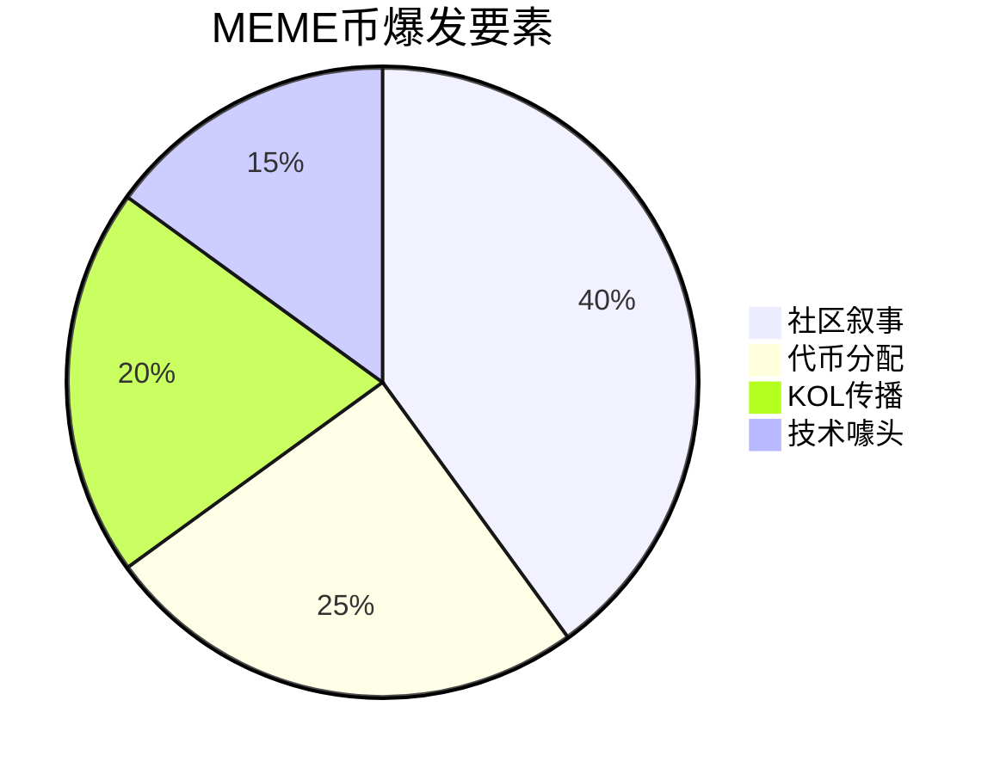

> 区块链技术现在已经从单一的加密货币支付系统发展为涵盖金融、艺术、组织治理和社区文化的多元生态系统。这次我们将深入解析 DeFi（去中心化金融）、NFT（非同质化代币）、DAO（去中心化自治组织）与 MEME（模因币）四大领域，通过典型案例剖析其核心机制，为大家提供全面的入门指南，以便更好地寻找实习相关岗位。

## 一、DeFi：去中心化金融的创新实践

DeFi，全称为 Decentralized Finance（去中心化金融），是基于区块链技术建立的金融体系，目标是提供不依赖传统银行或金融中介的服务，比如借贷、交易、支付等，让每个人都可以自由参与，无需审批、无需信任中介机构。以下是 DeFi 领域的三个典型案例：

### 1. Uniswap：去中心化交易所（DEX）

Uniswap 是去中心化交易所（DEX）的代表，由 Hayden Adams 于 2018 年创立。其核心创新在于引入「自动做市商」（AMM）模式，通过「恒定乘积公式」[+恒定乘积公式] 实现代币定价。用户通过存入流动性池（如 ETH 和 DAI）成为流动性提供者（LP），赚取交易手续费。
[+恒定乘积公式]: x * y = k

为了便于理解，我们来举几个例子：小明手上有 1 个 ETH，他想换成 USDC [+USDC] 。
[+USDC]:（一种可以一对一兑换美元 USD 的稳定币）

- 在传统中心化交易所 [+中心化交易所]，他得注册账号、上传身份证、充币再交易。
- 但在 Uniswap 上，他只需连接钱包，选择「ETH 换 USDC」，点击确认，几十秒后交易完成，USDC 直接到账钱包里，全程无需注册，非常简单快捷。
[+中心化交易所]: 如：币安、OKX 等等

### 2. Compound：去中心化借贷协议

Compound 由 Robert Leshner 创立，是首个采用「流动性挖矿」模式的借贷协议。用户存入资产（如 ETH、DAI）可获得 cToken，并通过动态利率模型赚取利息。借款需超额抵押，抵押率低于阈值时触发强制清算。

我们再来举个例子，又是小明，他现在手上有 5 个 ETH，不想卖掉但又急需 2000 美元来用。

- 他可以把 ETH 抵押到 Compound，然后借出等值的 USDC（比如 2000 美元的 USDC）去用。
- 等他资金宽裕时，再把 USDC 和利息还回去，就能取回原来的 ETH。
- 同时，另一边有用户把 USDC 存进来获得利息回报。

### 3. MakerDAO：稳定币系统

MakerDAO 通过超额抵押模式生成稳定币 DAI，用户可抵押 ETH 等资产生成与美元挂钩的 DAI。协议通过「稳定费率」机制调节 DAI 供需，并尝试引入现实世界资产（RWA）以降低风险。

如果小明现在持有很多 ETH，但是他担心市场波动，想换点「相对稳的」资产来过渡一下。

- 他把 1 个 ETH（假设价值 3500 美元）抵押到 MakerDAO，系统生成 2000 个 DAI 给他（DAI ≈ 1 美元）。
- 他可以用 DAI 消费、投资或存起来。等哪天想拿回 ETH，就把 2000 个 DAI 还回去，系统退还 ETH。

## 二、NFT：数字所有权的革命

NFT（Non-Fungible Token）即「非同质化代币」，代表一种独一无二的数字资产，比如一张艺术画作、一段音乐、一个头像，甚至是一块虚拟土地。NFT 的本质，是数字资产「唯一性」和「所有权」的证明。以下是在 NFT 领域的两个非常有名的代表：

### 1. CryptoPunks：NFT 的开山之作

CryptoPunks 由 Larva Labs 于 2017 年推出，包含 1 万个像素朋克形象，是 NFT 文化和社区的奠基之作。每个 Punk 拥有独特特征（如外星人、僵尸），持有者可授权商业使用权。

### 2. OpenSea：NFT 交易的基础设施

OpenSea 是目前最大的 NFT 交易平台，类似「NFT 领域的淘宝」，用户可以在上面购买、出售或铸造（创建）NFT。它支持多种区块链，如以太坊、Polygon 等。

## 三、DAO：去中心化自治组织的崛起

DAO（Decentralized Autonomous Organization）即「去中心化自治组织」，是一种基于智能合约运行、由社区成员共同治理的组织形式。它不依赖传统公司结构，而是靠代码和代币驱动决策。

DAO 就像是一个用投票决定一切的「线上组织」，成员可用社区治理代币来参与投票决定资金用途、项目走向等重要事务。

### 1. Nouns DAO：社区驱动的 NFT 艺术 DAO

NounsDAO 每天铸造一个 NFT 小人头像，并将拍卖所得存入 DAO 金库。Nouns NFT 的持有者可以共同提案和治理，如资助开源项目、举办线下活动等。

### 2. LXDAO：公共物品的建设者

LXDAO 专注于支持 Web3 公共物品和开源项目，采用「固定岗位 + Bounty 任务」协作模式。治理结合二次方投票和信念投票，通过时间加权算法提升长期持币者权重。

### 3. ConstitutionDAO：一场疯狂的拍卖

ConstitutionDAO 在 2021 年试图集体购买美国宪法副本，筹集 470 万美元但未成功。

## 四、MEME：文化与投资热潮

MEME 原意为「迷因」，即网络文化中的梗、表情包、搞笑段子等。在加密圈，MEME 通常指那些以网络文化为基础的代币，比如 DOGE（狗狗币）、PEPE（青蛙币）等。

MEME 币的特点是「有趣、搞怪、无实际应用」。它更像是网络的「加密段子」，但也因群众效应和炒作情绪曾掀起巨大浪潮。

### 1. DOGE：MEME 币的开山鼻祖

DOGE 由 Jackson Palmer 和 Billy Marcus 于 2013 年创建，借用了「狗狗」表情包形象。2021 年因马斯克力挺市值突破 300 亿美元，2023 年推出 DOGE 2.0 引入链上社区投票机制。

### 2. PEPE：社区驱动的 MEME 币

PEPE 基于「悲伤青蛙」形象，发行总量高达 420.69 万亿枚，采用销毁机制（每笔交易销毁一定比例代币）。2024 年市值突破 58 亿美元，成为 MEME 币「战神」。
::: warning
MEME 币波动极大，极易受社交媒体情绪驱动。一条马斯克的推文可能让某币暴涨，也可能暴跌。投资 MEME 更像是赌博，尤其要警惕「拉高出货」「归零币」等风险。
:::
## 五、交叉创新领域

### 1. DeFi + NFT

- NFT抵押借贷：BendDAO 的 P2Pool 模型
- 碎片化流动性：Sudoswap 的 AMM 改进

### 2. DAO + MEME

- 社区代币分发：FriendTech 的 key 机制
- 治理娱乐化：Pepe Coin 的 meme 提案

### 3. 基础设施突破

- 账户抽象：ERC-4337 的 UserOperation
- 数据可用性：EigenDA vs. Celestia

## 六、学习路径建议

1. **DeFi**：从 Uniswap V2 代码 → 理解 AMM 数学 → 研究 V4 Hook 设计
2. **NFT**：ERC-721 标准 → 动态 NFT 技术栈 → 全链游戏开发
3. **DAO**：参与 Gitcoin Grants → 分析 Aragon 案例 → 实践 SubDAO 治理
4. **MEME**：监控 DEXTools 热榜 → 分析链上大户行为 → 模拟 meme 传播

## ::ep:avatar::文章贡献者  
作者：[吃汤圆](/)  
排版：[Echo](https://x.com/Echo_liuchan)

