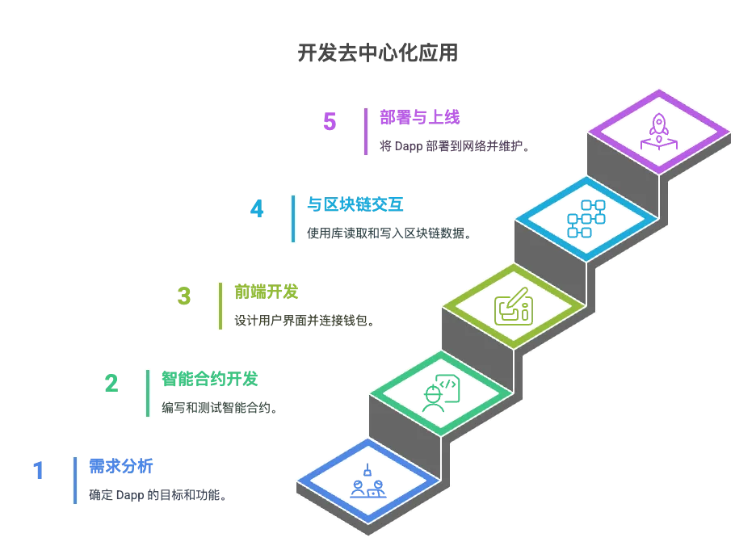

> 本章将围绕 Web3 行业中的智能合约工程师所需的技能进行介绍，首先介绍去中心化应用（dApp）的基本架构，重点分析其与传统应用的不同之处。接着，我们将详细讨论开发 dApp 的流程，从需求分析、智能合约的编写、前端与后端的设计，到最终部署和上线，帮助读者理解整个开发生命周期。


## 一、Dapp 架构和开发流程

去中心化应用（Dapp）是与传统集中式应用不同的全新应用模式，通常运行在区块链或分布式网络上。与传统应用相比，dApp 的核心特点在于去中心化，意味着应用的逻辑和数据不由单一实体控制，而是由多个参与者共同维护。因此，开发 Dapp 需要理解和掌握去中心化技术栈、智能合约编程以及前端与区块链的交互方式。

## 1.1 Dapp 架构

Dapp 的架构主要由三个核心部分组成：


1. **前端（User Interface）**：
    
    前端是 Dapp 与用户交互的界面，通常由 HTML、CSS 和 JavaScript（如 React、Vue 等框架）构建。与传统 Web 应用不同，dApp 前端会连接区块链来调用智能合约，呈现数据和执行交易。
    
    前端还需要集成区块链钱包（如 MetaMask）来进行身份验证和签署交易，确保用户的隐私和安全。
    
2. **智能合约（Smart Contracts）**：
    
    智能合约是 Dapp 的核心，它定义了应用的业务逻辑，并部署在区块链上。智能合约通过执行自动化的规则来确保交易和操作的透明性与不可篡改性。
    
    在以太坊平台上，智能合约通常使用 **Solidity** 编程语言编写，并通过 **Ethereum Virtual Machine (EVM)** 执行。
    
3. **区块链和去中心化存储（Blockchain & Decentralized Storage）**：
    
    区块链用于存储智能合约的状态数据及交易记录。去中心化存储如 **IPFS**（InterPlanetary File System）或 **Arweave**，用于存储大规模的非结构化数据（如图片、文档等），确保数据不易丢失和篡改。
    
    通过使用去中心化存储，Dapp 确保所有数据在多个节点上备份，保证数据的持久性和去中心化特性。
    

## 1.2 Dapp 开发流程

Dapp 的开发流程可以分为以下几个阶段：



### 1.2.1 **需求分析与规划**

在开发 Dapp 之前，首先需要进行需求分析和规划，明确应用的目标和功能。此阶段包括：

- **确定功能需求**：需要定义用户可以进行的操作，比如转账、查询余额、创建投票等。
- **选择区块链平台**：决定在哪个平台上构建 Dapp（如以太坊、Solana、Polygon 等），这通常取决于目标用户群、交易成本、可扩展性等因素。
- **设计用户体验（UX）**：定义 Dapp 的界面设计和交互流程，确保用户能够轻松使用应用并与区块链交互。

### 1.2.2 **智能合约开发**

智能合约是 Dapp 的核心，负责执行去中心化的业务逻辑和存储重要的数据。在这一阶段，开发者需要：

- **编写智能合约**：使用 **Solidity** 或其他智能合约语言编写合约，确保合约的功能满足需求分析中定义的要求。
- **编写测试用例**：为智能合约编写单元测试，确保合约逻辑正确、无漏洞。
- **审计和优化**：对合约进行安全审计，确保合约的安全性，避免常见漏洞（如重入攻击、整数溢出等）。

### 1.2.3 **前端开发**

前端是用户与 Dapp 交互的主要界面，因此开发前端时需要：

- **选择前端框架**：可以使用现代前端框架（如 **React**、**Vue**）来构建 UI。前端将通过 JavaScript 与智能合约进行交互。
- **连接钱包**：通过集成 **MetaMask** 等 Web3 钱包，用户可以连接到 dApp，并授权其与智能合约交互。
- **显示区块链数据**：前端需要从区块链获取数据（如账户余额、交易记录），并通过用户界面展示。
- **处理交易签名与确认**：当用户发起交易时，前端需要与钱包进行交互，获取用户的签名并将交易发送到区块链。

### 1.2.4 **与区块链交互**

前端和智能合约通过 **Web3.js**、**Ethers.js** 或 **Viem** 等库进行交互。这些库允许前端与以太坊或其他区块链进行通信，实现读取和写入操作：

- **读取数据**：前端通过智能合约的公共函数读取区块链上的状态数据（如余额、合约信息）。
- **发送交易**：当用户发起交易时，前端需要通过钱包签署交易并发送到区块链，执行合约中的某个功能（如转账）。

### 1.2.5 **部署与上线**

一旦开发完成，Dapp 进入部署阶段。具体步骤包括：

- **部署智能合约**：通过工具（如 **Hardhat** 或 **Truffle**）将智能合约部署到测试网（如 **Sepolia**）或主网。
- **前端部署**：将前端应用部署到去中心化平台（如 **IPFS**、**Fleek**）或传统的 Web 主机。
- **发布和维护**：将 Dapp 上线，进行用户反馈收集，定期更新合约和前端，修复潜在问题。

## 1.3 小结

Dapp 的开发流程从需求分析、智能合约编写、前端开发，到最终部署，涵盖了多个技术栈的综合应用。通过了解 dApp 的架构和开发流程，开发者可以更好地把握去中心化应用的核心概念，并有效地进行开发和部署。

开发 Dapp 时，区块链技术的透明性、不可篡改性以及智能合约的自动执行能力为应用提供了去中心化的基础，但与此同时，开发者需要应对与传统 Web 应用不同的挑战，如用户体验、交易处理以及安全性问题。掌握这些技术和概念，能够帮助开发者构建更强大和可靠的去中心化应用。

# 二、**以太坊开发环境搭建**

以太坊开发环境的搭建主要有以下几种常用方式，适合不同的开发需求：

### 2.1 基础环境准备

**1. 必备工具**

- Node.js（建议用 nvm 管理）
- npm 或 yarn
- Git

安装命令（如未安装）：

```bash
# 安装 nvm（如未装）
curl -o- <https://raw.githubusercontent.com/nvm-sh/nvm/v0.39.7/install.sh> | bash

# 安装 Node.js LTS
nvm install --lts
nvm use --lts

# 安装 yarn（可选）
npm install -g yarn
```

---

### **2.2 以太坊本地开发链**

**方式一：Ganache（Truffle 团队出品，适合初学者）**

- 下载网址：[https://archive.trufflesuite.com/ganache/](https://archive.trufflesuite.com/ganache/)


---

**方式二：Foundry（Rust 实现，极快，适合进阶用户）**

- [Foundry 中文文档](https://learnblockchain.cn/docs/foundry/i18n/zh/)

```bash
curl -L <https://foundry.paradigm.xyz> | bash
foundryup
```

---

**方式三：Hardhat（推荐，现代以太坊开发框架）**

- [**Hardhat 官方教程**](https://hardhat.org/tutorial) - 含视频指导

```bash
npm install --global hardhat
mkdir eth-dev && cd eth-dev
npx hardhat
```

选择“创建一个基本示例项目”，会自动生成合约、测试和配置。

**启动本地节点**

```bash
npx hardhat node
```

**部署合约**

```bash
npx hardhat run scripts/deploy.js --network localhost
```

---

## 3. 以太坊钱包和前端交互

- 推荐使用 MetaMask 浏览器插件作为开发钱包。
- 前端可用 ethers.js 或 web3.js 进行合约交互。

---

## 4. 其他常用工具

- Remix IDE（网页版，适合快速测试合约）：[https://remix.ethereum.org](https://remix.ethereum.org/)
- OpenZeppelin 合约库：`npm install @openzeppelin/contracts`
- [**Chainlink 测试环境**](https://docs.chain.link/resources/link-token-contracts) - 预言机集成指南

# **三、Solidity 智能合约编程（简单介绍）**

Solidity 是一种面向合约的高级编程语言，专门用于在以太坊虚拟机（EVM）上编写智能合约。它具有静态类型、支持继承、库和复杂的用户定义类型等特性。

## 3.1 基础语法与开发范式

### 3.1.1 版本声明

每个 Solidity 文件必须以版本声明开始：

```solidity
pragma solidity ^0.8.0;
```

### 3.1.2 数据类型

基本数据类型

| 类型 | 描述 | 示例 | 默认值 |
| --- | --- | --- | --- |
| bool | 布尔值 | true / false | false |
| uint8 | 8 位无符号整数 | 0 ~ 255 | 0 |
| uint16 | 16 位无符号整数 | 0 ~ 65535 | 0 |
| uint256 / unit | 256 位无符号整数 | 0 ~ (2^256 - 1) | 0 |
| int8 | 8 位有符号整数 | -128 - 127 | 0 |
| int256 / int | 256 位有符号整数 | -2^255 ~ (2^255 - 1) | 0 |
| address | 以太坊地址 | 0x…. | 0 |
| bytes1 ~ bytes32 | 固定长度字节数组 | bytes32 data = “Hello” | 0x00 |
| bytes | 动态字节数组 | bytes memory data = “Hello World” | “” |
| string | UTF-8 编码字符串 | string name = “Alice” | “” |

复合数据类型

| 类型 | 语法 | 描述 | 示例 |
| --- | --- | --- | --- |
| 静态数组 | T[k] | 固定长度数组 | uint[5] numbers |
| 动态数组 | T[] | 可变长度数组 | uint[] memory list |
| 映射 | mapping(K => V) | 键值对存储 | mapping(address => uint256) balances |
| 结构体 | struct | 自定义数据结构 | struct Person { string name; uint age; } |
| 枚举 | enum | 枚举类型 | enum Status { Pending, Active, Inactive } |

### 3.1.3 函数修饰符

可见性修饰符表

| 修饰符 | 可见范围 | 描述 | 使用场景 |
| --- | --- | --- | --- |
| public | 内部 + 外部 | 任何地方都可以调用 | 对外提供的公共接口 |
| external | 仅外部 | 只能从合约外部调用 | 外部用户接口，gas 效率更高 |
| internal | 内部 + 继承 | 当前合约和子合约可调用 | 内部逻辑函数，需要被继承 |
| private | 仅内部 | 只有当前合约可调用 | 私有实现细节 |

状态修饰符表

| 修饰符 | 状态读取 | 状态修改 | Gas 消耗 | 描述 |
| --- | --- | --- | --- | --- |
| pure | ❌ | ❌ | 低 | 不读取也不修改状态的函数 |
| view | ✅ | ❌ | 低 | 只读取状态，不修改状态 |
| payable | ✅ | ✅ | 正常 | 可以接收以太币的函数 |
| 无修饰符 | ✅ | ✅ | 正常 | 可以读取和修改状态 |

### 3.1.4 开发范式

- **状态机模式**
    
    智能合约本质上是一个状态机，通过交易改变合约状态。
    
- **事件驱动编程**
    
    使用事件（Events）记录重要的状态变化，便于前端监听和日志记录。
    
- **模块化设计**
    
    通过继承和库（Library）实现代码复用和模块化。
    

## 3.2 合约结构详解

### 3.2.1 基本结构

1. `//` 是 Solidity 中的单行注释符号，例如：`// SPDX-License-Identifier: MIT` 用于指定源代码的许可证类型。
2. `pragma` 关键字用于声明 Solidity 源代码所需的编译器版本，确保合约在兼容的编译器环境中正确编译。
3. `contract` 关键字用于定义一个智能合约，其语法格式为：`contract 合约名 { ... }`。
4. 一个智能合约的基本结构通常由以下三部分组成：状态变量、构造函数和普通函数。

```solidity
// SPDX-License-Identifier: MIT
pragma solidity ^0.8.0;

contract MyContract {
    // 状态变量
    uint256 public myNumber;

    // 构造函数
    constructor() {
        myNumber = 100;
    }

    // 函数
    function setNumber(uint256 _number) public {
        myNumber = _number;
    }
}
```

### 3.2.2 状态变量（State Variables）

状态变量是指在合约中定义的、其值永久存储在区块链上的变量。它们用于记录合约的持久化数据，构成了合约的整体状态。当合约被部署后，这些变量将被写入区块链，并在合约的整个生命周期中保持可访问性和可追踪性。

```solidity
contract MyContract {
    /*
    * 可以通过内部与外部函数更改变量
    * public可以通过前端代码访问
    */
    uint256 public totalSupply;
    mapping(address => uint256) private balances;
    address public owner;
    
    // 常量
    uint256 public constant MAX_SUPPLY = 1000000;
    
    // 不可变量（构造函数中设置一次）
    uint256 public immutable deploymentTime;
    
    constructor() {
        owner = msg.sender;
        deploymentTime = block.timestamp;
        totalSupply = 0;
    }
}
```

### 3.2.3 函数（Functions）

函数是 Solidity 智能合约中执行具体逻辑操作的核心组成部分。通过函数，可以实现对状态变量的读取、修改，或执行特定业务逻辑。

**函数声明格式**

Solidity 中函数的标准声明格式如下所示：

```solidity
function <函数名>(<参数列表>)
    <可见性>
    <状态可变性>
    <修饰符列表>
    <虚拟/重写关键字>
    returns (<返回值列表>)
{
    // 函数体
}
```

各部分含义如下：

- `<函数名>`：函数的名称；
- `<参数列表>`：传入函数的参数；
- `<可见性修饰符>`：如 `public`、`private`、`internal`、`external`；
- `<状态可变性修饰符>`：如 `view`、`pure`、`payable`；
- `<函数修饰符>`：如 `onlyOwner` 等自定义逻辑控制；
- `virtual/override`：用于支持继承与函数重写；
- `returns`：定义返回值及其类型。

**函数可见性（Function Visibility）**

函数可见性决定了函数在何种上下文中可以被调用

```solidity
contract VisibilityExample {	
		// 仅当前合约可访问
    function privateFunc() private pure returns(uint) { return 1; }
    // 当前合约和继承合约可访问
    function internalFunc() internal pure returns(uint) { return 2; }
    // 所有人可访问
    function publicFunc() public pure returns(uint) { return 3; }
    // 仅外部调用
    function externalFunc() external pure returns(uint) { return 4; }
}
```

**函数状态修饰符**（State Mutability Modifiers）

用于指明函数是否修改或读取合约状态：

```solidity
contract StateModifiers {
    uint public count = 0;

    // view: 只读函数，不修改状态
    function getCount() public view returns(uint) {
        return count;
    }

    // pure: 纯函数，不读取也不修改状态
    function add(uint a, uint b) public pure returns(uint) {
        return a + b;
    }

    // payable: 可接收以太币
    function deposit() public payable {
        // msg.value 是发送的以太币数量
    }

    // 默认：可修改状态
    function increment() public {
        count++;
    }
}
```

**函数参数和返回值**

Solidity 支持多参数与多返回值，以及命名返回值：

```solidity
// 多个返回值
function getPersonInfo() public pure returns(string memory name, uint age) {
    name = "Alice";
    age = 25;
}

// 命名返回值
function calculate(uint a, uint b) public pure returns(uint sum, uint product) {
    sum = a + b;
    product = a * b;
    // 自动返回命名变量
}

// 调用带多返回值的函数
function callExample() public pure {
    (string memory name, uint age) = getPersonInfo();
    // 或者忽略某些返回值
    (, uint productOnly) = calculate(5, 3);
}
```

**修饰符（Function Modifiers）**

修饰符允许在函数执行前插入额外逻辑，常用于权限控制与前置检查：

```solidity
contract ModifierExample {
    address public owner;
    bool public paused = false;

    constructor() {
        owner = msg.sender;
    }

    // 自定义修饰符
    modifier onlyOwner() {
        require(msg.sender == owner, "Not the owner");
        _;  // 继续执行被修饰的函数
    }

    modifier whenNotPaused() {
        require(!paused, "Contract is paused");
        _;
    }

    function togglePause() public onlyOwner {
        paused = !paused;
    }
    
    // 使用多个修饰符
    function criticalFunction() public onlyOwner whenNotPaused {
        // 函数逻辑
    }
}
```

**继承与函数重写（Inheritance and Override）**

Solidity 支持单继承与多继承，子合约可重写父合约中的虚函数：

```solidity
// 基础合约
contract Animal {
    string public name;

    constructor(string memory _name) {
        name = _name;
    }

    function speak() public virtual returns(string memory) {
        return "Some sound";
    }
}

// 继承合约
contract Dog is Animal {
    constructor(string memory _name) Animal(_name) {}

    // 重写父类函数
    function speak() public pure override returns(string memory) {
        return "Woof!";
    }
}

// 多重继承
contract Pet is Animal {
    address public owner;

    constructor(string memory _name, address _owner) Animal(_name) {
        owner = _owner;
    }
}

contract Labrador is Dog, Pet {
    constructor(string memory _name, address _owner)
        Dog(_name)
        Pet(_name, _owner) {}
}
```

**接口与抽象合约（Interfaces & Abstract Contracts）**

接口与抽象合约用于定义规范与继承框架：

```solidity
// 接口定义
interface IERC20 {
    function transfer(address to, uint256 amount) external returns (bool);
    function balanceOf(address account) external view returns (uint256);
}

// 抽象合约
abstract contract AbstractToken {
    string public name;

    // 抽象函数，必须在子类中实现
    function totalSupply() public virtual returns (uint256);
}
```

**事件机制（Events）**

事件用于在链上记录重要状态变化，并可由外部监听器（如前端应用）捕捉：

```solidity
contract EventExample {
    // 定义事件
    event Transfer(address indexed from, address indexed to, uint256 amount);
    event Approval(address indexed owner, address indexed spender, uint256 amount);

    mapping(address => uint256) public balances;

    function transfer(address to, uint256 amount) public {
        require(balances[msg.sender] >= amount, "Insufficient balance");

        balances[msg.sender] -= amount;
        balances[to] += amount;

        // 触发事件
        // 可以在区块链浏览器查找到当前事件记录
        emit Transfer(msg.sender, to, amount);
    }
}
```

## 3.3 安全实践

常见攻击手段

| 风险点 | 攻击机理 | 典型防护措施 |
| --- | --- | --- |
| Reentrancy | 恶意合约在 transfer / call 回调中再次进入受害函数，导致重复提款 | 1. **Checks-Effects-Interactions**2. `ReentrancyGuard`（OpenZeppelin）3. 使用 `transfer`/`send` 或限制 gas（已不推荐，仅旧代码） |
| 访问控制 (Access Control) | 未受保护的管理函数可被任何人调用 | 1. `Ownable`：`onlyOwner` 修饰符2. `AccessControl`：基于角色的权限（`DEFAULT_ADMIN_ROLE`, `MINTER_ROLE` 等）3. 及时转移 / 多签管理 |
| 整数溢出 (Integer Overflow / Underflow) | 旧版本 `<0.8` 加法/减法越界产生错误数值 | 1. Solidity 0.8+ 默认内置溢出检查2. 对老版本使用 `SafeMath` 库3. 精简不必要的 `unchecked` 区块 |

### 3.3.1 重入攻击（Reentrancy）防护

重入攻击（Reentrancy Attack）是智能合约中最常见且危害极大的安全漏洞之一。该攻击方式通常发生在合约向外部地址发送以太币或调用外部合约函数时，攻击者利用回调机制在合约状态更新之前重复调用受影响的函数，从而多次提取资金或重复执行某些操作，造成资产损失或逻辑混乱。

**攻击原理简述**

典型的重入攻击流程如下：

1. 合约调用外部合约或地址（如 `call` 发送以太币）；
2. 外部合约在其回调函数中重新调用原合约尚未更新状态的函数；
3. 原合约在状态尚未变更的前提下再次执行逻辑；
4. 攻击者反复进入该函数，实现多次提现等恶意操作。

**典型示例（易受攻击版本）**

```solidity
contract VulnerableContract {
    mapping(address => uint256) public balances;
    
    function withdraw() external {
        uint256 amount = balances[msg.sender];
        require(amount > 0, "No balance");
        
        // 危险：先转账，后更新状态
        (bool success,) = msg.sender.call{value: amount}("");
        require(success, "Transfer failed");
        
        balances[msg.sender] = 0; // 状态更新在转账之后
    }
}
```

**防护措施**

1. 检查-生效-交互模式（CEI Pattern）

```solidity
contract SecureContract {
    mapping(address => uint256) public balances;
    
    function withdraw() external {
        uint256 amount = balances[msg.sender];
        require(amount > 0, "No balance");
        
        // 先更新状态
        balances[msg.sender] = 0;
        
        // 后进行外部调用
        (bool success,) = msg.sender.call{value: amount}("");
        require(success, "Transfer failed");
    }
}
```

1. 重入锁（Reentrancy Guard）

```solidity
contract ReentrancyGuard {
    bool private locked;
    
    modifier noReentrant() {
        require(!locked, "Reentrant call");
        locked = true;
        _;
        locked = false;
    }
}

contract SecureWithGuard is ReentrancyGuard {
    mapping(address => uint256) public balances;
    
    function withdraw() external noReentrant {
        uint256 amount = balances[msg.sender];
        require(amount > 0, "No balance");
        
        balances[msg.sender] = 0;
        (bool success,) = msg.sender.call{value: amount}("");
        require(success, "Transfer failed");
    }
}
```

### 3.3.2 访问控制（Access Control）

访问控制是保障智能合约安全性的核心机制之一。通过对关键函数设置访问权限，可以有效防止未经授权的用户执行敏感操作，从而避免资金被盗、状态被篡改等严重安全风险。

**缺乏访问控制的风险示例**

以下为一个存在严重安全漏洞的合约示例，任何地址均可提取合约内全部资金：

```solidity
/**
 * @title BadVault
 * @dev 缺少访问控制，任何人都能调用 withdraw() 取走全部 ETH
 */
contract BadVault {
    mapping(address => uint256) public balance;

    // 用户存钱
    function deposit() external payable {
        balance[msg.sender] += msg.value;
    }

    // ❌ anyone can withdraw ALL funds!
    function withdraw() public {
        payable(msg.sender).transfer(address(this).balance);
    }
}

```

**问题题说明**：

该合约未对 withdraw 函数设置访问权限，攻击者可通过简单调用提取合约内所有以太币，造成资金全部流失。

**安全的访问控制示例**

通过引入显式权限判断，限制敏感操作的调用者，可以提升合约的安全性：

```solidity
/**
 * @title SafeVault
 * @dev 仅部署者 (owner) 可以提取资金，简单显式访问控制
 */
contract SafeVault {
    address public immutable owner;           // 部署者地址
    mapping(address => uint256) public balance;

    // 构造函数：在部署时确定所有者地址
    constructor() {
        owner = msg.sender;
    }

    // 存款函数：允许所有用户调用
    function deposit() external payable {
        balance[msg.sender] += msg.value;
    }

    // ✔️ 提款函数：仅限所有者调用
    function withdraw() external {
        // 进行访问权限判断
        require(msg.sender == owner, "Not owner");
        uint256 amount = address(this).balance;
        require(amount > 0, "Nothing to withdraw");

        // 注意 Checks-Effects-Interactions 顺序
        (bool ok, ) = owner.call{value: amount}("");
        require(ok, "Transfer failed");
    }
}
```

### 3.3.3 整数溢出防护（Integer Overflow Protection）

在早期版本的 Solidity（v0.8.0 之前），算术运算默认**不进行溢出检查**。这意味着当整数变量超出其最大值或最小值时，数值将**环绕（wrap around）**，导致严重的逻辑漏洞和安全隐患。

**受攻击的示例：无溢出检测的合约（< v0.8.0）：**

```solidity
pragma solidity ^0.7.6;          // ⚠️ 0.7 版本不会自动检查溢出

/**
 * @title BadCounter
 * @dev 用户每调用一次 `inc()`，计数器加 1；当计数器达到 10 停止奖励。
 *      但整数溢出可让攻击者将计数器绕回 0，再无限领奖。
 */
contract BadCounter {
    mapping(address => uint256) public counter;
    mapping(address => bool)    public rewarded;

    // 计数 +1
    function inc() external {
    
        counter[msg.sender] += 1;        // 若已 2**256-1 则回到 0
    }

    // 满 10 次领取 1 wei
    function claim() external {
        require(counter[msg.sender] >= 10, "not enough actions");
        require(!rewarded[msg.sender],    "already claimed");
        rewarded[msg.sender] = true;
        msg.sender.transfer(1);           // 为演示简化为 1 wei
    }

    // 向合约注入少量 ETH 供演示
    receive() external payable {}
}
```

**问题说明：**
在该合约中，如果攻击者的 counter 达到最大值 2^256 - 1，再次调用 inc() 会使计数器绕回 0，从而绕过 >=10 的检查条件，并再次触发奖励逻辑，实现无限循环领取。

**安全方案：限制上限 + 使用最新编译器版本**

自 Solidity 0.8.0 起，所有算术运算默认开启溢出/下溢检查，若发生异常会自动 `revert`。除此之外，也建议通过逻辑限制控制最大值，防止边界绕回。

```solidity
/**
 * @title SafeCounter
 * @dev 方案：在 inc() 中直接固定「最高 11」，超过即拒绝。
 *      溢出永远不会发生，也杜绝了重复领奖。
 */
contract SafeCounter {
    mapping(address => uint256) public counter;

    uint8 constant MAX_ACTIONS = 11;   // 上限 11，留 1 个缓冲

    /// 受控递增：达到 10 后就不准再加
    function inc() external {
        require(counter[msg.sender] < MAX_ACTIONS, "limit reached");
        counter[msg.sender] += 1;
    }

    /// 领取奖励
    function claim() external {
        require(counter[msg.sender] >= 10, "≥10 actions required");
        counter[msg.sender] = 0;                   // 重置为 0
        (bool ok, ) = msg.sender.call{value: 1}("");
        require(ok, "transfer failed");
    }

    /// 注资
    receive() external payable {}
}
```

# **四、智能合约实战项目**

本章节将通过一个简单的“链上留言板”项目，介绍如何使用 Remix 开发、编译、部署并调用智能合约。

## 4.1 环境准备

推荐使用 [Remix IDE](https://remix.ethereum.org/)，它是一个基于浏览器的在线集成开发环境，提供完整的 Solidity 编写、编译、部署与调试功能，适合初学者快速上手。


## 4.2 合约代码

本项目的智能合约实现了一个链上留言功能。每个用户地址可以在区块链上提交一条留言信息，所有留言将永久保存在链上，具有不可篡改与可溯源的特点。

```solidity
// SPDX-License-Identifier: MIT
pragma solidity ^0.8.0;

contract MessageBoard {
    // 保存所有人的留言记录
    mapping(address => string[]) public messages;

    // 留言事件，便于链上追踪
    event NewMessage(address indexed sender, string message);

    // 构造函数，在部署时留言一条欢迎词
    constructor() {
        string memory initMsg = "Hello ETH Pandas";
        messages[msg.sender].push(initMsg);
        emit NewMessage(msg.sender, initMsg);
    }

    // 发送一条留言
    function leaveMessage(string memory _msg) public {
        messages[msg.sender].push(_msg);     // 添加到发言记录
        emit NewMessage(msg.sender, _msg);   // 发出事件
    }

    // 查询某人第n条留言（从0开始）
    function getMessage(address user, uint index) public view returns (string memory) {
        return messages[user][index];
    }

    // 查询某人一共发了多少条
    function getMessageCount(address user) public view returns (uint) {
        return messages[user].length;
    }
}

```

## 4.3 新建合约文件

在 Remix IDE 左侧文件管理面板（File Explorer）中，点击“新建文件”按钮，创建一个名为 `messageboard.sol` 的 Solidity 合约文件，并将合约代码粘贴至该文件中。


## 4.4 编译

1. 在 Remix 右侧面板中选择 **Solidity Compiler**，进入编译设置界面；
2. 在 **COMPILER VERSION** 下拉菜单中选择与合约代码版本一致的编译器版本；
3. 点击 **Compile messageboard.sol** 按钮以启动编译过程；
4. 若编译成功，将在面板右上角看到绿色的 ✅ 符号；
5. 若编译失败，错误信息将显示在底部命令行终端中。根据提示修改代码后可重新编译。

如需重新组织项目结构，可点击 **FILE EXPLORER** 创建文件夹以便分类管理文件。


## 4.5 部署

- 在 Remix 右侧面板中选择 **Deploy & Run Transactions**，进入部署与交互界面；
- 默认环境选择为 JavaScript VM，本地虚拟区块链，系统将自动为多个账户分配初始余额（每个账户默认 100 ETH），可用于部署与调用合约时支付 Gas 费用；


- 确认部署合约的合约名无误后，点击 **Deploy** 按钮，即可完成部署；
- 部署成功后，在下方面板将显示合约部署地址、可调用函数列表及状态变量


- 展开底部命令终端可查看部署日志及构造函数的执行信息，验证合约初始化情况与留言功能的准备状态。


## 4.5 调用函数

部署完成后，即可在 Remix 中调用合约的留言函数：

1. 在合约实例中找到 `leaveMessage` 函数输入框；
2. 在输入框中填入留言内容（例如：`Hello World`）；
3. 点击 **leaveMessage** 按钮，发起交易调用；
4. 右侧命令终端将显示一条新的交易记录，点击该记录可查看交易详情与链上存储的留言信息。


# **五、以太坊技术基础**

## 5.1 帐户模型

| 对比维度 | 外部拥有账户 **EOA** | 合约账户 **Contract Account** |
| --- | --- | --- |
| 地址来源 | `keccak256(pubKey)[12:]`   (公钥→地址) | 创建时由 `CREATE/CREATE2` 计算 |
| 控制方式 | **私钥签名**（用户、钱包） | **合约代码**（EVM 字节码） |
| 状态字段 | `nonce`、`balance` | `nonce`、`balance`、`codeHash`、`storageRoot` |
| 能否发起交易 | ✅ 必须用私钥签名 | ❌ 只能由 EOA 触发或合约内部调用 |
| Gas 费用支付 | 由账户本身 ETH 余额承担 | 从调用者余额扣除 |
| 典型场景 | 钱包地址、热冷账户 | ERC-20/721 Token、DeFi 协议、DAO |

## 5.2 Gas 机制

| 术语 | 含义 | 备注 |
| --- | --- | --- |
| **Gas** | 执行 1 条 EVM 指令的抽象工作量单位 | 汇编级别价格表见黄皮书 |
| **Gas Limit (Tx)** | 发送者愿为本笔交易消耗的 Gas 上限 | 防止死循环耗尽余额 |
| **Gas Used** | 实际执行指令花费的 Gas 总和 | 多退少不补 |
| **Base Fee** | 随区块动态调整的基础费用（EIP-1559） | 全网销毁，抑制拍卖狂飙 |
| **Priority Fee / Tip** | 发送者给出以激励打包者的附加费 | 给矿工 / 验证者 |
| **Max Fee Per Gas** | `maxFee = baseFee + priorityFee` 上限 | 钱包通常自动估算 |

## 5.3 交易生命周期

- **签名构造**
    - 钱包收集字段：`nonce, to, value, data, gasLimit, maxFeePerGas, priorityFeePerGas, chainId`
    - 使用私钥生成 `v, r, s` 签名 → **序列化 RLP**
- **广播到 P2P 网络**
    - 交易进入本地 & 邻居节点的 **mempool**
    - 节点根据 `maxFeePerGas`、`gasLimit`、`nonce` 做基本筛查
- **打包 / 提议区块**
    - 验证者（PoS）或矿工（PoW 时代）挑选利润最高、合法顺序的交易
    - 执行 EVM → 产生 **交易收据**（`status, gasUsed, logsBloom, logs[]`）
- **区块传播与共识**
    - 区块头包含新 **stateRoot**、**receiptsRoot**
    - 超 2⁄3 质押者签名后在共识层定案（PoS Finality ≈ 2 Epoch ≈ 64 slot ≈ ~12 min）
- **确认数 & Finality**
    - 客户端/前端常以 `n ≥ 12` 作“概率足够低”确认
    - 完全终结在 PoS 下由 **Finality Gadget**（Casper FFG）给出

# 六、部署合约

在第四章中，我们已经体验了使用 Remix 在本地虚拟机环境下部署合约的基本流程。然而，该过程仅为本地模拟，并未真正将合约发布到区块链网络。

接下来，我们将通过 **测试网络（Testnet）** 实现合约的正式部署，使其真正上链。

**测试链部署的意义**

测试网络是与主网结构一致的区块链网络，由真实的去中心化节点共同维护。与主网不同的是，测试网中的代币不具有实际经济价值，适用于：

- 验证合约功能是否符合预期；
- 检查合约在不同场景下的行为稳定性；
- 发现并修复潜在的安全漏洞；
- 避免在主网部署时产生高额 Gas 费用或造成实际损失。

一旦在测试链中部署成功且运行稳定，才建议将合约迁移至以太坊主网，以降低研发与运维成本。

**浏览器可见性**

由于测试链同样由真实节点组成，部署在测试链上的合约也可以通过以太坊区块浏览器（如 Sepolia Etherscan）进行查询与验证。

您可以在浏览器中查看：

- 合约部署地址；
- 所属交易哈希（Transaction Hash）；
- 发起者地址；
- 合约代码及 ABI；
- 状态变量和函数调用记录等。

## 6.1 测试链

以太坊测试网（Ethereum Testnets）是用于开发、测试和部署智能合约的网络环境，它们模拟主网功能但使用无价值的测试代币，让开发者可以安全地进行实验而无需承担真实的经济成本。

| 名称 | 共识机制 | 状态 | 主要特点 | 适用场景 |
| --- | --- | --- | --- | --- |
| Sepolia | PoS (权益证明) | 活跃 |  长期支持的主要测试网，与主网最相似，稳定性高。 | 最终部署前测试，生产环境模拟，DApp集成测试 |
| Goerli | PoS (权益证明) | 即将弃用 |  曾经的主要测试网，2024年开始逐步淘汰，仍有部分服务支持。 | 遗留项目测试，不建议新项目使用。 |
| Holesky | PoS (权益证明) | 活跃 | 专为验证者测试设计，大型网络规模，质押功能完整。 | 验证者节点测试， 质押协议开发，大规模网络测试。 |
| Ropsten | PoW (工作量证明) | 已弃用 | 历史上重要的测试网，2022年已关闭，曾模拟主网PoW环境。 | 已停用 |
| Rinkeby | PoA (权威证明) | 已弃用 | 基于权威证明，2022年已关闭，曾经较为稳定。 | 已停用 |
| Kovan | PoA (权威证明) | 已弃用 | 快速出块，2022年已关闭，社区维护。 | 已停用 |

## 6.2 领取 Sepolia 代币

在将合约部署至 Sepolia 测试网之前，需确保部署地址拥有足够的测试用 ETH（Sepolia ETH），以支付部署与调用智能合约所需的 Gas 费用。

### 6.2.1 获取 Sepolia 地址

1. 打开 [MetaMask 钱包](https://metamask.io/)，创建或导入钱包账户；
2. 在网络选择栏中切换至 **Sepolia 测试网络**；
3. 此时，您将获得一个以 `0x` 开头的以太坊地址，用于接收 Sepolia 测试币。


### 6.2.3 申请测试币

可以通过以下水龙头（Faucet）网址申请 Sepolia 测试代币：

- [https://sepolia-faucet.pk910.de/](https://sepolia-faucet.pk910.de/)

**操作步骤如下：**

1. 打开上述网址；
2. 在输入框中粘贴您的 **Sepolia 测试地址**；
3. 点击 **Start Mining** 按钮，平台将自动为您启动工作量证明（Proof of Work）过程；
4. 几分钟后，您将收到一定数量的 Sepolia ETH，自动打入对应地址。

**注意事项**

- 某些水龙头服务可能会对申请者的主网余额、GitHub 账号或 Twitter 活跃度进行校验；
- 若在上述网站申请时出现 IP 相关错误提示，请按照以下步骤操作：
    - 先完成网站的真人验证（Captcha）；
    - 关闭 VPN 或代理服务；
    - 重新点击 **Start Mining**；
- 若该 Faucet 不可用，也可尝试其他公开的 Sepolia 水龙头服务


## 6.3 Remix部署到Sepolia

在完成合约编写、编译和测试币领取等准备工作后，接下来可通过 Remix IDE 将合约正式部署到 Sepolia 测试网络，实现“上链”操作。

### 6.3.1 Remix编译部署

**连接钱包**

打开 Remix IDE，点击右侧面板中的 **Deploy & Run Transactions** 模块，在 **Environment** 下拉菜单中选择：

> Injected Provider - MetaMask
> 
> 
> Remix 将自动调用浏览器中的 MetaMask 钱包，并连接到当前所选网络（确保已切换至 Sepolia 测试网）。
> 


**编译合约**

切换至**Solidity Compiler**面板，点击**Compile messageboard.sol**对合约进行编译，确保无错误提示。


**部署合约**

回到 **Deploy & Run Transactions** 面板：

- 确保合约名称与合约文件一致；
- 点击 **Deploy** 按钮；
- MetaMask 会弹出交易确认窗口，展示 Gas 费用等信息；
- 点击 **确认** 提交交易。


**查看部署结果**

部署完成后，Remix 下方的命令行终端将输出相关日志，包括：

- 合约部署的交易哈希（Transaction Hash）；
- 部署成功的合约地址；
- 构造函数的执行信息；
- 可调用的函数与状态变量接口


### 6.3.2 Etherscan查看合约

部署成功后，我们可以借助 [Etherscan](https://sepolia.etherscan.io) （已默认选择测试网）区块浏览器 对部署过程及合约状态进行进一步验证与分析。

**切换到 Sepolia 网络**

1. 打开 [Etherscan](https://etherscan.io/)；
2. 在页面顶部的网络切换器中选择 **Sepolia** 测试网，或直接访问 https://sepolia.etherscan.io。


**通过交易哈希查看部署信息**

部署合约时，MetaMask 会生成一条交易记录，其 **Transaction Hash** 可在 Remix 的命令终端或 MetaMask 历史记录中找到。将该哈希值粘贴到 Etherscan 的搜索框中，即可查看部署交易的详细信息，包括：

- 交易发起地址（From）；
- 合约部署地址（To 会显示为 *Contract Creation*）；
- Gas 使用量及费用；
- 区块确认数；
- 输入的合约字节码（Input Data）等。


**通过合约地址查看合约详情**

1. 在 Remix 中复制合约部署成功后的地址（如示例地址：`0xfaC4dF6aA3b8265A96a7B269a55A88E2009F34Be`）；
2. 在 Etherscan 搜索框中粘贴该地址并进入合约页面；
3. 页面中将显示如下信息：
    - 当前余额（Balance）；
    - 合约创建交易；
    - 交互记录（若无交互，则显示为“暂无 Transactions”）；
    - 发布者地址（Creator）；
    - 合约代码（若已验证）等


**查看合约事件日志（Events）**

即使该合约尚未发生函数调用或转账交易，也可以通过 Etherscan 的 **Events** 标签页查看部署过程中由构造函数或初始设置触发的事件。该功能有助于调试初始化逻辑和验证合约状态。


### 6.3.3 合约交互

完成部署后，我们可以使用 Remix 提供的图形界面与已部署的智能合约进行函数调用测试，实现链上交互，并通过 Etherscan 验证交易与日志记录。

**通过 Remix 调用合约函数**

1. 回到 Remix 的 **Deploy & Run Transactions** 面板；
2. 在已部署合约实例下，找到函数 `leaveMessage`；
3. 在输入框中输入一条测试信息（例如：`Hello ETH`）；
4. 点击 `leaveMessage` 按钮发起函数调用；
5. MetaMask 将弹出交易确认窗口，确认后即可发送交易；
6. Remix 下方的终端将显示交易成功日志，包括交易哈希（Tx Hash）。


**通过 Etherscan 验证交互结果**

1. 复制合约地址，再次访问 Sepolia Etherscan；
2. 在搜索框粘贴合约地址，进入合约详情页面；
3. 此时页面中将显示新增的一条交易（Transaction），即刚刚执行的函数调用记录；
4. 点击该交易进入交易详情页；
5. 在页面下方的 **Logs** 或 **Event Logs** 标签页中，可看到刚刚触发的事件日志，其中包含输入的留言内容等参数信息。


# **七、区块链前端整合**

## 7.1 前端与合约交互工作流程概览

### 7.1.2 交互流程

1. **初始化连接**：前端检测并连接Web3提供者
2. **用户授权**：请求用户授权访问钱包账户
3. **合约实例化**：使用ABI和合约地址创建合约实例
4. **函数调用**：通过合约实例调用智能合约函数
5. **交易签名**：钱包对交易进行数字签名
6. **广播交易**：将签名交易发送到区块链网络
7. **状态更新**：获取交易结果并更新前端界面


### 7.1.2 关键技术栈

- **合约语言：**掌握Solidity等相关合约开发语言
- **Web3.js/Ethers.js**：JavaScript库，提供区块链交互API
- **钱包连接器**：如WalletConnect、Web3Modal
- **状态管理**：React Context、Redux等管理连接状态
- **错误处理**：网络异常、用户拒绝、Gas不足等场景处理

上述技术栈中，合约语言与一些前端JS区块交互的API最为基础，其他方面往往由其他厂商提供，如RPC节点、钱包等。

## **7.2 实例操作**

在第六章中，我们已成功将智能合约部署至测试网络。然而，仅部署合约并不足以实现用户交互。为此，本章节将通过构建一个基于 Web 的前端页面，使用户可以通过网页界面与区块链上的合约进行交互（如留言等操作），从而实现完整的链上功能闭环。


### **7.2.1 关键代码**

本前端界面基于以下技术栈构建：

- **开发语言**：HTML + JavaScript + CSS（单页面集成）
- **代码规模**：约 650 行
- **核心依赖库**：`Web3.js` —— 用于与以太坊区块链进行交互

完整源代码参考地址：

👉 [messageboard.html - GitHub](https://github.com/JXChuangLab/JXChuangLab.github.io/blob/main/messageboard.html)

**连接钱包**

前端通过调用浏览器中的以太坊钱包插件（如 MetaMask）提供的 API，实现用户地址的连接与授权操作。

```jsx
async function connectWallet() {
    // 1. 请求用户授权账户访问
    const accounts = await window.ethereum.request({ 
        method: 'eth_requestAccounts' 
    });
    
    // 2. 创建 Web3 实例
    web3 = new Web3(window.ethereum);
    account = accounts[0];
    
    // 3. 验证网络,本示例使用Sepolia 测试网
    const chainId = await web3.eth.getChainId();
    if (chainId !== 11155111) { // Sepolia 测试网
        // 网络错误处理
    }
}
```

**合约 ABI 定义**

- ABI（**Application Binary Interface**，应用二进制接口）是智能合约对外提供的接口描述规范。
- 在前端，ABI 以 JSON 格式定义，描述合约中的函数、参数、返回类型等。
- ABI 是实现前端与合约交互的基础，前端可通过 ABI 调用对应函数、读取状态变量。

```json
const contractABI = [
            {
                "inputs": [],
                "stateMutability": "nonpayable",
                "type": "constructor"
            },
            {
                "anonymous": false,
                "inputs": [
                    {
                        "indexed": true,
                        "internalType": "address",
                        "name": "sender",
                        "type": "address"
                    },
                    {
                        "indexed": false,
                        "internalType": "string",
                        "name": "message",
                        "type": "string"
                    }
                ],
                "name": "NewMessage",
                "type": "event"
            },
            ......
        ];
```

**合约实例化**

完成 ABI 导入与钱包连接后，通过 Web3.js 创建合约实例，绑定合约地址与 ABI，从而可直接调用合约中的函数接口。

```jsx
function setContract() {
    const address = document.getElementById('contractAddress').value.trim();
    
    // 地址有效性验证
    if (!web3.utils.isAddress(address)) {
        // 错误处理
        return;
    }
    
    // 创建合约实例
    contract = new web3.eth.Contract(contractABI, address);
}
```

**合约方法调用**

写入操作（需要 Gas）

**核心概念**：

- `.send()` 方法用于执行状态改变的交易
- 需要指定 `from` 参数（发送者地址）
- 返回交易对象，包含 `transactionHash` 等信息
- 用户需要在钱包中确认交易并支付 gas 费用

```jsx
async function leaveMessage() {
    const message = document.getElementById('messageInput').value.trim();
    
    try {
        // 调用合约的写入方法
        const tx = await contract.methods.leaveMessage(message).send({ 
            from: account 
        });
        
        // 获取交易哈希
        console.log('交易哈希:', tx.transactionHash);
        
    } catch (error) {
        // 错误处理
    }
}
```

只读操作（免费）

- `.call()` 方法用于执行只读查询
- 不需要 gas 费用，不会改变区块链状态
- 可以直接获取返回值

```jsx
async function queryMessages() {
    const address = document.getElementById('queryAddress').value.trim();
    
    try {
        // 调用只读方法获取留言数量
        const count = await contract.methods.getMessageCount(address).call();
        
        // 批量获取留言内容
        for (let i = 0; i < count; i++) {
            const message = await contract.methods.getMessage(address, i).call();
            // 处理消息内容
        }
        
    } catch (error) {
        // 错误处理
    }
}
```

通过上述操作，前端即可实现用户连接钱包、链上留言、读取留言记录等功能，构建一个完整可用的 DApp 原型。至此你已经了解合约代码，合约上链，前端交互整个大概流程。

# 八、高阶内容

## 8.1 Gas 优化

### 8.1.1 基本原理与计量单位

- Gas 是 EVM 执行操作的单位。每条指令消耗固定的 gas。
- 优化目标是减少交易所需的总 gas，提高用户体验并降低成本。

### 8.1.2 常见优化技巧

1. **减少存储操作（Storage Write）**
    - 读取存储第一次需 2100 gas（后续 100 gas），而内存读取仅3 gas。推荐多次访问同一存储数据时，将其缓存到内存以减少 SLOAD 次数
    - 每次写入 `storage` 的成本高达 20,000 gas；优先使用 `memory`。
    - 示例：
        
        ```
        // ❌ 非优化写法
        mapping(address => uint256) public balances;
        function deposit() public payable {
            balances[msg.sender] += msg.value;
        }
        
        // ✅ 优化写法（一次读，一次写）
        function deposit() public payable {
            uint256 current = balances[msg.sender];
            balances[msg.sender] = current + msg.value;
        }
        ```
        
2. **使用位压缩（Bit Packing）**
    - 将多个变量压缩到一个 `uint256` 中以节省存储空间。
    - 示例：
        
        ```
        struct Packed {
            uint128 a;
            uint128 b;
        }
        ```
        
3. **循环优化**
    - 减少不必要的运算，如 `array.length` 缓存到变量中。
    - 示例：
        
        ```
        // ❌ 非优化
        for (uint i = 0; i < arr.length; i++) {
            ...
        }
        // ✅ 优化
        uint len = arr.length;
        for (uint i = 0; i < len; i++) {
            ...
        }
        ```
        
4. **函数可见性选择**
    - `external` 比 `public` 更节省 gas，适用于仅被外部调用的函数。

## 8.2 合约安全

- 安全漏洞库（reentrancy、oracle manipulation）

### 8.2.1 安全设计原则

- 最小权限原则（Least Privilege）
- 模块化结构便于审计
- 显式错误处理与事件记录

### 8.2.2 常见漏洞类型与防护

1. **重入攻击 Reentrancy**
    - 利用外部合约在 fallback 中重新调用原函数。历史上最著名的The DAO事件便因重入漏洞导致约6000万美元ETH被盗，最终造成以太坊社区分裂（形成ETH/ETC链）。
    - 防护方法：先更新状态，再转账。
    - 示例：
        
        ```
        // ❌ 有漏洞
        function withdraw() public {
            require(balance[msg.sender] > 0);
            (bool sent,) = msg.sender.call{value: balance[msg.sender]}("");
            require(sent);
            balance[msg.sender] = 0;
        }
        
        // ✅ 修复后
        function withdraw() public {
            uint amount = balance[msg.sender];
            balance[msg.sender] = 0;
            (bool sent,) = msg.sender.call{value: amount}("");
            require(sent);
        }
        ```
        
2. **预言机操纵 Oracle Manipulation**
    - 依赖外部价格源的不可信更新。
    - 解决方法：
        - 使用 Chainlink 等权威价格源。
        - 增加时序约束和多源验证。
3. **整数溢出/下溢**
    - 使用 `unchecked {}` 时需确保逻辑安全。
    - 推荐使用 `SafeMath` 或 Solidity 0.8+ 的内建溢出检查。
4. **权限控制缺失**
    - 所有管理函数应使用 `onlyOwner` 或 `AccessControl` 修饰符保护。
5. **未初始化代理**
    - 基于代理模式的合约若未正确执行初始化函数，可能被任意人初始化并接管合约。
    - 著名的例子包括 Harvest Finance 其在使用 Uniswap V3 做市策略的 Vault 合约中存在未初始化漏洞，如果被利用攻击者可销毁实现合约。该团队曾为此漏洞支付高额赏金修复。
6. **前置交易/三明治攻击**
    - 攻击者在交易执行前后分别发送交易，以不利滑点或套利为目的。
    - 例如 2025 年 3 月，一名用户在 Uniswap V3 的稳定币兑换中遭遇三明治攻击，约 21.5 万美元的 USDC 兑换几乎被抢跑，损失了 98% 的资金

## **8.3 智能合约审计**

> 为什么要审计合约、合约审计的流程是什么、业内有名的审计公司有哪些
> 

### 8.3.1 审计必要性

- 智能合约一旦部署无法修改，审计是风险控制关键手段。
- 资金安全：避免用户资产被盗。
- 法律合规：一些监管要求必须审计证明。

### 8.3.2 常见的合约审计工具

- **Slither**：以 Python 编写的静态分析工具，可检测安全漏洞和代码规范问题
    - 常用命令为 `slither MyContract.sol`（也可指定合约地址）来扫描合约代码
    - 使用方式：[learnblockchain.cn](https://learnblockchain.cn/article/6069#:~:text=02.slither%E5%9F%BA%E6%9C%AC%E4%BD%BF%E7%94%A8%20,solidity%20cfg)
- **MythX**：基于云平台的安全分析服务，支持命令行和 API 调用
    - 使用CLI时，可执行类似 `mythx analyze MyContract.sol` 进行安全扫描
    - 使用方式：[github.com](https://github.com/ConsenSysDiligence/mythx-cli#:~:text=%24%20mythx%20Usage%3A%20mythx%20,ARGS)[github.com](https://github.com/ConsenSysDiligence/mythx-cli#:~:text=analyze%20%20%20Analyze%20the,Display%20API%20version%20information)
- **Foundry**：高效的Solidity开发测试框架，支持属性测试（模糊测试）。
    - 可使用 `forge test` 运行所有测试（包括以 `testFuzz_` 开头的基于属性测试）
    - 使用方式：[learnblockchain.cn](https://learnblockchain.cn/docs/foundry/i18n/zh/forge/fuzz-testing.html#:~:text=%E8%BF%90%E8%A1%8C%E6%B5%8B%E8%AF%95%EF%BC%8C%E6%88%91%E4%BB%AC%E7%9C%8B%E5%88%B0%E5%AE%83%E9%80%9A%E8%BF%87%E4%BA%86%EF%BC%9A)，或通过 `forge test --match-path <test 文件路径>` 定向运行特定测试文件。

### 8.3.3 审计标准流程


1. **静态分析（Static Analysis）**：使用工具如 Slither、Mythril 扫描代码缺陷
2. **动态测试（Fuzzing/Property Testing）**：模拟攻击行为和极限条件
3. **人工审查（Manual Review）**：由资深审计员检查业务逻辑漏洞
4. **审计报告生成（Audit Report）**：明确发现的问题及修复建议

### 8.3.4 知名审计机构比较

| 机构 | 特点 | 项目经验 |
| --- | --- | --- |
| 慢雾科技 | 国内领先，注重攻击复现 | EOS、币安、火币等 |
| CertiK | 静态扫描+天网监控平台 | PancakeSwap、Aave |
| OpenZeppelin | 社区信赖度高，基础库作者 | Compound、Balancer |
| ConsenSys Diligence | 精通以太坊底层原理 | Uniswap、1inch |

## 8.4 **开发协作规范**

### 8.4.1 GitHub 工作流


- 分支策略：
    - **主分支 (main/master)**：始终保持可部署状态，任何代码合并前必须经过测试与审查。
    - **开发分支 (develop)**：用于日常功能开发，作为 feature 分支的合并目标。
    - **功能分支 (feature/xxx)**：以 `feature/功能描述` 命名，完成后合并至 develop 分支。
    - **修复分支 (fix/xxx)**：针对 bug 的修复，以 `fix/bug描述` 命名，优先合并到 develop 或 main。
    - **发布分支 (release/xxx)**：用于发布前准备，如版本打包、测试等，合并后删除。
- 提交信息规范
    - 使用简洁明确的提交信息，推荐格式：
        
        ```
        类型: 简要描述
        
        说明：可选的详细信息、动机、对比等
        Issue：关联的 Issue 编号（如有）
        ```
        
    - 类型包括：
        - `feat`: 新功能
        - `fix`: 修复问题
        - `docs`: 文档更新
        - `refactor`: 代码重构
        - `test`: 添加或修改测试
        - `chore`: 构建过程或辅助工具变动
- Pull Request（PR）流程
    - 每个功能或修复应新建一个分支。
    - 提交 PR 前需确保：
        - 本地通过所有测试
        - 通过 ESLint 或其他静态检查工具
        - 包含必要的文档或注释
    - PR 标题应简洁明了，描述改动内容。
    - 不允许合并自己创建的 PR，需至少一位 reviewer 审查通过。
    - 可在项目仓库中添加 `PULL_REQUEST_TEMPLATE.md` 文件，可统一 PR 描述格式，提升协作效率。例如：
        
        ```jsx
        ## PR 说明  
        - 变更内容：简要描述此次 PR 完成了哪些功能或修复了哪些问题。  
        - 关联 Issue：填写相关 Issue 编号（如无可留空）。  
        - 主要改动：列出代码改动的关键点，如新增哪些函数、修改哪些逻辑等。  
        - 测试情况：说明已编写或执行了哪些测试来验证改动。  
        - 影响评估：列出可能影响的模块或兼容性问题（如版本依赖）。  
        ```
        
    - PR 标题应简洁表达功能，如 `feat: 添加 staking 功能`
    - Code Review 检查清单（代码评审时可按以下要点逐项检查）：
        
        ```
        - 代码是否符合风格规范，命名清晰、可读性高？
        - 业务逻辑是否正确，边界情况和异常情况是否处理周全？
        - 安全性检查：是否考虑重入、整数溢出、权限校验、外部调用等风险？
        - Gas 消耗：是否避免了不必要的存储操作或大循环？
        - 是否增加了足够的注释和文档说明？是否存在未使用的代码或死代码？
        - 是否编写了充分的单元测试覆盖常见场景和极端情况？
        ```
        

### 8.4.2 Issue 管理


- 描述 Issue 结构推荐：背景 + 问题 + 尝试过的方法 + 环境信息
    - 示例：
        
        ```
        ### 问题描述
        执行 `forge test` 时出现 `out of gas` 错误
        
        ### 环境
        - Foundry 版本: 0.2.0
        - Solidity: 0.8.21
        ```
        
- Issue 标签分类标准与自动化：
    - 制定统一的 Issue 标签规则，例如使用 `bug`（缺陷）、`enhancement`（增强）、`security`（安全）、`documentation`（文档）、`question`（问题）等标签；
    - 根据需求添加 `high-priority`、`low-priority`、`help wanted` 等。
    - 通过 GitHub Actions 等自动化工具，还可自动为新 Issue 或 PR 添加标签（如根据文件路径、标题关键字匹配标签）、标记长期未更新的 Issue 为 `stale` 等，减少人工维护成本。

### 8.4.3 开源协作礼仪

- 所有代码变更需配测试和文档
- 保持沟通公开透明：Prefer PR 评论而不是私信
- 使用讨论区（Discussion）提重大设计变更

## 8.5 Layer 2 解决方案

### 8.5.1 Rollup 技术比较

| 项目类型 | 原理 | 优点 | 缺点 |
| --- | --- | --- | --- |
| Optimistic Rollup | 设定欺诈证明期 | EVM 兼容性强，成本低 | 提现延迟（1~2 周） |
| ZK Rollup | 零知识证明 | 安全性高，支持快速提现 | 开发难度大，不完全 EVM 兼容 |

### 8.5.2 主流 L2 平台概览

1. **Starknet**
    - 语言：Cairo（非 Solidity）
    - 特点：ZK-STARK，极高扩展性
2. **zkSync**
    - 工具链：支持 Solidity 合约
    - 特点：ZK Rollup，开发体验佳
3. **Arbitrum**
    - Optimistic 架构
    - 特点：兼容 EVM 工具链，如 Hardhat/Foudnry
4. **Base**
    - Coinbase 推出，构建于 OP Stack 上
    - 特点：强生态支持，开发成本低

### 8.5.3 开发入门指南

1.  **环境准备**
- 安装与配置：基于目标平台选择相应 SDK，如 zkSync CLI、Starknet CLI
- 网络设置：区分 L1 与 L2 的 RPC 端点与钱包配置（如 MetaMask L2 网络）
- Devnet 本地测试：如 Starknet Devnet、zkSync Dev Node、Hardhat L2 plugin
1. **合约部署注意事项**
- 部分平台不支持 `CREATE2` 或存在 gas 上限差异
- 使用平台特定部署脚本，如 zkSync 的 `deploy()` 命令或 `hardhat starknet deploy`
- 考虑合约地址推导方式变化（例如 zkRollup 平台不保证地址一致性）

**3. 跨链交互与桥接**

- 使用官方桥接器：如 zkSync Bridge、Arbitrum Bridge
- 第三方跨链协议支持：LayerZero、Axelar、Wormhole 等
- 跨链消息时延、费用需事先评估

**4. 案例推荐（可拓展）**

- zkSync：Uniswap V3 fork 实践部署体验
- Starknet：使用 Cairo 构建 NFT 合约与前端交互
- Arbitrum：使用 Nitro 模式构建 Gas 竞拍逻辑

---