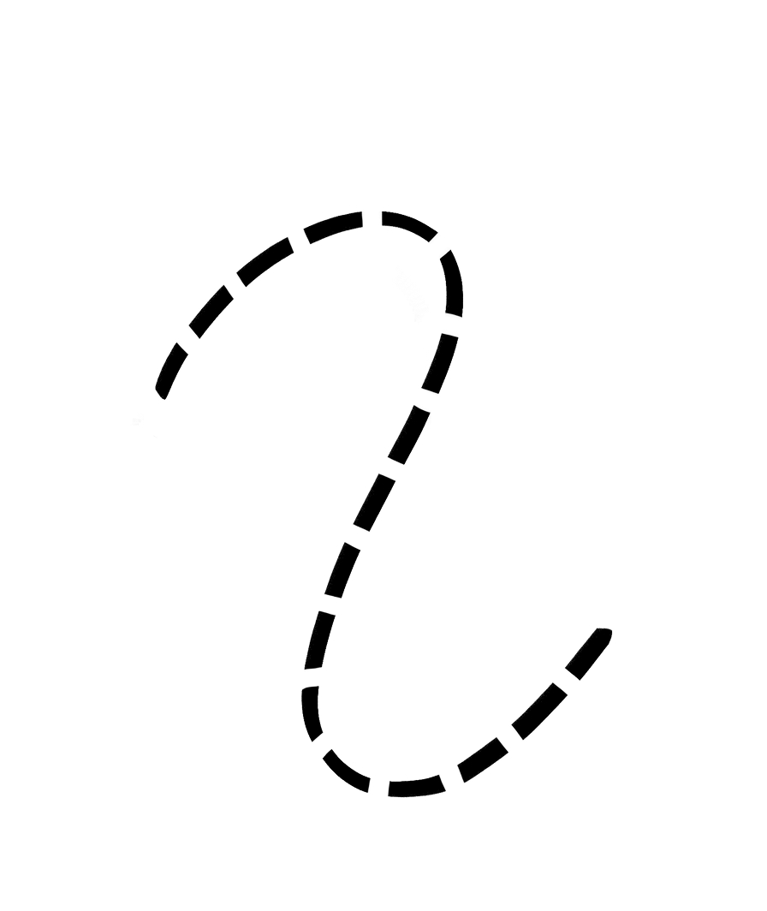
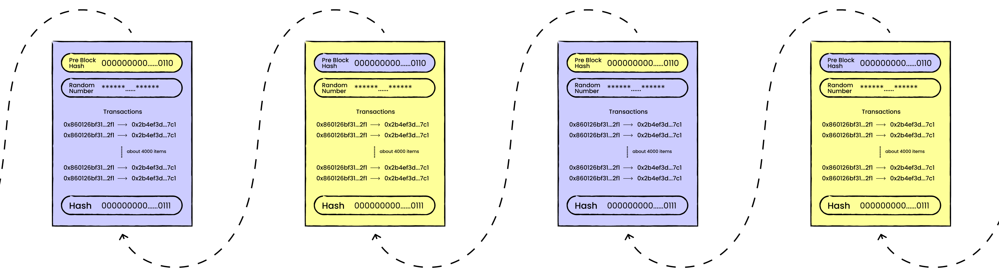
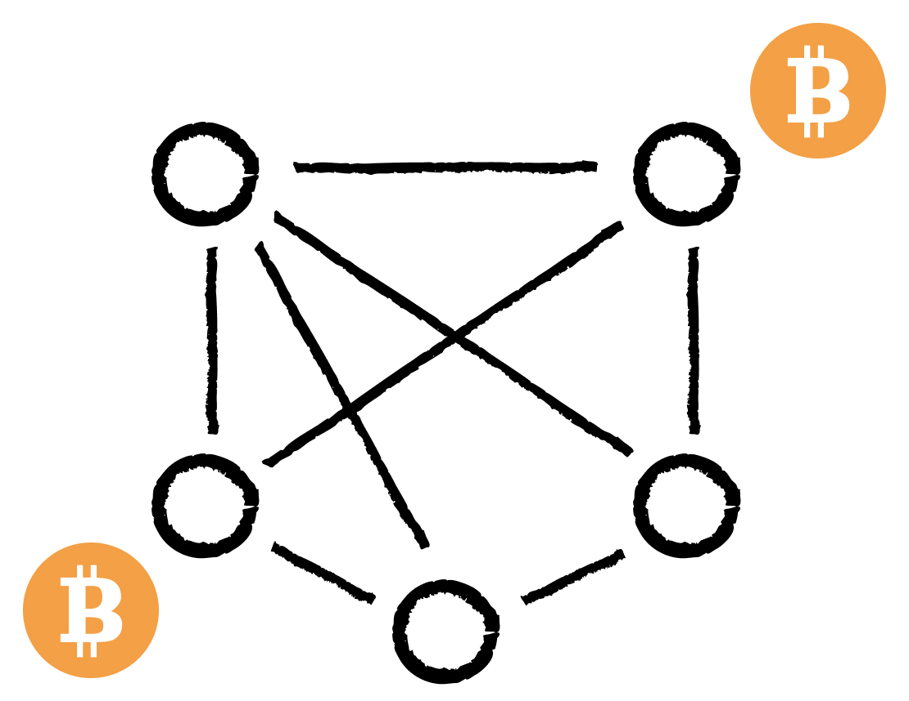
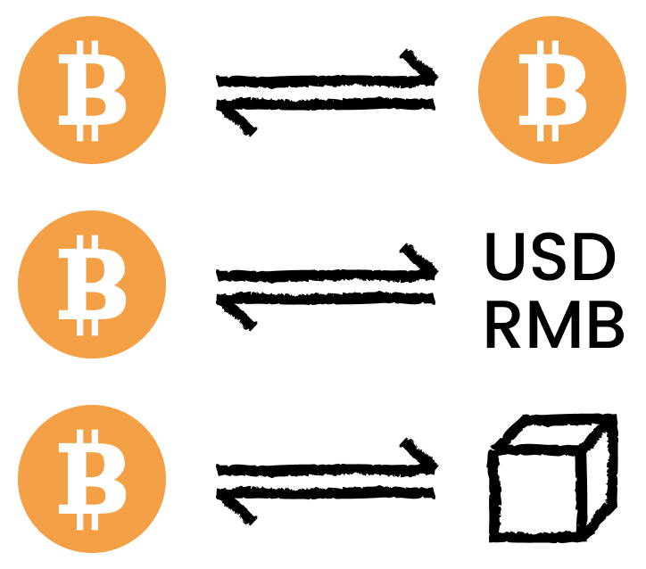
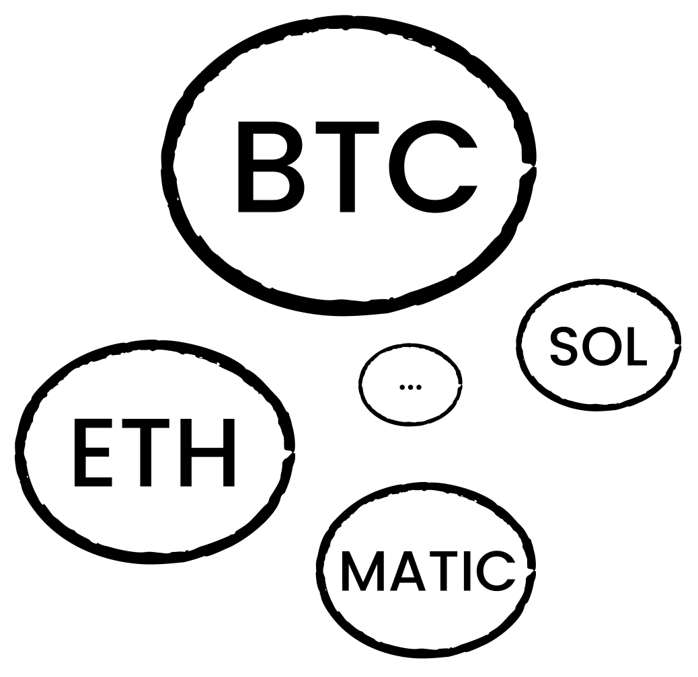
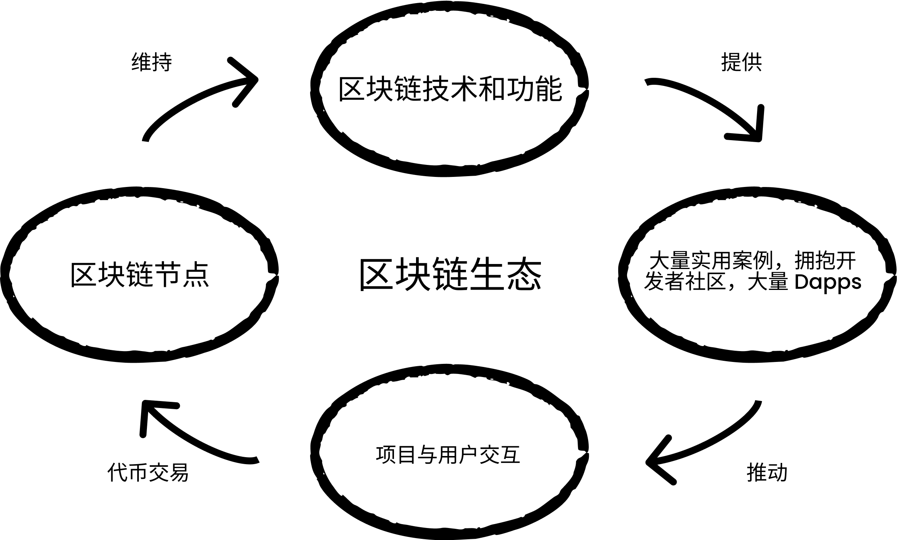
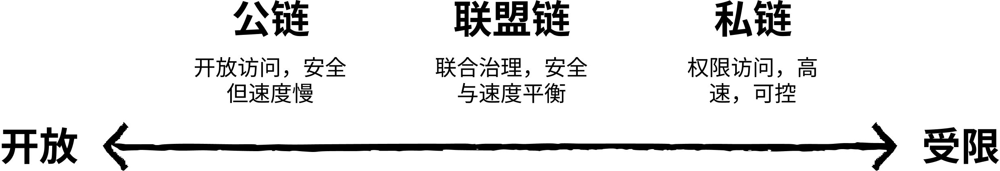

> 在本章，我們首先介紹區塊鏈的基本概念，包括其定義、典型結構，接著闡述公鏈、私鏈與聯盟鏈三種主要型別；然後解析一下 Web3 的內涵，並對比了 Web3、Web 3.0 與傳統 Web2 的差異；最後探討去中心化帶來的主要優勢與面臨的挑戰。

## 一、區塊鏈是什麼？

區塊鏈是一種去中心化的分散式賬本技術，用於在網路節點之間安全、透明且不可篡改地記錄事務資料。每條鏈由一系列按照時間順序相連的“區塊”組成，每個區塊內部包含了多筆交易資料及後設資料，確保了資料記錄的完整性與可追溯性。

這是 Wiki 上面非常嚴謹的定義，看不懂沒關係，接下來我們會詳細解釋其中的每一個概念。
<br>

:::: card-grid
::: card
==**這是一個區塊**=={.warning}

- 每一個區塊包括兩個部分：交易記錄等一些資訊, 和之前的區塊摘要（雜湊）。
- 每一個區塊只有有限的儲存容量。
- 每個區塊會在一定時間內打包，例如大概 10 分鐘打包生成一個。


:::
::: card
==**這是一條鏈**=={.warning}

- 一條鏈只可以連結兩個區塊。
- 只有一條鏈。
- 區塊按照順序依次串聯。
  <br>
  <br>


:::
::::

::: card
==**合併在一起就是：區塊鏈**=={.danger}
<br>


:::

<br>

### ==由此得出區塊鏈特性=={.important}

<br>

::: danger 不可篡改
你無法改變歷史資訊，因為每個區塊包含了上一個區塊的摘要並串聯起來，如果你修改了歷史的區塊，你將必須修改後面的全部區塊。
:::

::: info 公開透明、匿名
在區塊鏈上的資訊全部公開透明。每個人都可以順著區塊和鏈找到歷史上所有的記錄來檢視你的錢包餘額。但是沒人知道這是你的錢包。
:::

::: tip 快速交易
無論金額多少以及你在什麼地方，只要你的交易記錄被打包在區塊鏈中，交易就自動完成。相比傳統的跨國匯款非常快速便捷。
:::

<br>

### ==那麼如何來確保歷史交易記錄真的沒有被篡改而且可信呢？=={.important}

<br>


一個區塊鏈網路中有非常多的節點（礦機）來記賬，每個節點都會記錄完整的、相同的區塊鏈資訊！

<br>

### ==有了分散式網路之後，區塊鏈有了新特性=={.important}

<br>

::: important 去中心化
區塊鏈網路通常分佈在全球，每個節點都將會儲存一份相同的區塊鏈資料。沒有人能夠控制全部的節點，因此這份區塊鏈資料將會一直存在。
:::

::: caution 真正的不可篡改
區塊鏈網路通常分佈在全球，一個人控制大部分節點幾乎不可能，因此即便有人修改了部分節點的區塊鏈資料，只要被修改記錄的節點不超過 51%，這個改動將不會被認可。
:::

## 二、什麼是比特幣（BTC）？

> 去中心化和分散式網路很好，可是為什麼會有人願意提供這項服務呢？
> <br>
> 因為他們可以因此得到獎勵：==比特幣！==

<br>

:::: card-grid
::: card

==**節點可以得到獎勵**=={.warning}

網路節點服務提供商（以下簡稱為網路服務提供商）可以得到獎勵。不同的網路服務提供商可以得到不同的代幣獎勵，比如：比特幣。


:::

::: card
==**比特幣具備了貨幣屬性**=={.warning}

根據比特幣的設計，它僅有有限的供應量，而且可以自由轉賬。因此具備了貨幣的特性，成為了加密貨幣。


:::
::::

::: steps

### ==FAQ=={.important}

::: details 比特幣有什麼價值?
它具有貨幣的屬性，按照白皮書的設計，不會通脹。同時根據區塊鏈的特性它還具備以下特點：賬戶匿名、交易公開透明、不可篡改、完全在虛擬網路中，相比跨境轉賬結算等場景要方便許多。因此具備了一定的使用價值。
:::

::: details 為什麼比特幣會有如此高且不穩定的價格?
它的價格由供需決定，與大白菜、股票、貨幣沒有區別。只不過沒有監管和限制，容易受到熱點新聞的影響出現大幅度波動。
:::

::: details 區塊鏈如何實現交易公開透明同時保護隱私並且匿名呢?
在整個網路中，你的交易將透過一個隨機生成的錢包地址完成，與這個錢包地址相關的交易等在網路上全部是公開透明的。匿名是因為別人不知道你跟這個錢包有關聯。如果你在社交媒體釋出過這個錢包地址，那麼就可以將其跟你聯絡在一起。
:::

::: details 比特幣有什麼缺點?
匿名和自由有利也有弊。弊端在於難以追蹤和限制，所以經常被黑產利用，進行洗錢等違法犯罪活動。由於每打包一個區塊需要約 10 分鐘，因此也會影響交易的實時性。每個區塊的儲存資料也是有限的。不過，越來越多的新區塊鏈技術正在最佳化和解決這些問題。
:::

## 三、區塊鏈的核心組成部分

由上面區塊鏈和比特幣內容我們可以得知區塊鏈由兩個核心組成

::: card
==**去中心化的網路和區塊鏈**==

區塊鏈將會有一條鏈來記錄全部的資訊，這條鏈將存在對應的去中心化網路中。
去中心化的網路，將由無數節點提供服務來維持網路執行。節點透過計算驗證交易獲得代幣獎勵。

{.full-width width="50%"}
:::
:::card
==**維持網路執行的代幣激勵**==

去中心化的網路由無數節點提供服務來維持網路執行，這些操作統稱為挖礦。維持這些服務的人一般稱之為礦工。礦工們維持網路執行需要獎勵，就像你工作需要工資，在區塊鏈中對礦工的獎勵一般是代幣，你經常聽說的燃料費（Gas Fee）就是礦工們的“工資”。
你使用這個網路進行交易、轉賬、鑄造 NFT 等等，均需要支付代幣。如果你沒有代幣又想使用這個區塊鏈網路服務，則需要進行代幣之間交換或者法幣交換。

{.full-width width="40%"}
:::

<br>

### ==一條區塊鏈如何執行起來呢？=={.important}

區塊鏈生態系統的執行包含以下幾個關鍵步驟：

1. **使用者發起交易**：使用者透過錢包應用發起轉賬、智慧合約呼叫等操作
2. **交易廣播**：交易資訊被廣播到整個網路中的各個節點
3. **節點驗證**：網路中的礦工節點驗證交易的合法性（餘額是否足夠、簽名是否正確等）
4. **打包成塊**：透過共識機制（如工作量證明），礦工將驗證過的交易打包成新的區塊
5. **連結上鍊**：新區塊被新增到區塊鏈上，更新全網的賬本狀態
6. **獎勵發放**：成功打包區塊的礦工獲得代幣獎勵和交易手續費  
<br>

{.full-width width="80%"}

## 四、公鏈 vs 私鏈 vs 聯盟鏈

區塊鏈根據訪問許可權與治理模式，大致可分為三類。按照去中心化程度從高到低排列。  
<br>



### 1. 公鏈（Public Blockchain） = 公共公園

::: card
想象一個 ==**完全開放的公園**==，任何人都可以自由進入、散步、拍照、甚至參與公園的維護（比如修剪草坪、清理垃圾）。公園裡沒有管理員，所有規則由大家共同制定。
:::

- **成為節點的方法**：
  - **無需申請**：任何人只要帶著工具（比如手機、電腦）就能加入公園，成為維護者（節點）。
  - **自由進出**：你可以隨時離開或回來，沒人會攔你。
- **共同管理資料的模式**：
  - **所有人可見**：公園裡的所有活動（比如誰修剪了草坪、誰清理了垃圾）都會被公開記錄在公告欄上，所有人都能看到。
  - **去中心化決策**：如果公園需要修路，大家會投票決定（共識機制），不需要某個領導拍板。
  - **缺點**：因為人太多，決策效率低（交易確認慢），維護成本高（比如電費、人力）。

### 2. 聯盟鏈（Consortium Blockchain） = 多公司聯合的董事會

::: card
想象一個由 ==**多家公司**==（比如銀行、物流公司）組成的 ==**董事會**==，他們共同管理一個共享資料庫（比如客戶信用資訊）。只有這些公司才能參與決策，外人不能隨便加入。
:::

- **成為節點的方法**：
  - **需要邀請或申請**：如果你想加入董事會，必須得到其中一家公司的認可（比如你是某家銀行的合作伙伴）。
  - **許可權分級**：董事會成員可能分為兩類：
    - **決策者**（聯盟核心成員）：比如銀行 A、銀行 B，可以修改資料庫規則。
    - **觀察者**（聯盟普通成員）：比如物流公司，只能檢視資料但不能修改。
- **共同管理資料的模式**：
  - **半公開資料**：資料庫裡的資訊（比如客戶信用評分）只有董事會成員能看到，外人無法訪問。
  - **聯合決策**：如果要修改資料庫規則（比如增加新欄位），需要董事會成員投票透過。
  - **優點**：效率比公鏈高（因為成員少），隱私比公鏈好（資料不對外公開），但不如私鏈靈活（需要多方協調）。

### 3. 私鏈（Private Blockchain） = 私人俱樂部

::: card
想象一個 ==**私人俱樂部**==，只有會員才能進入。俱樂部的老闆（比如 CEO）完全控制規則，比如誰可以加入、誰能檢視賬本（會員消費記錄）。
:::

- **成為節點的方法**：
  - **嚴格審批**：想加入俱樂部？必須經過老闆批准（比如交會員費、填寫申請表）。
  - **固定成員**：一旦成為會員，你的許可權由老闆決定（比如能否檢視賬本、能否修改規則）。
- **共同管理資料的模式**：
  - **資料完全私有**：賬本只對會員開放，外人無法檢視（比如你的消費記錄只有你和老闆知道）。
  - **老闆說了算**：如果俱樂部要改規則（比如漲價），老闆可以直接決定，不需要投票。
  - **優點**：效率極高（因為只有少數人參與），隱私極強（資料不對外公開），但缺乏公鏈的透明性。

### 4. **總結對比**

| 區塊鏈型別 | 節點加入方式        | 資料可見性     | 管理模式               | 適合場景           |
| ---------- | ------------------- | -------------- | ---------------------- | ------------------ |
| **公鏈**   | 任何人自由加入      | 所有人可見     | 去中心化（大家投票）   | 加密貨幣、公共存證 |
| **聯盟鏈** | 需聯盟成員邀請/審批 | 僅聯盟成員可見 | 多中心化（董事會決策） | 供應鏈、金融協作   |
| **私鏈**   | 由老闆嚴格審批      | 僅內部成員可見 | 中心化（老闆說了算）   | 企業內部管理、審計 |

## 四、Web3 vs Web 3.0 vs Web2 的正規化革命

### 1. Web2（當前網際網路）

==**核心特徵**：=={.important}

- **中心化控制**：資料儲存在科技巨頭的伺服器（如 Google、Facebook）
- **使用者角色**：內容生產者，但不擁有資料
- **商業模式**：廣告驅動，平臺抽取佣金
- **典型應用**：微信、抖音、亞馬遜

**比喻**：
::: card
就像租房子，你可以裝飾（發內容），但房東（平臺）隨時能收回鑰匙（封號）。
:::

### 2. Web 3.0（語義網）

==**核心特徵**：=={.important}

- **語義標記**：使用 RDF、OWL 等標準描述資料關係
- **結構化資料**：資訊按照標準格式組織，便於機器理解
- **知識圖譜**：構建實體間的語義關係網路
- **典型技術**：本體工程、語義查詢語言（SPARQL）、連結資料

**關鍵區別**：

- ❌ **不是區塊鏈技術**，而是傳統網際網路的資料組織升級
- ❌ **主要不依賴 AI**，而是透過標準化資料格式實現
- ✅ 與 Web3 可結合（語義標記 + 區塊鏈儲存）

**比喻**：
::: card
像把圖書館的每本書都貼上詳細標籤（作者、主題、關聯書籍），讓圖書管理員能快速找到相關資料。
:::

### 3. Web3（去中心化網際網路）

==**核心特徵**：=={.important}

- **資料主權歸使用者**：用區塊鏈儲存身份和資產
- **無需信任中介**：智慧合約自動執行規則
- **核心元件**：

  ```mermaid
  flowchart LR
      錢包 -->|簽名| Dapp
      Dapp -->|呼叫| 智慧合約
      智慧合約 -->|讀寫| 區塊鏈

  ```

- **典型應用**：MetaMask、Uniswap、ENS

**核心創新**：

- **真正擁有數字資產**：你的 NFT 頭像、遊戲道具真正屬於你，平臺無法刪除或收回
- **金融服務無門檻**：無需銀行卡，用手機錢包就能借貸、理財、交易
- **應用可自由組合**：一個 DeFi 協議的流動性可以被其他應用直接呼叫，就像搭積木
- **內容永不消失**：文章、圖片儲存在分散式網路，不會因為平臺關閉而丟失

**比喻**：

::: card
像自己買地蓋房（資料自託管），用智慧合約管理水電費（自動結算）。
:::

### 4. **對比矩陣**

| 維度         | Web2            | Web 3.0       | Web3                |
| ------------ | --------------- | ------------- | ------------------- |
| **控制權**   | 平臺壟斷        | 部分開放      | 使用者自治            |
| **資料儲存** | 中心伺服器      | 混合儲存      | 區塊鏈 / IPFS       |
| **支付系統** | 信用卡 / 支付寶 | 整合支付      | 加密貨幣            |
| **典型技術** | JavaScript      | RDF / OWL     | 智慧合約            |
| **代表企業** | 騰訊 / 阿里     | W3C / DBpedia | Uniswap / ConsenSys |

### 5. **常見誤解澄清**

1. **Web3 ≠ Web 3.0**
   - Web3 是**區塊鏈驅動**的革命
   - Web 3.0 是**語義網技術驅動**的資料組織升級
2. **Web3 不是萬能的**
   - 優勢：金融、產權、隱私場景
   - 劣勢：不適合高頻社交（如微博）
3. **漸進式過渡**

   ```mermaid
   flowchart LR
       Web2 -->|+區塊鏈登入| Web2.5 -->|完全去中心化| Web3

   ```

   - **Web2.5 案例**：Reddit 社群積分（鏈上積分+傳統介面）

### 6. **技術棧對比**

**Web2 開發**：

```bash
React + Node.js + MySQL
```

**Web3 開發**：

```bash
React + Ethers.js + Solidity + IPFS
```

**Web 3.0 開發**：

```bash
Python + RDFLib + SPARQL
```

### 7. **該關注哪個？**

- 想參與去中心化金融？→ **學 Web3**（Solidity / Rust）
- 想構建知識圖譜和語義搜尋？→ **學 Web 3.0**（RDF / OWL）
- 想快速就業？→ **Web2 仍是主流市場**

## 五、去中心化的優勢與挑戰

### 1. 優勢

::: steps

1.  **信任最小化**

    去中心化網路無需依賴中心化第三方，交易和資料由共識演算法和加密證明保障，降低了 “信任成本”。

2.  **抗審查與高彈性**

    資料分佈儲存在多個節點，單點故障或審查攻擊難以完全阻斷網路，提升了系統的安全性和可用性。

3.  **使用者自主管理**

    使用者透過私鑰掌控資產與資料，平臺無法隨意更改或凍結賬戶，賦予個人更高的隱私權和所有權。

4.  **開放創新生態**

    區塊鏈與智慧合約構建了去中心化應用（Dapps）平臺，任何開發者都可在此基礎上創新並獲得代幣激勵，促進了技術和商業模式的多樣化。

:::

### 2. 挑戰

::: steps

1.  **可擴充套件性瓶頸**

    公鏈在節點眾多時共識效率低下，吞吐量和延遲問題突出，目前各大專案正透過分片、Layer 2 方案等技術進行最佳化。

2.  **安全與治理難題**

    區塊鏈的不可篡改特性雖能保證資料安全，但程式碼漏洞或治理失衡（如 DAO 中投票權集中）也可能導致嚴重損失。

3.  **使用者體驗與成本**

    完全去中心化的系統往往對普通使用者不夠友好，如私鑰管理複雜、交易手續費浮動大，需要在易用性與去中心化程度之間權衡。

4.  **法律與合規風險**

    去中心化和匿名特性與現行法規存在衝突，跨境監管和合規要求尚未完善，給專案方和使用者帶來不確定性。

:::

## ::eos-icons:application-outlined /#32b2f0::擴充套件閱讀

[1] 《我的第一個 NFT》：[https://nft.myfirst.io/](https://nft.myfirst.io/)

## ::ep:avatar /#32b2f0::文章貢獻者

作者：[吃湯圓](https://x.com/web3_cty)  
排版：[Echo](https://x.com/Echo_liuchan)  
校對：[Bruce](https://x.com/brucexu_eth)
