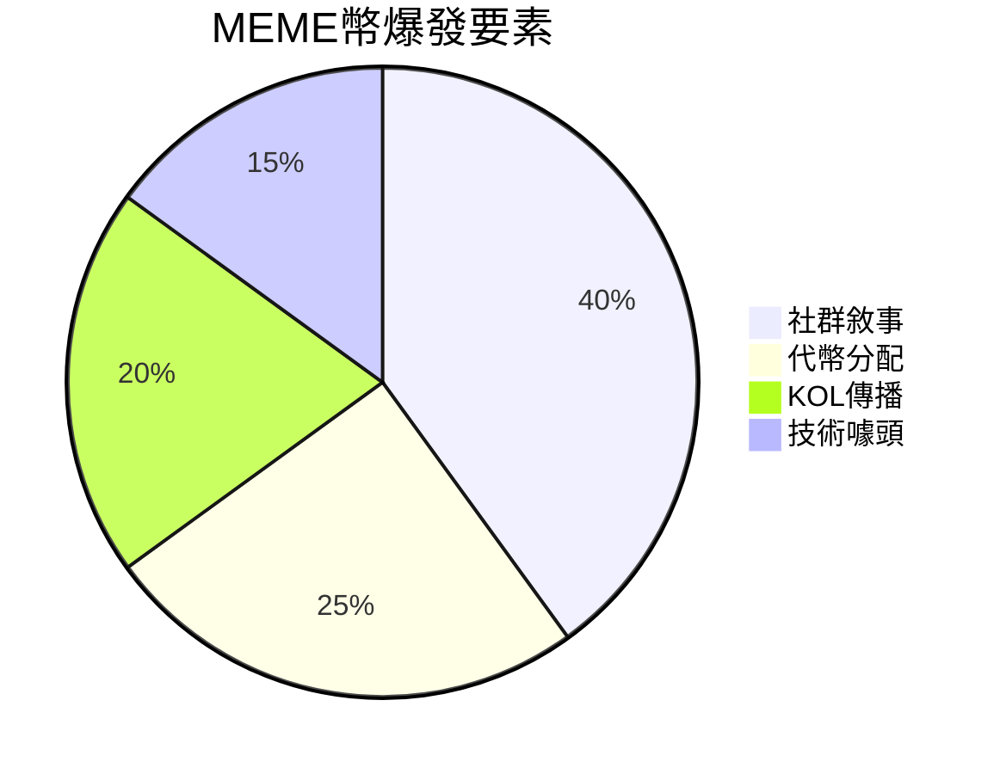

> 區塊鏈技術現在已經從單一的加密貨幣支付系統發展為涵蓋金融、藝術、組織治理和社群文化的多元生態系統。這次我們將深入解析 DeFi（去中心化金融）、NFT（非同質化代幣）、DAO（去中心化自治組織）與 MEME（模因幣）四大領域，透過典型案例剖析其核心機制，為大家提供全面的入門指南，以便更好地尋找實習相關崗位。

## 一、DeFi：去中心化金融的創新實踐

DeFi，全稱為 Decentralized Finance（去中心化金融），是基於區塊鏈技術建立的金融體系，目標是提供不依賴傳統銀行或金融中介的服務，比如借貸、交易、支付等，讓每個人都可以自由參與，無需審批、無需信任中介機構。以下是 DeFi 領域的三個典型案例：

### 1. Uniswap：去中心化交易所（DEX）

Uniswap 是去中心化交易所（DEX）的代表，由 Hayden Adams 於 2018 年創立。其核心創新在於引入“自動做市商”（AMM）模式，透過“恆定乘積公式”[+恆定乘積公式] 實現代幣定價。使用者透過存入流動性池（如 ETH 和 DAI）成為流動性提供者（LP），賺取交易手續費。
[+恆定乘積公式]: x \* y = k

::: steps

1.  ==**恆定乘積公式：x \* y = k**==

    這個公式聽起來複雜，但它的核心思想其實很簡單。我們可以把它想象成 Uniswap 是一個非常聰明的自動交易員，它透過一個簡單的數學公式來決定價格，而不依賴人工設定或市場波動。

    - **x** 和 **y** 代表流動性池中的兩種加密貨幣，比如 ::token-branded:eth =24::ETH 和 ::token-branded:usdc =24::USDC。
    - 比如一個流動性池裡，假設有 10 個 ETH 和 5000 個 USDC。那麼：
      ::: center
      x = 10（ETH）
      y = 5000（USDC）
      :::
      公式如何工作？

    - 恆定乘積公式就是 **x \* y = k**，其中 **k** 是一個常數。
      ::: center
      10 \* 5000 = 50,000（這就是 k 的值）
      :::
      當你在這個池子裡進行交易時，這個公式始終要保持成立。也就是說，交易後，ETH 和 USDC 的數量會發生變化，但它們相乘的結果 **k** 必須始終是 50,000（忽略手續費的情況下）。

    ::: note 舉個例子：

    - 如果你想用 1 個 ETH 兌換 USDC，流動性池中的 ETH 數量就會增多，而 USDC 的數量就會減少。
    - 假設交易後，池中的 ETH 變成了 11 個，那麼為了保持公式成立，USDC 數量需要調整到 4545.45 個（50,000 \/ 11 = 4545.45）。
    - **具體兌換價格計算**：
      - 交易前：10 ETH，5000 USDC
      - 交易後：11 ETH，4545.45 USDC
      - 你用 1 ETH 兌換到了 5000 − 4545.45 = 454.55 USDC（不考慮手續費的情況）
      - **兌換價格 = 454.55 USDC / 1 ETH = 454.55 USDC per ETH**（低於交易前現貨價 500，體現了價格衝擊）
    - 這樣，Uniswap 就能自動算出兌換的價格，而且隨著池子中資產比例的變化，價格也會自動調整。
      :::
      Uniswap 透過這個公式，自動決定每個交易的價格和兌換率。它確保報價由池儲備比例決定並連續調整；當交易規模相對池子較大時，會出現明顯滑點。

2.  ==**流動性池和流動性提供者（LP）**==

    流動性池是 Uniswap 交易的核心。它是由很多使用者共同提供的資金池，用於交易中的兌換。你不再需要透過一箇中心化的交易所來等待配對和匹配訂單。你只需要加入流動性池，Uniswap 就會根據池子裡的資金自動幫助你完成交易。

    **那流動性提供者（LP）是如何賺錢的？**

    - 當你把資金存入流動性池時，你成為了流動性提供者（LP）。每當別人進行交易時，你提供的資金就會被用來進行兌換。
    - LP 在每次交易中都會收取一定的 **交易手續費**（我們以 0.3% 為例）。這些手續費會根據你在流動性池中提供的資金比例進行分配。

    ::: note 舉個例子：

    - 假設該 ETH/USDC 流動性池目前總儲備為 10 ETH 和 5000 USDC（約 500 USDC/ETH）。如果有人用 1 ETH 兌換 USDC，以 0.3% 手續費計算，手續費為 0.003 ETH，有效輸入為 0.997 ETH，在恆定乘積 AMM 下，本次交易輸出約 453.31 USDC。
    - **具體收益計算（簡化）**：
      - 手續費是以輸入代幣計價（這裡是 ETH），直接留在池子裡分給 LP
      - 交易手續費：1 ETH × 0.3% = 0.003 ETH，按照 500 USDC / ETH 的價格，手續費價值 1.5 USDC
      - 如果你佔池子 10% 的流動性份額，你獲得的手續費收入：0.003 ETH × 10% = 0.0003 ETH
    - 當然，實際情況會因為池子大小、交易量、市場波動等因素而不同，這裡只是一個簡化的例子。
    - 註：此例僅展示「手續費如何產生與分配」。 LP 的真實收益也會受到無常損失、交易量、價格波動、Gas 成本等影響。
      :::

3.  ==**去中心化 vs. 中心化交易所的好處**==

    去中心化交易所（DEX）相比於傳統的中心化交易所（如幣安、火幣等），有很多優勢。最重要的幾點包括：

    | 特點                         | 去中心化                                                                                                                     | 中心化                                                                                             |
    | ---------------------------- | ---------------------------------------------------------------------------------------------------------------------------- | -------------------------------------------------------------------------------------------------- |
    | **交易不需要中介，快速方便** | 你直接用自己的錢包進行交易，不需要像中心化交易所那樣註冊賬戶、上傳身份證等繁瑣步驟。                                         | 需要透過一個平臺來進行配對和交易，往往存在人工稽核、系統延遲等問題，交易可能比較慢。               |
    | **24/7 全天候交易**          | 無論你身在何處，任何時候都能進行交易。沒有交易時間的限制。                                                                   | 通常會受到全球市場交易時間、伺服器維護等因素的影響。尤其是某些交易所還可能進行系統升級或停機。     |
    | **大額交易更便捷**           | 你不需要等待層層審批，特別是對於一些大額資金的交易，完全依賴智能合約和流動性池來完成。所有交易都直接在鏈上進行，快速而高效。但大額交易可能滑點更高。 | 大額資金的交易通常需要透過銀行、金融機構等審批環節，可能還要經過反洗錢審查等複雜的程式，時間較長。 |

:::

### 2. Compound：去中心化借貸協議

Compound 是一個去中心化的借貸平臺，允許使用者借入或借出加密資產。由 Robert Leshner 於 2017 年建立，Compound 利用智能合約和去中心化金融 (DeFi) 的理念，徹底改變了傳統借貸模式。使用者在平臺上存入資產並獲得相應的 **cToken**，這是一種代表使用者在協議中存入資金的代幣。使用者可以透過這個代幣賺取利息，同時也可以借入其他資產，但需要提供超額擔保。

::: steps

1. ==**流動性挖礦與利息收入**==

   - 使用者將自己的資產（如 ETH、DAI）存入 Compound，便能獲得 cToken。比如，如果你存入 1 個 ETH，系統會給予你相應的 cETH 代幣。
   - 利息是根據實時市場動態決定的，平臺採用動態利率模型。當借貸需求增加時，利率會上升，反之則會下降。

2. ==**借貸模式與超額抵押**==

   - 使用者在借入資產時，必須提供超額的擔保。例如，如果小明想借出 2000 美元的 USDC，那麼他需要抵押超過等值的資產（如 ETH）。
   - 如果市場波動導致抵押資產的價值低於借款要求（例如小明抵押的 ETH 被市場價格大幅波動），Compound 會觸發 ==**強制清算**=={.danger}，即強制賣出部分抵押資產來償還貸款。

::: note **舉個例子**

小明手上有 5 個 ETH，但他需要 2000 美元現金。他可以把這 5 個 ETH 抵押到 Compound，系統會根據市場情況發放相應的 USDC（比如 2000 美元等值的 USDC）。透過這種方式，小明可以獲得所需的資金，而不必賣掉自己的 ETH。

**重要：關於價格變化的影響**

- 小明需要償還的 USDC 數量是固定的（2000 USDC + 利息），不會因為 ETH 價格上漲而改變
- 如果 ETH 價格上漲，小明其實賺了：他用價值更高的 ETH 作為抵押，但償還的 USDC 數量不變
- 如果 ETH 價格下跌過多，可能會觸發強制清算，系統會自動賣出部分 ETH 來償還貸款

**具體例子**：

- 抵押時：ETH 價格 $2000，抵押 5 ETH（價值 $10,000），借出 2000 USDC
- 價格上漲後：ETH 價格 $3000，抵押物價值 $15,000，但仍只需償還 2000 USDC + 利息
- 這樣小明既獲得了流動性，又享受了 ETH 價格上漲的收益

透過這種機制，Compound 不僅為借款人提供流動性，也為存款人提供利息回報。整個過程都由智能合約自動執行，極大地提高了效率和透明度。
:::

### 3. MakerDAO（現已更名為 Sky）：穩定幣系統

MakerDAO 是一個去中心化的借貸協議，它允許使用者透過超額抵押資產來生成 **DAI**，一種與美元掛鉤的穩定幣。DAI 的價值穩定在 1 美元左右，因此可以作為一個避險工具或支付手段。MakerDAO 透過智能合約管理抵押資產，並利用 **穩定費率** 來調整系統中 DAI 的供需關係。

::: info 品牌更新
**2024 年品牌升級**：MakerDAO 已正式更名為 **Sky**，並推出了新的代幣體系。DAI 穩定幣升級為 **USDS**（Sky Dollar），MKR 治理代幣升級為 **SKY**。雖然品牌煥新，但其核心的超額抵押穩定幣機制保持不變。使用者可以選擇繼續使用 DAI，也可以升級到 USDS 享受更多功能。
:::
::: steps

1. ==**超額抵押生成 DAI**==

   在 MakerDAO 中，使用者可以將其資產（如 ETH、BAT 或其他加密貨幣）抵押到系統中，並透過智能合約生成與美元掛鉤的 DAI 穩定幣。生成 DAI 時，使用者的資產需要超額抵押，例如使用者必須將價值 2 美元的資產抵押，才能生成 1 美元的 DAI。

2. ==**穩定費率與清算機制**==

   - 為了確保 DAI 穩定，MakerDAO 使用 **穩定費率** 來調節市場。穩定費是使用者在還款時需要支付的利息。這一機制幫助 MakerDAO 控制 DAI 的供應量，避免其脫離 1 美元的目標價格。
   - 如果抵押資產的價值下降，且使用者的抵押率低於系統設定的安全閾值，系統會觸發 **清算**，自動將抵押資產出售以償還債務，防止系統破產。

::: note **舉個例子**

假設小明持有很多 ETH，但他擔心市場波動，想換成一個更加穩定的資產。他可以將 1 個 ETH（價值約 3500 美元）抵押到 MakerDAO，並生成 2000 個 DAI（1 DAI ≈ 1 美元）。這 2000 個 DAI 可以用於消費、投資或存款。當小明希望取回 ETH 時，他只需要償還 2000 個 DAI 和相關的穩定費，系統將退還給他 1 個 ETH。

Sky（原 MakerDAO）的這種超額抵押和去中心化的穩定幣生成機制，不僅為使用者提供了資金的靈活性，還為加密市場提供了一個相對穩定的貨幣單位。
:::

## 二、NFT：數字所有權的革命

### 1. **NFT 的本質：數字資產的唯一性和所有權**

傳統的數字檔案（如圖片、影片、音訊）可以被無限複製，這就導致了“所有權”變得模糊。比如，你在網上下載了一張圖片，雖然你擁有它的副本，但原始的“所有權”屬於創作者或某個授權的主體。

而 NFT 透過區塊鏈技術解決了這一問題。每個 NFT 代表一個唯一的數字資產，並且在區塊鏈上存有不可篡改的記錄。**區塊鏈技術**的核心特點是，它是一種去中心化、公開透明的賬本，所有交易和所有權資訊都被記錄在上面。因此，透過 NFT，你不僅可以擁有數字檔案的“副本”，而且可以擁有它的**唯一性和所有權**，這一點無法被複制或篡改。

### 2. **智能合約：自動化的所有權轉移和交易**

NFT 背後的另一項重要技術是**智能合約**。智能合約是一種自執行的協議，意味著合約中的條款在滿足特定條件時會自動執行，而無需第三方中介。這些合約不僅能確保交易的安全性和自動化，還能賦予 NFT 一些特別的功能。

例如，在 NFT 交易中，智能合約可以設定當你轉售該 NFT 時，原作者會自動獲得一定比例的轉售收入（這被稱為“版稅”）。這個過程是自動化的，根本不需要依賴傳統的藝術經紀人或拍賣行。

下面介紹兩個實際的 NFT 案例：

### 3. **CryptoPunks：NFT 的先鋒**

CryptoPunks 可以被看作是 NFT 歷史中的“先驅者”。由 Larva Labs 於 2017 年建立，CryptoPunks 是一系列由 10,000 個畫素風格的頭像組成，每個頭像都有其獨特的屬性（如不同的髮型、眼睛、面部特徵等）。這些頭像一開始並未得到廣泛重視，但隨著 NFT 和加密貨幣市場的崛起，CryptoPunks 成為了最早的 NFT 收藏品之一，並且逐漸形成了專屬的社群和文化。

透過區塊鏈，這些 CryptoPunks 的所有權和歷史交易都得到了記錄，任何人都可以驗證某個 Punk 是否屬於你，也能看到它的歷史交易價格、所有者等資訊。

### 4. **OpenSea：NFT 交易的中心**

OpenSea 是目前全球最大的 NFT 交易平臺，基本上覆蓋了所有主流 NFT 的交易。它與傳統的藝術品拍賣平臺（如 Sotheby’s）不同，OpenSea 透過區塊鏈技術讓任何人都能輕鬆買賣 NFT。使用者不僅可以在 OpenSea 上買賣 CryptoPunks、Bored Ape Yacht Club（另一大知名 NFT 專案）等，還能建立自己的 NFT 併發布在平臺上。

OpenSea 的創新在於，它不僅僅是一個交易平臺，它的基礎設施使得 NFT 能夠快速流通，所有權記錄透過區塊鏈系統得到確認和傳遞。你不再需要透過傳統的金融系統，而是可以直接用加密貨幣（如以太坊）進行交易。

## 三、DAO：去中心化自治組織的崛起

::: card
想象一下，如果你和一群志同道合的朋友，不用任何老闆，也不需要複雜的公司結構，透過投票、分享資源，共同決定一個組織的未來——這就是 DAO 的核心理念。

DAO（Decentralized Autonomous Organization，去中心化自治組織），不依賴傳統的公司架構，而是透過智能合約和社群投票來做決策。它不需要一個管理層，所有事情都由持有代幣的社群成員共同治理，公開透明，沒有什麼事情可以揹著大家，尤其是利益分配相關的問題。
:::

### 1. Nouns DAO：社群驅動的 NFT 藝術 DAO

Nouns DAO 就像是藝術和區塊鏈的結合體，每天都會生成一個獨一無二的 NFT —— 一個卡通小人頭像。這些頭像會透過拍賣出售，所有的收益都會存入 DAO 的金庫。

持有 Nouns NFT 的人不僅僅是收藏者，還能參與組織的決策。比方說，你可以投票決定 DAO 要用這些資金做什麼：是不是資助一個有創意的開源專案？還是做一個線下活動？這些決定都由大家一起討論和投票決定，完全靠社群力量。

有點像你和朋友們搞一個共同的藝術收藏專案，每個人都有發言權，大家一起決定專案的走向，而每個人透過持有 NFT 的方式，都能分享到這個過程的樂趣。

### 2. LXDAO：支援 Web3 公共物品的建設者

LXDAO 是一個特別專注於 Web3 公共物品的專案。Web3 是一種更自由、更去中心化的網際網路形態。LXDAO 透過支援開源專案、資助創新專案，推動這一理念的實際落地。

它的運作方式有點像是一個“工會”加“獎勵平臺”。大家根據興趣和專長，承擔不同的任務。完成任務後，你會獲得相應的獎勵。每個社群成員都可以自發的組織或者發起一些倡議，獲得大家的討論和反饋，如果確認對社群有幫助，則會得到社群的支援一起做出來。

可以把它想象成一個遠端工作的組織，每個人都能透過貢獻自己的時間和技能，幫助建設一個去中心化的未來。最棒的是，這個組織不僅僅是“做事”，而且有公平的機制獎勵貢獻者。這些也都是基於區塊鏈和智能合約實現的。

### 3. ConstitutionDAO：一場瘋狂的拍賣

在 2021 年，**ConstitutionDAO** 成為了全球關注的焦點。這群人大膽設想——如果大家齊心協力，是不是能合力購買一份《美國憲法》的原稿？聽起來像是個瘋狂的想法，但他們真這麼做了。

ConstitutionDAO 透過幾萬人共同參與，成功籌集了 **4700 萬美元**，準備在拍賣中競爭。這份《美國憲法》原件被拍賣出來，成為了一個具有歷史意義的物品，而他們的目標就是讓普通人有機會共同參與購買，而不是由傳統的博物館或私人收藏家壟斷。

不過，最終他們沒有成功競標到憲法副本，這個事件仍然展現了 DAO 的巨大潛力——不僅僅是小專案，DAO 的形式也能讓大眾共同參與到那些傳統上只能由少數人決定的重大事項中。在瞬間從全地球人手中募集 4700 萬美元來實現某個目標也體現了 DAO 來解決問題的巨大潛力。

然而，這場拍賣也暴露了 DAO 的一個**缺點**：過於公開透明的結構讓其他競標者能夠輕易瞭解你的出價情況。例如，其他拍賣方可能提前知道了 ConstitutionDAO 的籌集金額，他們可以輕鬆在拍賣結束前稍微提高出價，就能拿下憲法副本。這種資訊不對稱，讓 DAO 在競爭中處於了劣勢，最終沒有如願以償。

這也讓我們看到，DAO 雖然有無限潛力，但在操作上還是需要克服一些問題，比如如何保護參與者的隱私和資金安全，避免過多的外部干擾。儘管如此，ConstitutionDAO 的嘗試依然為 DAO 模式開闢了新天地，也為未來的去中心化集體行動提供了寶貴的經驗。

這場拍賣不僅僅是為了獲得一個歷史文物，它也讓人們開始重新思考，DAO 不再只是“虛擬貨幣”或“小眾專案”的代名詞，甚至有可能成為打破傳統精英控制、讓大眾參與重大歷史事件的全新方式。

## 四、MEME：文化與投資熱潮

MEME 原意為“迷因”，即網路文化中的梗、表情包、搞笑段子等。在加密圈，MEME 通常指那些以網路文化為基礎的代幣，比如 DOGE（狗狗幣）、PEPE（青蛙幣）、SHIB（柴犬幣）等。

MEME 幣的特點通常是“有趣、搞怪、社群驅動”，它們往往缺乏明確的技術價值，但透過強大的社群共識和文化認同獲得價值。2024-2025 年，MEME 幣市場出現了新的特點：**公平發射**（Fair Launch）、**社群自治**和**實用性整合**成為新趨勢。

::: warning 投資風險提醒
MEME 幣具有極高的投機性和波動性。價格可能在短時間內暴漲暴跌，投資者應謹慎評估風險，僅投入能夠承受損失的資金。在本書中僅作展示和介紹，不鼓勵和引導投機行為。
:::

### 1. ::token-branded:doge =30::DOGE：MEME 幣的開山鼻祖

DOGE 借用了“狗狗”表情包形象。2021 年，特斯拉 CEO 埃隆·馬斯克（Elon Musk）透過推特頻繁提及 DOGE，甚至宣佈特斯拉接受 DOGE 支付，推動 DOGE 市值突破 800 億美元。

但後來馬斯克的態度發生變化，特斯拉暫停接受 DOGE 支付，並且他在節目中表示對加密貨幣的複雜態度，導致 DOGE 價格大幅波動。這種依賴名人效應的模式讓投資者在市場情緒波動中成為“接盤俠”。

DOGE 代幣高度集中，少數大戶掌控價格，散戶投資者面臨著極大的被操控風險。

### 2. ::token-branded:pepe =30::PEPE：社群驅動的 MEME 幣

PEPE 基於“悲傷青蛙”形象，發行總量高達 420.69 萬億枚。2024 年市值突破 58 億美元，成為 MEME 幣“戰神”。

### 3. 新手如何規避 MEME 幣風險？

::: steps

1.  **警惕“無實際價值”的炒作**

    - MEME 幣通常缺乏技術支援或應用場景（如 DOGE 的“支付功能”從未普及），其價格完全依賴市場情緒，極易遭遇暴跌風險。
    - **教訓**：例如在 2024 年，《黑神話：悟空》遊戲爆火時，多個“悟空”概念的 MEME 幣上線，但迅速崩盤，無人問津，投資者最終損失慘重。
       
       

2.  **拒絕盲目跟風**

    - 名人效應（如馬斯克）、政治事件（如特朗普）可能短期內推動價格飆升，但這種效應不具備持續性。
    - **教訓**：TRUMP 幣在 2025 年初因為政治事件引發市場暴漲後，最終跌回原點，散戶遭遇重大損失，XBIT 平臺透過熔斷機制保護了部分使用者資產。
       
       

3.  **關注鏈上資料透明度**

    - 專案方是否公開代幣分配、核心地址資訊？如果代幣高度集中，可能會被少數大戶操控價格，導致投資者虧損。
    - **教訓**：SEC 對匿名交易的監管直接導致多個 MEME 幣專案的停擺，說明缺乏透明度的專案潛藏巨大的風險。
       
       

4.  **分散投資，控制倉位**

    - 即使你選擇參與 MEME 幣投資，也要嚴格控制風險，將資金控制在總持倉的 10% 以內，避免單一投資帶來過大風險。
    - **資料參考**：2025 年 6 月，MEME 幣市場的總市值突破 624 億美元，但其中 75% 的專案都是在過去一年內建立的，泡沫風險極高。

:::

## 五、交叉創新領域

隨著 Web3 技術的發展，各個細分領域開始相互融合，產生了許多創新應用。這些跨領域的組合不僅拓展了單一技術的應用邊界，還創造了全新的商業模式和使用者體驗。

### 1. ==DeFi + NFT：數字資產金融化=={.important}

**NFT 抵押借貸**是這個領域最典型的應用。傳統上，NFT 作為非同質化代幣流動性較差，持有者很難在不出售的情況下獲得流動性。DeFi + NFT 的結合解決了這個問題。

::: steps

1. **BendDAO 的 P2Pool 模型**

   - **核心機制**：使用者可以將藍籌 NFT（如 BAYC、CryptoPunks）作為抵押品，從流動性池中借出 ETH
   - **價格發現**：透過 Floor Price 預言機實時獲取 NFT 地板價，確定可借貸金額
   - **風險控制**：設定清算閾值，當 NFT 價值下跌到危險水平時自動拍賣
   - **實際應用**：如果你持有一個價值 100 ETH 的 BAYC，可以抵押獲得約 40 ETH 的流動性，同時保持 NFT 所有權

2. **碎片化流動性解決方案**

   - **Sudoswap 的 AMM 改進**：將 Uniswap 的 AMM 模型應用到 NFT 交易，建立 NFT 流動性池
   - **價格曲線**：透過 Bonding Curve 演算法自動調整不同稀有度 NFT 的價格
   - **使用者體驗**：買家可以像在 Uniswap 兌換代幣一樣購買 NFT，無需等待賣家匹配

:::

### 2. ==DAO + MEME：社群文化與治理融合=={.important}

**MEME 幣與 DAO 治理**的結合創造了一種全新的社群組織形式，既保持了 MEME 文化的趣味性，又具備了實際的治理功能。

::: steps

1. **社群代幣分發創新**

   - **FriendTech 的 Key 機制**：
     - 使用者透過購買 KOL 的“Key”獲得私聊許可權和收益分成
     - Key 價格隨供需變化，形成社交影響力的金融化
     - 持有者可以參與該 KOL 的社群決策，如內容方向、合作專案等
   - **具體運作**：比如某個 Crypto KOL 發行了 1000 個 Key，早期支持者以 0.1 ETH 購買，隨著影響力增長，Key 價格上漲到 1 ETH，持有者既獲得了經濟收益，也獲得了社群話語權

2. **MEME 幣社群治理模式**

   - **Shiba Inu 的 ShibaSwap**：不僅是交易協議，還是社群治理平臺
     - SHIB 持有者可以投票決定協議升級、新功能開發、合作伙伴選擇
     - 透過“Doggy DAO”機制，社群成員提交提案，全民投票決定發展方向

3. **創新應用場景**

   - **Nouns DAO**：每天拍賣一個新的 Noun NFT，收益進入 DAO 金庫
     - 持有者可以提案使用資金，如資助創意專案、舉辦活動、開發工具
     - 將 MEME 文化（有趣的畫素頭像）與嚴肅的治理相結合

:::

### 3. ==AI + DeFi：智慧化金融服務=={.important}

**人工智慧與去中心化金融**的結合正在創造更智慧、更高效的金融服務體驗。

::: steps

1. **智慧投資策略**

   - **Yearn Finance V3**：整合 AI 演算法最佳化收益策略
     - 分析鏈上資料，預測最優收益農場時機
     - 自動調整資產配置，最大化使用者收益
   - **dHEDGE Protocol**：AI 管理的去中心化基金
     - 基金經理使用 AI 模型制定投資策略
     - 投資者可以跟投表現優秀的 AI 策略

2. **風險管理與預測**

   - **Gauntlet**：為 DeFi 協議提供 AI 風險管理服務
     - 實時監控協議風險引數，如抵押率、清算閾值
     - 透過機器學習預測市場波動，提前調整引數
   - **Chaos Labs**：AI 驅動的協議安全審計
     - 模擬各種極端市場情況，測試協議韌性
     - 為協議提供動態風險評估報告

3. **使用者體驗最佳化**

   - **1inch 的 AI 路由**：智慧尋找最優交易路徑
     - 分析數百個 DEX 和流動性池
     - 考慮 Gas 費用、滑點、MEV 等因素
     - 為使用者提供最優交易方案
   - **Zapper.fi**：AI 驅動的 DeFi 組合管理
     - 自動識別使用者的 DeFi 倉位和收益情況
     - 提供個性化的策略建議

:::

::: card
這些跨領域的創新不僅展示了 Web3 技術的可組合性，也為使用者創造了更豐富的應用場景。隨著技術的不斷發展，我們預計會看到更多領域的融合創新，如 Social + DeFi、IoT + Blockchain 等。
:::

### 4. ==WEB3 + 鄉建：南塘 DAO 的探索=={.important}

> 2024 年 8 月，在 **SeeDAO** 的持續推動與 **LXDAO** 的孵化支援下，一群年輕人相聚在安徽省阜陽市南塘興農合作社，成立了中國首個致力於將 Web3 落地於鄉村的組織——==南塘 DAO== 。
> 南塘 DAO 秉持“向鄉土求共同體之 DAO，向加密尋世界性之道”的核心理念，旨在促進鄉建與 Web3 領域的深度交流與融合，推動雙方互學互鑑。

::: steps

1.  **南塘豆：**

    南塘 DAO 在 OP 鏈上發行了 ERC20 標準的 Token ——南塘豆（代號：NT）。該代幣主要用於量化成員貢獻並作為 DAO 治理投票的憑證。鑑於南塘合作社文化大院是南塘 DAO 鄉村活動的主要基地，南塘 DAO 每月將增發相當於當月總支出的 20% 的南塘豆分配給南塘合作社（該部分南塘豆具備投票權）。

    在中國現行法律框架下，南塘豆被界定為虛擬商品，可在當地特定場景中用於交換商品與服務。**應用例項包括：** 使用南塘豆購買咖啡、果汁、午餐、社群超市商品（支付比例為 50% 人民幣 + 50% 南塘豆），或用於南塘合作社住宿消費等。其應用場景仍在持續拓展中。為便利村民適應這一新型社群貨幣，南塘 DAO 為老年人提供了社群貨幣卡片，並幫助年輕村民使用社群數字身份（詳見[南塘 DAO 相關網站：社群數字身份](app.ntdao.xyz)）。

    

2.  **鄉村共居：**

    ==**南塘合作社文化大院：**==

    我們之所以在南塘相聚，根源在於南塘興農合作社深厚的社群自治土壤。合作社的歷史可追溯至 1998 年，最初由本土農民為維護自身權益自發組織成立，成功推動了不合理政策的改變。此後，在 **溫鐵軍、劉老石** 等學者與實踐者的引領下，合作社積極融入“新鄉建運動”，實現了從維權到鄉村建設的轉型，其探索延續至今。

    南塘合作社的發展歷程蘊含著強烈的自組織精神，這種由基層社群自發凝聚力量、追求公正與發展的核心，與區塊鏈技術誕生的初衷高度契合。

    進入新時代，南塘合作社持續深化自治實踐，創新性地將羅伯特議事規則本土化為“蘿蔔白菜規則”，有效應用於村民自治與集體決策。同時，透過組織豐富的文娛活動，顯著提升了村民的精神文化生活品質，其治理模式展現出前瞻性。村民們還自力更生，親手建造瞭如今的合作社文化大院，在這裡樹立起了合作的豐碑。

    南塘 DAO 正是從南塘合作社這份寶貴的自治傳統中汲取經驗，運用區塊鏈技術，透過 DAO 這一高度契合其自治基因的組織形式，探索 Web3 與鄉村建設的深度交融。==在實踐過程中，團隊在農業生產、衛生維護、膳食自理及社群融入等基礎性環節面臨現實挑戰，這正是一個原生線上社群向線上線下協同治理模式演進時所遇到的典型課題。=={.info} 目前，社群成員正以務實的態度積極適應環境，並持續推動改進。

    ==**成都箭塔村院落：**==

    成都箭塔村院落受成都箭塔在地的吾鄉鄉村創業孵化器啟發。該專案以協商民主方式，結合非遺文化激發鄉村內生動力。箭塔村院落旨在建立一個以 DAO 形式組織的鄉創創新創業者基地，當前聚焦於非遺文化的商品化開發與社群生活內容創作。透過跨地域協作，群策群力，團隊正著力構建更完善的基礎設施，為鄉村創新創業者提供社群支援。

3.  **PGS + 區塊鏈：**

    在與生態農人的溝通中，團隊意識到生態農產品在市場上難以廣泛流通的原因在於真正做生態農業的小規模農場很難獲得中心化機構的認證。食品安全問題的解決，非單純依靠技術或中心化機構，關鍵在於重構生產關係——這正是區塊鏈技術的核心價值所在。

    因此，南塘 DAO 提出了將 ==PGS（公眾參與的社會化保障體系）=={.info} 與區塊鏈技術結合的方案。利用區塊鏈的不可篡改性，將農產品認證權力從中心化機構轉移到由一個個真實個體所組成的社群。社群推動公平田野（一個由生態農場組成的聯盟）在其社群體系中採用區塊鏈技術。目前處於系統開發與運營模式探索階段，正嘗試針對考察和實踐反饋完善具體功能。

4.  **啟蒙計劃：**

    我們組織了 Web3 用於鄉村振興案例的線上分享、面向高校鄉建夥伴的宣講團、合作開發了面向新手的 Web3book 等活動，極大擴張了鄉建領域對於 Web3 如何幫助鄉村振興的認知。

    目前已開展包括 Web3 助力鄉村振興案例線上分享、面向高校鄉建夥伴的宣講團，併合作開發面向新手的 Web3book 教材等活動，顯著拓寬了鄉建領域對 Web3 如何助力鄉村振興的認知。

5.  **鄉創計劃：**

    鄉創計劃旨在構建跨地域去中心化協作的基礎設施，以解決鄉村資源分散制約規模效應有效發揮的難題。專案初期以非遺文化的商品化開發為切入點，透過舉辦非遺藝術共創營活動，培育鄉村創新創業者社群。計劃引導青年群體深度接觸、體驗非遺文化，發掘個人與非遺的結合點，並將其轉化為可持續運營的專案。透過為社群內的青年創造者提供系統性支援，充分釋放其創造力，進而帶動鄉村發展。

:::

## 六、2025 年新興趨勢

### 1. ==**Intent-Based 交易**==

傳統的 Web3 交易需要使用者明確指定每一步操作（如選擇 DEX、設定滑點等），而意圖驅動的交易允許使用者表達目標（如“用 100 USDC 買到最多的 ETH”），由系統內不同的求解器給出報價，系統最終自動尋找最優報價對應的路徑執行。

**核心技術棧：**

- **Solver 網路**：專門的求解器競爭為使用者找到最優解決方案
- **Intent 標準化**：ERC-7683 等標準定義意圖表達格式
- **跨鏈聚合**：自動在多個鏈之間尋找最佳流動性

**代表專案：**

- **UniswapX**：基於荷蘭拍賣的意圖交易協議
- **1inch Fusion**：零 Gas 費的意圖驅動 DEX 聚合器
- **CoW Protocol**：專注 MEV 保護的批次交易協議

### 2. ==**賬戶抽象與智慧錢包**==

賬戶抽象（Account Abstraction, AA）透過 ERC-4337 標準，讓以太坊賬戶具備智能合約的靈活性，使用者無需持有 ETH 即可進行交易，支援社交恢復、批次操作等高階功能。

**核心功能：**

- **Gas 代付**：第三方可為使用者支付交易費用
- **社交恢復**：透過朋友/家人恢復錢包，而非助記詞
- **批次交易**：一次簽名執行多個操作
- **自定義驗證**：支援生物識別、多重簽名等

**代表專案：**

- **Safe**：企業級多重簽名智慧錢包
- **Argent**：移動端智慧錢包先驅
- **ZeroDev**：開發者友好的 AA 基礎設施

### 3. ==**模組化區塊鏈**==

2025 年的區塊鏈架構向模組化發展，將執行、共識、資料可用性、結算等功能分離，實現更好的可擴充套件性和可定製性。

**核心層級：**

- **結算層**：最終性和爭議解決（Ethereum L1）
- **資料可用性層**：資料儲存和檢索（Celestia、EigenDA、Ethereum Blob）
- **執行層**：交易處理和狀態轉換（Optimism、Arbitrum）
- **共識層**：區塊排序和最終確定（Ethereum PoS）

**代表專案：**

- **Celestia**：專用資料可用性層
- **Polygon CDK**：可定製的 zkEVM 部署工具
- **OP Stack**：模組化的 Optimistic Rollup 框架

### 4. ==**AI + Web3 融合**==

人工智慧與 Web3 的結合創造了新的應用正規化，從去中心化 AI 訓練到 AI 驅動的自動化交易。

**主要方向：**

- **去中心化 AI 訓練**：分散式計算資源共享
- **AI 代理**：自主執行的智能合約機器人
- **預測市場**：AI 增強的市場預測和決策
- **內容生成**：AI 創作的 NFT 和數字資產

**代表專案：**

- **Fetch.ai**：AI 代理網路
- **SingularityNET**：去中心化 AI 市場
- **Render Network**：分散式 GPU 計算網路

## 七、學習建議與職業規劃

### 對於初學者：

1. **基礎優先**：深入理解 DeFi 核心概念，而非追逐最新熱點
2. **實踐學習**：在測試網上體驗各種協議，理解使用者流程
3. **安全意識**：瞭解常見攻擊向量和防護措施

### 對於求職者：

1. **專業化發展**：選擇 1-2 個領域深入研究
2. **技術棧匹配**：根據目標崗位學習相應技術
3. **專案經驗**：參與開源專案或 Hackathon
4. **行業動態**：持續關注最新發展和監管變化

### 延伸閱讀資源：

- **技術文件**：Ethereum.org、各專案官方文件
- **研究報告**：Messari、The Block、Delphi Digital
- **播客節目**：Bankless、ETHPanda Talk

::: tip 持續學習提醒
Web3 行業發展極快，本手冊內容會定期更新。建議關注專案官方渠道獲取最新資訊，避免基於過時資訊做出決策。
:::

## ::eos-icons:application-outlined /#32b2f0::擴展閱讀

**官方文件：**

- [Ethereum.org](https://ethereum.org/) - 以太坊官方文件
- [Uniswap Docs](https://docs.uniswap.org/) - Uniswap 協議文件
- [OpenSea Learn](https://opensea.io/learn) - NFT 入門指南

**研究報告：**

- [Messari](https://messari.io/research) - 區塊鏈專案深度分析
- [The Block](https://www.theblock.co/research) - 行業資料和趨勢
- [Delphi Digital](https://delphidigital.io/research) - 加密市場研究

**中文資源：**

- [ETHPanda](https://ethpanda.org/) - 以太坊中文社群
- [LXDAO](https://lxdao.io/)

**南塘 DAO 相關網站**

- 論壇：[forum.ntdao.xyz](forum.ntdao.xyz)
- 工時記錄：[app.fairsharing.xyz/project/0x8e5B25E1b0093c3882Bd405998462a1365f21930/contribution](https://app.fairsharing.xyz/project/0x8e5B25E1b0093c3882Bd405998462a1365f21930/contribution)
- 投票治理：[snapshot.box/#/s:ntdao.eth](https://snapshot.box/#/s:ntdao.eth)
- 社群數字身份：[app.ntdao.xyz](app.ntdao.xyz)

## ::ep:avatar /#32b2f0::文章貢獻者

作者：[吃湯圓](https://x.com/web3_cty)、 [古憶](https://x.com/0xStella5607)  
排版：[Echo](https://x.com/Echo_liuchan)  
校對：[Bruce](https://x.com/brucexu_eth)、[WongSSH](https://x.com/wong_ssh)
