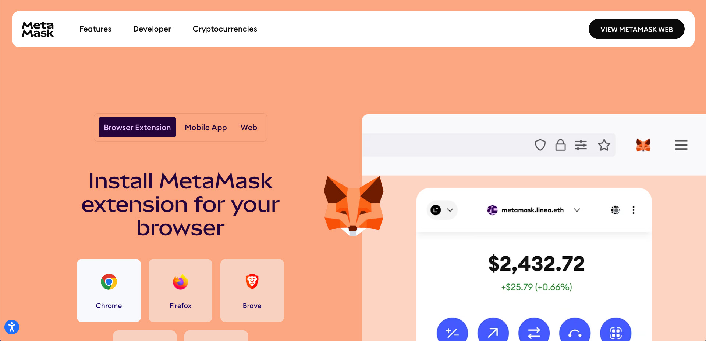
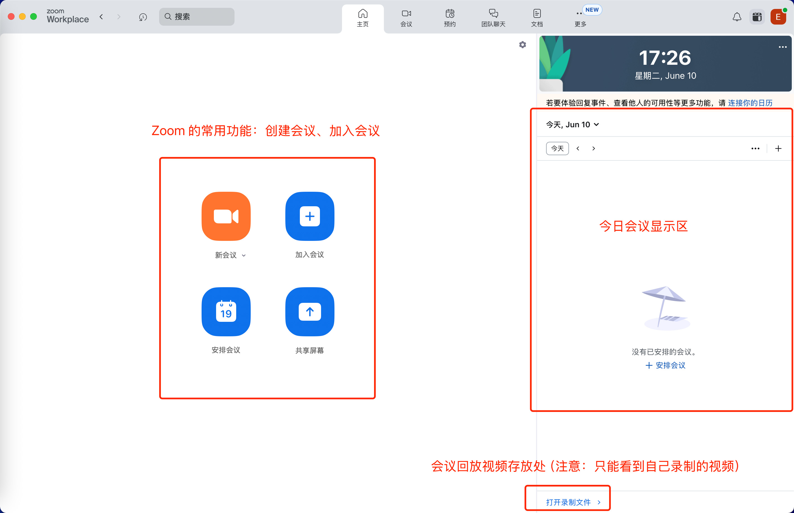
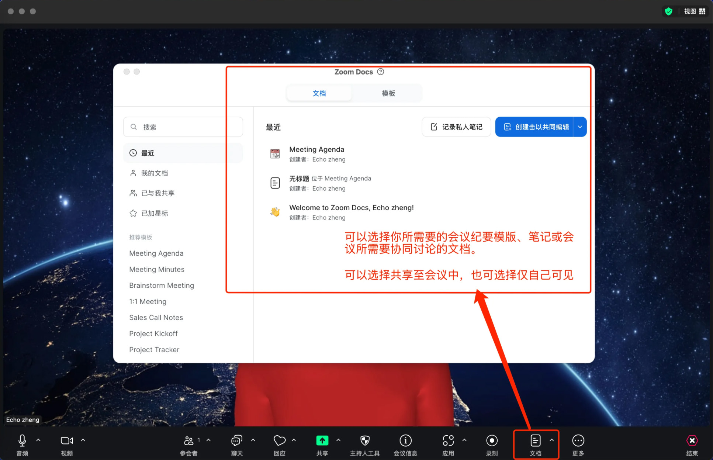
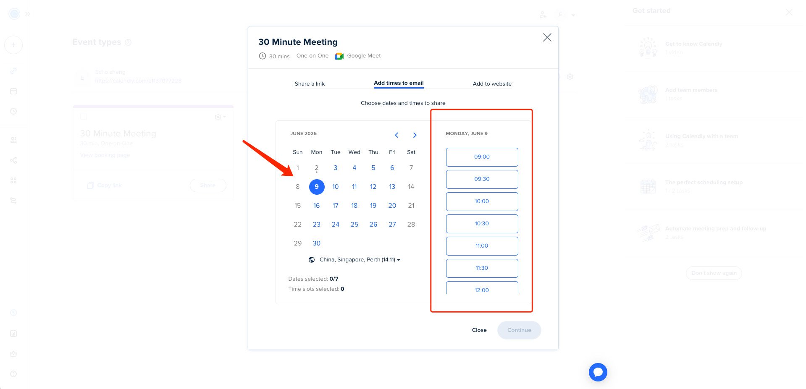
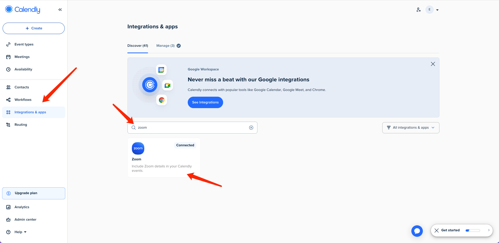
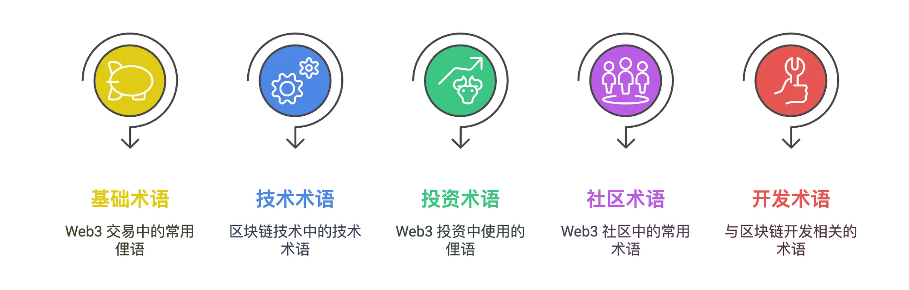

> 遠端辦公是 Web3 世界的生存法則，去中心化組織的基因決定了遠端協作的必然性。典型 Web3 團隊可能由美國的技術極客、新加坡的合規專家、東歐的智能合約開發者組成，這種地理分佈要求成員必須具備遠端協作能力。全球頂尖的 Web3 加速器如 Seed Club，其核心團隊分佈在 12 個時區，卻透過非同步溝通工具完成每週千萬美元級專案的孵化。所以提前掌握一些基礎的 Web3 工作習慣、方式會幫助你更好的適應這個行業。

## 一、Web3 常用工具及遠端辦公軟體

### 1. Twitter

::: steps

1. ==工具介紹==

   Twitter（現名 X）是一家美國的社交媒體平臺和微型部落格服務，它允許使用者釋出並互動“推文”（短文字、圖片或影片）。Twitter 是世界上訪問量最高的社交網站之一，區塊鏈和 Web3 相關專案常利用 Twitter 釋出最新動態和公告，因此成為生態交流的重要渠道。

2. ==安裝註冊指南==

   - 開啟瀏覽器，訪問 Twitter 官網：[https://twitter.com](https://twitter.com/)
   - 點選頁面上的“註冊”或“Sign up”按鈕開始新使用者註冊
   - 填寫姓名和電子郵件（或手機號）及出生日期，然後按提示點選“下一步”
   - Twitter 會向所填郵箱/手機號傳送驗證碼，輸入驗證碼後點選“下一步”
   - 設定賬戶密碼並完成註冊。如果提示透過手機號驗證，可稍後在賬號設定中新增手機號
   - Twitter 官網也提供官方桌面應用（Windows 商店或 Mac App Store），下載安裝後使用同一賬戶登入，可獲得類似網頁版的使用體驗

:::

### 2. Telegram

::: steps

1. ==工具介紹==

   Telegram 是一款跨平臺的即時通訊應用。它支援在手機、電腦等裝置上執行，使用者可透過網際網路傳送加密訊息、圖片、語音和影片等各種型別的檔案。Telegram 提供個人聊天、頻道（群發訊息）和群組功能，因其安全性高、傳輸速度快而受到開發者和區塊鏈社群的歡迎。

2. ==安裝註冊指南（以 Mac 系統為例）==

   - 在瀏覽器中訪問 [https://desktop.telegram.org](https://desktop.telegram.org)。
   - 點選“Get Telegram for macOS”下載適用於 macOS 的安裝包。
   - 開啟下載的 `.dmg` 檔案，將 Telegram 拖入“應用程式”資料夾中進行安裝。
   - 安裝完成後開啟 Telegram 應用，使用手機號登入並按照介面提示輸入驗證碼完成註冊。具體操作指南可檢視：[https://kerrynotes.com/telegram-tutorial/#google_vignett](https://kerrynotes.com/telegram-tutorial/#google_vignette) （帶常見問題回答）

3. ==Telegram 常見的使用問題==
   ::: tabs

   @tab 手機號碼隱私洩露

   問題：​ 預設情況下，註冊和使用 Telegram 需要手機號。如果隱私設定不當，這個號碼可能會被：

   - 你聯絡人列表中的所有人或部分人看到。
   - 任何知道你的手機號的人透過 Telegram 的“聯絡人同步”功能找到你的 Telegram 賬號。

   ​ 風險：​​ 手機號是極其敏感的個人資訊，洩露可能導致騷擾、垃圾資訊、被新增到不需要的群組，甚至成為其他針對性攻擊（如 SIM 卡交換攻擊）的起點。

   ​ 防範：​​

   - ​ 立即檢查並設定隱私許可權：​​ 進入 設定 > 隱私和安全 > 手機號碼。
     - 將`誰能看到我的手機號碼`設定為 ​**無人 或 我的聯絡人**​ (根據你的信任級別謹慎選擇)。
     - ​ 關鍵設定：​​ 將`誰能透過手機號碼找到我`設定為 ​**我的聯絡人 (強烈推薦)。這意味著只有你主動儲存在手機通訊錄中並同時是 Telegram 聯絡人的人**才能透過手機號關聯到你的賬號。阻止了陌生人利用你的手機號搜尋你。
   - 警惕共享二維碼或使用者名稱連結時可能間接暴露資訊 (儘量使用使用者名稱)。

   @tab ​ 釣魚資訊/詐騙 (極其常見且危險)​​

   ​ 問題：攻擊者偽裝成可信來源（Telegram 官方、朋友、招聘方、客服、投資專家等），傳送包含惡意連結或要求敏感資訊的訊息。常見誘餌：

   - 賬戶安全問題：“您的賬號存在異常活動/風險即將被封禁/需要驗證身份，請立即點選此連結登入...”。
   - 虛假福利/中獎：“恭喜您被選中獲得 Telegram 會員/禮品卡/獎金... 點選連結領取”。
   - 虛假招聘/兼職：主動聯絡你提供“高薪工作機會”，誘導你點選連結“填寫資料/面試/培訓”或下載有問題的應用。
   - 虛假好友求助：冒充你的聯絡人，聲稱需要驗證碼、金錢幫助等（通常會說手機壞了/丟了）。
   - 虛假客服：聲稱解決你的賬號問題（你根本沒提出過），索要驗證碼、密碼等。
   - 惡意檔案/應用：傳送偽裝成文件、圖片、安裝包的檔案，內含病毒或木馬。

   風險：導致賬號被盜、資金損失、惡意軟體感染、個人資訊被竊。

   防範 (核心原則：保持懷疑，永遠不輕信，不隨意點選或提供資訊)：​​

   - 官方永不私聊：​Telegram 官方 (@telegram 或 Telegram Support) 絕不會主動透過私聊訊息聯絡使用者討論賬戶問題、傳送獎品或招聘！​​ 所有官方通知只會透過系統通知頻道 (帶藍色勾認證) 釋出。
   - 警惕“需要立即行動”的訊息：釣魚資訊慣用製造緊迫感（“賬號將在 1 小時後關閉！”、“限時領取！”）讓你來不及思考。
   - ​ 仔細檢查發件人身份：​​
     - 檢視對方使用者名稱是否可疑？是真好友的常用賬號嗎？
     - 對方有`​藍色官方認證勾`嗎？（注意：普通藍勾是付費訂閱標記，​ 真正的官方賬號旁邊會明確標註為 Telegram 團隊或 Telegram Tips/Security 等）。
     - 與朋友核實：如果“朋友”求助，換一種已知可靠的通訊方式（電話、其他即時通訊工具）直接聯絡該朋友確認。
   - ​ 絕不點選可疑連結：​​ 永遠不要點選訊息中的不明連結，​ 尤其是指向非 telegram.org 域名的“登入/驗證”頁面。如果你有懷疑，手動輸入官網地址 https://telegram.org 或透過官方應用訪問賬戶設定。
   - 絕不透露敏感資訊：​​
     - ​Telegram 官方、任何銀行或正規平臺客服不會在訊息中索要：​​
       - 你的登入密碼/兩步驗證密碼。
       - ​ 簡訊驗證碼 (這是關鍵)。​​
       - 你的完整銀行卡號、CVV、有效期。
   - 不相信天上掉餡餅：​​ 對主動送上門的“高薪兼職”、“鉅額獎金”、“免費會員”保持極度警惕。
   - ​ 注意檔案字尾：​​ 不要隨意開啟或下載陌生人發來的 .exe, .apk, .bat, .scr, .jar 等可執行檔案或指令碼檔案，即使看起來像文件（如 .doc.exe）。

:::

### 3. Discord

::: steps

1.  ==工具介紹==

    Discord 是一款面向社群的免費實時聊天和語音通訊平臺。使用者可以建立或加入“伺服器”（類似社群頻道）來進行文字、語音和影片聊天。Discord 最初為遊戲玩家設計，但現已廣泛用於各種線上社群和專案討論；其豐富的頻道管理和許可權系統適合團隊協作。使用者可以在不同頻道中分享圖片、檔案，也可以進行語音通話或視訊會議。

2.  ==操作指南==

    - 開啟瀏覽器，訪問 Discord 官網下載頁面：[https://discord.com](https://discord.com/)。
    - 安裝完成後開啟 Discord，建立新賬戶或使用已有郵箱/手機號登入。
    - 官方新手指南：[https://support.discord.com/hc/zh-tw/articles/360045138571-Discord-新手指南](https://support.discord.com/hc/zh-tw/articles/360045138571-Discord-%E6%96%B0%E6%89%8B%E6%8C%87%E5%8D%97)

    

:::

### 4. MetaMask

::: steps

1.  ==工具介紹==

    ::token-branded:metamask:: MetaMask（小狐狸錢包）是一款常用的加密貨幣錢包瀏覽器擴充套件，使使用者能夠在瀏覽器中安全地訪問以太坊等區塊鏈網路中的去中心化應用。安裝 MetaMask 後，你可以在瀏覽器工具欄中看到其圖示，用於管理數字資產和身份。

    **注意安全**：務必透過官網或瀏覽器外掛商店安裝 MetaMask，不要從第三方渠道下載，避免安裝到惡意偽裝的克隆版。

2.  ==安裝註冊指南==

    - 詳細安裝、操作指南：<https://support.metamask.io/zh-cn/start/getting-started-with-metamask/>
    - macOS 使用者安裝流程與 Windows 類似：開啟 Chrome 瀏覽器，同樣透過 MetaMask 官網下載安裝擴充套件。
    - 安裝完成後登入 MetaMask 賬號，或按提示建立並備份新的助記詞錢包（與 Windows 流程相同）。
    - 如果使用 Safari 瀏覽器，請注意 MetaMask 暫無 Safari 版本，需使用支援的 Chromium 核心瀏覽器。

    

:::

### 5. LinkedIn

::: steps

1. ==工具介紹==

   LinkedIn（領英）是全球領先的職業社交平臺，專注於幫助使用者建立職業身份、拓展行業人脈、獲取求職機會以及分享專業知識。透過 LinkedIn，使用者可建立個人職業檔案，連線企業、同事和行業夥伴，並訪問海量職位招聘資訊與行業動態。

2. ==安裝註冊指南==

   - [2025 年 LinkedIn 新賬號註冊官方教程](https://www.linkedin.com/help/learning/answer/a1338223?lang=zh-CN)

   

### 6. Notion

::: steps

1.  ==工具介紹==

    Notion 是一款功能強大的線上協作平臺，將筆記、文件、資料庫和任務管理整合在一個工作區中。你可以在 Notion 中建立頁面，用於記錄專案計劃、知識庫、團隊 Wiki 等內容，並透過多種內容模組（如文字、圖片、表格）自由排版。Notion 支援多人實時協作，共享與評論功能便於團隊交流與知識積累。

2.  ==安裝註冊指南（以 Mac 系統為例）==

    - 在瀏覽器中訪問 [https://www.notion.com/desktop](https://www.notion.com/desktop)。
    - 點選“Download for macOS”下載 Mac 版安裝包。
    - 下載後，開啟 `.dmg` 檔案並將 Notion 應用拖動到“應用程式”資料夾中完成安裝。
    - 具體的工具指南請閱讀：[https://www.notion.com/zh-cn/help/guides](https://www.notion.com/zh-cn/help/guides)

:::

### 7. Zoom

::: steps

1.  ==工具介紹==

    **Zoom** 是一款廣泛使用的線上視訊會議軟體，類似於國內的騰訊會議，支援視訊會議、語音通話、螢幕共享、聊天、錄製等功能。它適用於遠端辦公、線上教育、團隊會議等多種場景。

2.  ==安裝註冊指南==

    - 具體安裝細節請參考：[https://zoom.us/zh-cn/download](https://zoom.us/zh-cn/download)
    - 安裝完成後，開啟 Zoom 客戶端：如果已有 Zoom 賬號，可點選“登入”輸入郵箱和密碼；也可使用 **Google、Apple、Facebook 或企業郵箱（SSO）** 登入。

3.  ==常用功能演示==

    

    

    

    

:::

### 8. Calendly

::: steps

1.  ==工具介紹==

    Calendly 是一款智慧日程排程工具，透過自動化預約流程提高約會效率，讓使用者輕鬆共享個人可用時間並同步管理多平臺日曆，適用於跨團隊協調會議、對外交流（如合作方、客戶）、面試安排等場景，能夠滿足 Web3 遠端工作的一些需求。

2.  ==操作指南==

    - 訪問官網：<https://calendly.com/>，用郵箱或 Google / Microsoft 賬號註冊（公司使用者建議使用公共郵箱）
    - 驗證郵箱後進入儀表盤，系統會引導完成基礎配置
    - 設定你的可預約時間段（如：工作日 9:00–17:00）
      

    - 可選擇會議型別：如 15 / 30 分鐘通話、產品演示、一對一會議、組群會議等
      

    - 自動生成預約連結，可分享給對方
      

3.  ==使用建議==

    - 預約前自動檢查衝突，避免雙重預訂
    - 支援時區自動轉換，對方看到的是自己的本地時間
    - 可整合 Zoom / Google Meet 自動生成會議連結
      

:::

### 9. Figma

::: steps

1.  ==工具介紹==

    Figma 是一款基於瀏覽器的向量設計工具，支援 UI/UX 設計、原型製作與團隊實時協作。支援實時協作，可多人同時編輯同一檔案，設計稿自動儲存雲端。同時附帶 AI 增強功能，支援透過自然語言生成互動原型（Figma Make），自動生成響應式程式碼。

2.  ==使用指南==

    - Figma 官方入門指南：<https://help.figma.com/hc/en-us/sections/4403932712087-Getting-started>
    - 官方下載：<https://www.figma.com/downloads/>
      

:::

### 10. GitHub

::: steps

1.  ==工具介紹==

    GitHub 是全球最大的程式碼託管平臺，基於 Git 版本控制系統構建。它為開發者提供了一個集中的地方來儲存、管理和協作開發程式碼專案。透過 GitHub，你可以：

    - **版本控制**：追蹤程式碼的每次修改，輕鬆回滾到之前的版本
    - **協作開發**：多人同時參與專案開發，透過分支（branch）和合並（merge）功能實現並行開發
    - **程式碼審查**：透過 Pull Request 功能讓團隊成員審查程式碼變更
    - **專案管理**：使用 Issues 追蹤 bug 和功能請求，使用 Projects 管理開發進度
    - **開源貢獻**：參與全球開源專案，貢獻程式碼並學習最佳實踐

2.  ==安裝註冊指南==

    - GitHub 官方入門指南：<https://docs.github.com/zh/get-started/quickstart>
    - Git 官方安裝指南：<https://git-scm.com/book/zh/v2/起步-安裝-Git>
      

:::

## 二、遠端協作習慣

### 0. 非同步溝通與資訊留痕

遠端協作最怕「資訊只在聊天裡流動」。建議把關鍵結論沉澱到文件或 issue，並標註時區與預期回覆時間，減少重複溝通與誤讀。可參考 GitLab 的遠端溝通規範：<https://about.gitlab.com/handbook/communication/>

- 標註時區與回覆視窗（如「UTC+8，24h 內回覆」）
- 結論沉澱到文件或 issue，並附上決策依據或連結
- 會議後 24 小時內補齊紀要與行動項

### 1. OKR 寫法與最佳實踐

在遠端工作中使用 OKR（目標與關鍵結果）不僅是一種管理工具，更是解決分散式團隊核心痛點的系統性方案。遠端團隊因缺乏物理接觸易陷入目標碎片化。OKR 要求目標（Objectives）全團隊公開可見，關鍵結果（Key Results）量化可追蹤，例如位元組跳動 5 萬員工透過 OKR 系統實時檢視公司級目標到個人 KR 的完整鏈路，避免遠端協作中“各自為戰”。並且在遠端辦公中常引發管理者“失控焦慮”，而 OKR 聚焦結果產出而非工作時長。例如攜程遠端團隊設定 KR “客戶滿意度達 92% ”而非“ 每日線上 8 小時”，員工可自主安排工作節奏，效率反提升 40%。
::: steps

1. **目標設定原則**

   - **聚焦關鍵目標**：每季度設定 3-5 個目標，避免分散精力。
   - **野心與可行平衡**：目標應“令人不適但可達”，理想完成率在 60%-70%（Google 標準）。
   - **結果導向**：聚焦成果而非產出（例：“提升客戶留存率” 而非 “傳送 10 份調研”）。

2. **關鍵結果（KR）設計**

   - **遞進式量化**：避免二進位制（完成/未完成），採用里程碑式量化：

     ::: card
     目標：提升產品國際化能力

     KR1：完成 3 個語言版本開發（40%）

     KR2：使用者測試透過率 ≥90%（70%）

     KR3：新市場使用者增長 25%（100%）

     :::

   - **SMART 標準**：確保 KR 可衡量、有時限（例：“Q3 北美市場營收增長 15%”）。

3. **評分與覆盤**

   - **評分規則**：5 分（卓越貢獻）→ 1 分（完成度 ＜ 50%）；
   - **覆盤要點**：分析低分 KR 原因（目標過高/資源不足），高分則反思挑戰性是否不足。

   _表：OKR 評分標準參考_

   | **得分** | **完成度** | **意義**       |
   | -------- | ---------- | -------------- |
   | 1.0      | 100%+      | 目標過於簡單   |
   | 0.7      | 70%        | 理想挑戰水平   |
   | 0.3      | 30%        | 需重新規劃策略 |

4. **智能合約團隊 OKR 示例**
   ::: card
   **Objective** : 提升協議安全性至機構級標準

   **Key Results** :

   - [ ] 透過 Certora 形式化驗證（主網部署前）
   - [ ] 漏洞賞金計劃覆蓋率 100%（Immunefi 平臺）
   - [ ] 平均審計發現項 ≤2 個（對比 OpenZeppelin 基準）

:::

### 2. 遠端會議注意事項

#### 2.1 如何預約遠端會議

1. **明確目標**
   - 會議目的：明確會議議題、期望輸出（如：決策、同步資訊、頭腦風暴等）
   - 參與人：邀請關鍵決策者或資訊相關人，避免冗餘參會；明確回覆的截止時間（如：24 小時內回覆）
   - 預計時長：根據議程合理控制會議時長（15/30/60 分鐘）
2. **使用日曆工具（Google Calendar / Outlook Calendar）**
   - 建立事件：
     - 標題應簡潔明瞭（如：Weekly Sync、產品評審會）
     - 新增會議描述（議程、會議連結、預閱讀材料）
     - 設定提醒（提前 10~30 分鐘）
   - 新增參與者郵箱：自動傳送會議邀請與提醒
   - 注意時區設定：確認所有與會者的時區正確識別
   - 嵌入視訊會議連結（如 Google Meet、Zoom）方便直接在 Calendar 上面開啟
3. **推薦時間的技巧**
   - 避開：中午用餐時間、當地清晨或深夜
   - 儘量安排在團隊 "工作核心時段"（Overlapping Hours）
   - 使用"建議時間"功能：Google Calendar 會自動匹配參會人的可用時間

#### 2.2 會議中的注意事項

1. **溝通禁忌**
   - ❌ 傳送模糊需求（如“請儘快處理”）；
   - ✅ 改為：“需在 **6 月 10 日 18:00 UTC+8 前**提交方案，參考**附件 A 資料模板**”
2. **決策痕跡留存**
   - 準備會議紀要，關鍵結論標紅加粗
   - ✅ 決策事項 + 行動項明確 **DRI**（直接責任人）+ **Deadline**（精確到時區）

### 3. 職場軟技能

#### 3.1 排版的知識

1. **字型選擇**

   - **數量控制**：全文不超過 3 種字型（標題+正文+強調），否則顯亂。
   - **場景匹配**：
     - 正式報告 → 黑體
     - 輕鬆文案 → 微軟雅黑/思源柔黑

2. **間距是呼吸感的關鍵**
   - **行間距**：1.5 倍行距（12 磅字用 18 磅行距），避免文字窒息。
   - **段落間距**：段前段後空 0.5 行（約 6-8 磅），用按`Enter`空一行太粗暴。
   - **頁邊距**：預設 2.54 釐米，圖文多時縮至 1.5 釐米。
      
3. **標點與空格（細節控必備）**
   - 中英文混排時加空格：
     - ✅ “在 LeanCloud 上建立 AVObject”
     - ❌ “在LeanCloud上建立AVObject”
   - 全形中文標點：用 `“”` 代替 `""`，用 `。` 代替 `.`。
   - 數字用半形：寫“500 元”而非“５００元”。
   - 詳細排版規則請參考：[https://github.com/sparanoid/chinese-copywriting-guidelines](https://github.com/sparanoid/chinese-copywriting-guidelines)

#### 3.2 效率翻倍工具技巧

- **AI 工具：**
  - ChatGPT：<https://chatgpt.com/>
  - DeepSeek：<https://chat.deepseek.com/>
  - 豆包：<https://www.doubao.com/chat/>
- **媒體工具：**
  - Iconfont 阿里巴巴向量圖示庫：<https://www.iconfont.cn/>
    - 包含海量圖示、向量插畫、動態特性、可變字型等，是職場彙報的好幫手。
  - SmartArt 一鍵圖表化
    - 在 Word / PPT 中選中文字 → 插入“智慧圖形” → 自動生成流程圖 / 組織架構圖。
      
  - 秀米：<https://xiumi.us/#/>
    - 圖文排版、H5 製作、圖片設計，原創模板素材，精選風格排版，獨一無二的排版方式，設計出只屬於你的圖文，打動你的人群。
  - MD2Card：<https://md2card.com/zh>
    - MD2Card 是一個簡單易用的 Markdown 轉知識卡片工具，支援多種精美風格，幫助你快速建立漂亮的知識卡片。無論是學習筆記、知識整理還是內容分享，都能輕鬆搞定。
- **Web3 常用工具：**
  - CoinMarketCap 全球最值得信賴的加密貨幣資料、洞見和社群來源：<https://coinmarketcap.com/>
  - CoinGecko 是世界上最大的獨立加密貨幣資料聚合器：<https://www.coingecko.com/>
  - DefiLlama 是 DeFi（去中心化金融）領域最大的 TVL 聚合器：<https://defillama.com/>
  - RootData 是一個 Web3 資產資料平臺：<https://www.rootdata.com/zh/Projects?influenceSort=2>
  - 媒體：
    - 律動 BlockBeats：<http://theblockbeats.info/>
    - PANews：<https://www.panewslab.com/zh>
  - 免費發推抽獎工具：<https://apidance.pro/twitter_giveaway>
  - 檢視鏈上持倉：<https://pummmm.com>
  - 檢視持幣地址、籌碼分佈：<https://bubblemaps.io/>
  - 即將啟動的加密專案 IDO、IEO、ICO 列表：<https://www.coincarp.com/zh/upcoming-ido/>

#### 3.3 注意事項

- **承諾管理法：**
  - 接任務時立即確認 3 要素：
    ::: card
    明白！週三下班前提交方案初稿（交付物），優先採用 X 框架（方向），如需調整請週四 10 點前反饋（反饋節點）。
    :::
  - 超預期交付技巧：
    ::: card
    交報告時附加"執行要點清單"，比如："此方案落地需重點監控 3 個環節：① 預算紅線 ② 法務風險點 ③ 技術依賴項"。
    :::
- **萬能彙報結構：**

  - 向上彙報：
    - 公式：進展 + 卡點 + 建議 + 需支援（例："目前完成 80%，遇到 XX 問題，我建議嘗試 A 方案，需要您協調技術組確認可行性"）。
  - 跨部門協作：

    - 提前瞭解對方 KPI（如市場部關注轉化率），用共同利益點推動合作（例："這次最佳化可能幫你們提升 XX 指標"）。
      ::: card
      【專案 xxx 進度】

      ✅ 已完成：A 模組上線（比計劃提前 1 天） 
      🚧 進行中：B 測試（完成 70%，明天下班前交付） 
      ⚠️ 卡點：C 介面許可權未獲批（已聯絡 `@李四`，最晚週四答覆） 
      🔜 下一步：週四同步測試報告（初稿已發附件） 
      :::

- **埋點式覆盤**
  - 建立**個人 SOP 庫**（如：用 Notion 存"活動策劃檢查清單"），儘量詳細記錄每一個步驟
  - 對工作留痕
  - 交接檔案包：含操作指南 / 聯絡方式 / 踩坑記錄
- **溝通案例**

  - 需求溝通模板

    - 當同事說：“這個功能儘快做出來！”
    - ❌ 回答：“現在排期滿了” → 製造對立
    - ✅ 結構化回應：
      ::: card

      - 理解需求：您需要解決 X 問題，對麼？（確認真實訴求）
      - 給選項：
        - Option A：簡化版週五交付（缺 Y 功能）
        - Option B：完整版下週三交付
      - 建議：如果急用推薦 A，我能協調資源加急

      :::

  - 衝突化解話術
    - 當被甩鍋時：
    - ❌ “這明明是你的責任！”
    - ✅ “從流程看我這部分週三已完成（附郵件截圖），目前卡在 QA 環節，咱們一起找測試負責人碰下？”
    - 要點：用事實代替情緒，拉對方成“戰友”而非對手
  - 向上溝通技巧
    - 接收模糊任務時：您希望優先保證速度還是質量？如果有參考案例更好~
    - 領導意見矛盾時：上次您提到重點控成本，這次營銷預算超標是否意味著策略調整？求確認方向

## 三、行業黑話

### 1. 基礎類

| 黑話          | 含義                                                               |
| ------------- | ------------------------------------------------------------------ |
| **DYOR**      | Do Your Own Research，投資前請自行研究，專案方常用於免責           |
| **FOMO**      | Fear of Missing Out，害怕錯過，指因貪婪而追高的情緒                |
| **FUD**       | Fear, Uncertainty, Doubt，恐慌、不確定、懷疑，指唱衰情緒或輿論攻擊 |
| **WAGMI**     | We're All Gonna Make It，大家都會發財，社群常用打氣口號            |
| **NGMI**      | Not Gonna Make It，諷刺某人/專案做法不行                           |
| **REKT**      | 被"爆錘"，損失慘重，如投資失敗、合約被黑等                         |
| **Airdrop**   | 空投，免費發放代幣以激勵使用者參與專案                               |
| **Whale**     | 加密大戶、巨鯨，能影響市場價格的人                                 |
| **Degen**     | "投機狗"，不問專案質量只衝高風險高回報機會的人                     |
| **Shill**     | 宣傳、推銷（常含貶義），如"shill 專案"指惡意安利                   |
| **Exit Scam** | 專案方跑路，攜款失聯                                               |

### 2. 技術類

| 黑話               | 含義                                                                 |
| ------------------ | -------------------------------------------------------------------- |
| **L1 / L2**        | Layer 1（主鏈，如以太坊）和 Layer 2（擴容方案，如 Arbitrum、zkSync） |
| **EVM**            | Ethereum Virtual Machine，以太坊虛擬機器，執行智能合約的核心           |
| **Smart Contract** | 智能合約，自動執行合約邏輯的鏈上程式                                 |
| **Bridge**         | 跨鏈橋，用於在多條鏈之間轉移資產                                     |
| **Oracle**         | 預言機，用於向鏈上提供鏈下資料                                       |
| **Fork**           | 分叉，指複製已有程式碼的專案，或區塊鏈協議分裂                         |
| **Mint**           | 鑄造，生成新的 NFT 或代幣                                            |
| **Burn**           | 銷燬代幣，減少總量，用於通縮機制                                     |
| **Rugpull**        | 抽地毯，專案方捲款跑路（尤其在 DeFi 專案）                           |

### 3. 投資類

| 黑話           | 含義                                            |
| -------------- | ----------------------------------------------- |
| **Pump**       | 拉盤，代幣價格快速上漲                          |
| **Dump**       | 砸盤，代幣價格快速下跌                          |
| **HODL**       | 原為"Hold"打錯，後來變成文化，意為堅定持幣不賣  |
| **Bagholder**  | "接盤俠"，高位買入虧損後長期持幣的人            |
| **Alpha**      | 內部訊息/潛在機會，表示未公開但價值潛力大的資訊 |
| **Tokenomics** | 代幣經濟學，研究代幣發行、分配、用途等機制      |

### 4. 社群與文化類

| 黑話        | 含義                                                      |
| ----------- | --------------------------------------------------------- |
| **gm / gn** | good morning / good night，Web3 社群日常打招呼方式        |
| **Anon**    | 匿名者，社群中不透露真實身份的成員                        |
| **KOL**     | Key Opinion Leader，意見領袖，影響力人物                  |
| **CT**      | Crypto Twitter，加密行業活躍的資訊與討論來源              |
| **DAO**     | 去中心化自治組織，社群驅動型的組織管理形式                |
| **NFT PFP** | NFT 頭像專案，如 CryptoPunks、BAYC，PFP = Profile Picture |

### 5. 開發類

| 黑話                         | 含義                                                 |
| ---------------------------- | ---------------------------------------------------- |
| **Hardhat / Foundry**        | 常用的智能合約開發框架                               |
| **RPC**                      | Remote Procedure Call，鏈上節點訪問介面              |
| **Gas**                      | 交易費用，以太坊中以 Gwei 計費                       |
| **Etherscan**                | 區塊瀏覽器，用於檢視合約、交易、地址資訊             |
| **Viem / Ethers.js / Wagmi** | Web3 前端互動庫                                      |
| **ABI**                      | Application Binary Interface，合約呼叫所需的介面資訊 |
| **Mainnet / Testnet**        | 主網 / 測試網，分別對應正式和測試環境                |

::: note 更多行業黑話請檢視附錄
:::

<!-- ## ::eos-icons:application-outlined /#32b2f0::擴展閱讀

[1] -->

## ::ep:avatar /#32b2f0::文章貢獻者

作者：[Echo](https://x.com/Echo_liuchan)  
排版：[Echo](https://x.com/Echo_liuchan)  
校對：[Bruce](https://x.com/brucexu_eth)
