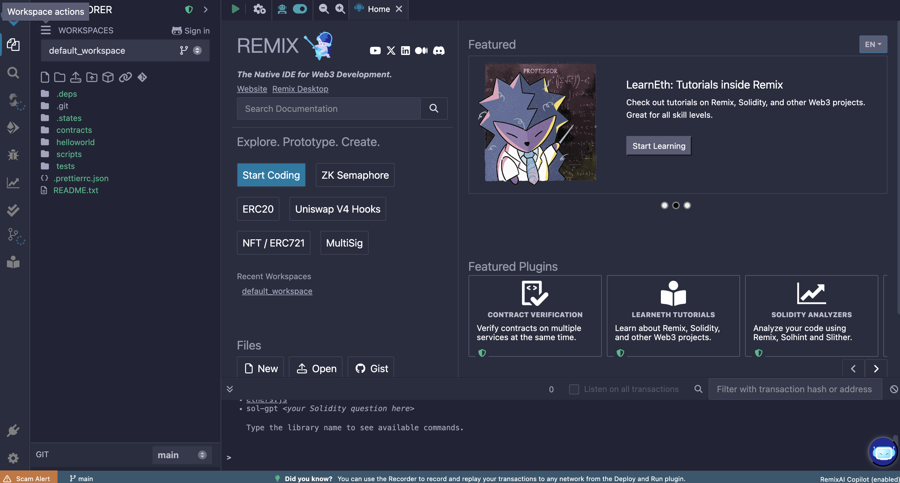
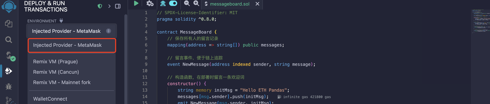
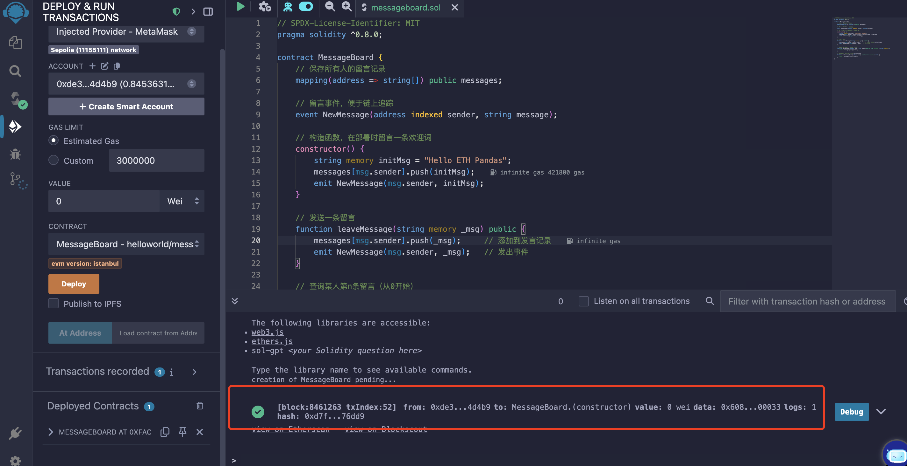
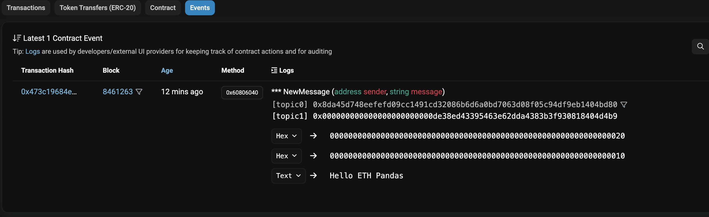
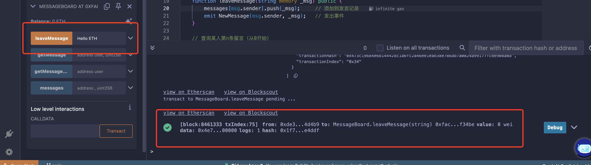

> 本章將圍繞 Web3 行業中的智能合約工程師所需的技能進行介紹，首先介紹去中心化應用（Dapp）的基本架構，重點分析其與傳統應用的不同之處。接著，我們將詳細討論開發 Dapp 的流程，從需求分析、智能合約的編寫、前端與後端的設計，到最終部署和上線，幫助讀者理解整個開發生命週期。

## 一、Dapp 架構和開發流程

去中心化應用（Dapp）是與傳統集中式應用不同的全新應用模式，通常執行在區塊鏈或分散式網路上。與傳統應用相比，Dapp 的核心特點在於去中心化，意味著應用的邏輯和資料不由單一實體控制，而是由多個參與者共同維護。因此，開發 Dapp 需要理解和掌握去中心化技術棧、智能合約程式設計以及前端與區塊鏈的互動方式。

### 1. Dapp 架構

Dapp 的架構主要由三個核心部分組成：

==1. **前端（User Interface）**：==

- 前端是 Dapp 與使用者互動的介面，通常由 HTML、CSS 和 JavaScript（如 React、Vue 等框架）構建。與傳統 Web 應用不同，Dapp 前端會連線區塊鏈來呼叫智能合約，呈現資料和執行交易。
- 前端還需要整合區塊鏈錢包（如 MetaMask）來進行身份驗證和簽署交易，確保使用者的隱私和安全。

==2. **智能合約（Smart Contracts）**：==

- 智能合約是 Dapp 的核心，它定義了應用的業務邏輯，並部署在區塊鏈上。智能合約透過執行自動化的規則來確保交易和操作的透明性與不可篡改性。
- 在以太坊平臺上，智能合約通常使用 **Solidity** 程式語言編寫，並透過 **Ethereum Virtual Machine (EVM)** 執行。

==3. **資料檢索器（Indexer）**：==

- 智能合約通常以 `Event` 形式釋放日誌事件，比如釋放代表 NFT 轉移的 `Transfer` 事件，資料檢索器會檢索這些資料並將其寫入到 PostgreSQL 等傳統資料庫中
- Dapp 在前端進行資料展示時需要檢索器內的資料。一個簡單的示例是某 NFT 專案需要展示使用者持有的所有 NFT，但是 NFT 合約並不會提供透過輸入地址引數返回該地址下的所有 NFT 的函式，此時我們可以執行資料檢索器將 `Transfer` 事件讀取後寫入傳統資料庫內，前端可以在傳統資料庫內檢索使用者持有的 NFT 資料

==4. **區塊鏈和去中心化儲存（Blockchain & Decentralized Storage）**：==

- 區塊鏈用於儲存智能合約的狀態資料及交易記錄。去中心化儲存如 **IPFS**（InterPlanetary File System）或 **Arweave**，用於儲存大規模的非結構化資料（如圖片、文件等），確保資料不易丟失和篡改。
- 透過使用去中心化儲存，Dapp 確保所有資料在多個節點上備份，保證資料的永續性和去中心化特性。

### 2. Dapp 開發流程

Dapp 的開發流程可以分為以下幾個階段：


::: steps

1.  **需求分析與規劃**

    在開發 Dapp 之前，首先需要進行需求分析和規劃，明確應用的目標和功能。此階段包括：

    - **確定功能需求**：需要定義使用者可以進行的操作，比如轉賬、查詢餘額、建立投票等。
    - **選擇區塊鏈平臺**：決定在哪個平臺上構建 Dapp（如以太坊、Solana、Polygon 等），這通常取決於目標使用者群、交易成本、可擴充套件性等因素。
    - **設計使用者體驗（UX）**：定義 Dapp 的介面設計和互動流程，確保使用者能夠輕鬆使用應用並與區塊鏈互動。

2.  **智能合約開發**

    智能合約是 Dapp 的核心，負責執行去中心化的業務邏輯和儲存重要的資料。在這一階段，開發者需要：

    - **編寫智能合約**：使用 **Solidity** 或其他智能合約語言編寫合約，確保合約的功能滿足需求分析中定義的要求。
    - **編寫測試用例**：為智能合約編寫單元測試，確保合約邏輯正確、無漏洞。
    - **審計和最佳化**：對合約進行安全審計，確保合約的安全性，避免常見漏洞（如重入攻擊、整數溢位等）。

3. **檢索器開發**

    檢索器是獲取鏈上資料的核心，負責捕獲智能合約釋放的事件並以合理的方式將其存入資料庫的不同的表內部。在這一階段，開發者需要:

    - **確定功能需要的資料內容**: 前端使用的資料大部份都直接來自檢索器，所以開發者需要確定前端工程師所需要的資料
    - **編寫檢索器程式**: 目前主流的檢索器框架，如 ponder 和 subgraph 都是用了 TypeScript 語言作為檢索器的程式編寫語言，開發者主要編寫事件資料清理以及事件資料寫入資料庫的程式碼
    - **部署和運維**: 編寫程式完成後，一般使用 Docker 部署到雲伺服器中，當然目前很多檢索器框架也提供 SaaS 服務，同時檢索器作為一個常規的資料庫應用需要運維

3.  **前端開發**

    前端是使用者與 Dapp 互動的主要介面，因此開發前端時需要：

    - **選擇前端框架**：可以使用現代前端框架（如 **React**、**Vue**）來構建 UI。前端將透過 JavaScript 與智能合約進行互動。
    - **連線錢包**：透過整合 **MetaMask** 等 Web3 錢包，使用者可以連線到 Dapp，並授權其與智能合約互動。
    - **顯示區塊鏈資料**：前端需要從區塊鏈和檢索器內獲取資料（如賬戶餘額、交易記錄），並透過使用者介面展示。
    - **處理交易簽名與確認**：當使用者發起交易時，前端需要與錢包進行互動，獲取使用者的簽名並將交易傳送到區塊鏈。

4.  **與區塊鏈互動**

    前端和智能合約透過 **Viem**（推薦）、**Ethers.js** 或 **Wagmi** 等現代化庫進行互動。這些庫提供更好的 TypeScript 支援和效能最佳化：

    - **讀取資料**：前端透過智能合約的公共函式讀取區塊鏈上的狀態資料（如餘額、合約資訊）。
    - **傳送交易**：當使用者發起交易時，前端需要透過錢包簽署交易併傳送到區塊鏈，執行合約中的某個功能（如轉賬）。

5.  **部署與上線**

    一旦開發完成，Dapp 進入部署階段。具體步驟包括：

    - **部署智能合約**：推薦使用 **Hardhat** 或 **Foundry**（現代化開發工具）將智能合約部署到測試網（如 **Sepolia**、**Holesky**）或主網。
    - **前端部署**：將前端應用部署到去中心化平臺（如 **IPFS**）或傳統的 Web 服務（Vercel）。
    - **釋出和維護**：將 Dapp 上線，進行使用者反饋收集，定期更新合約和前端，修復潛在問題。

:::

### 3. 小結

Dapp 的開發流程從需求分析、智能合約編寫、前端開發，到最終部署，涵蓋了多個技術棧的綜合應用。開發 Dapp 時，區塊鏈技術的透明性、不可篡改性以及智能合約的自動執行能力為應用提供了去中心化的基礎。但與此同時，開發者需要應對與傳統 Web 應用不同的挑戰，如使用者體驗、交易處理以及安全性問題。

## 二、以太坊開發環境搭建

以太坊開發環境的搭建主要有以下幾種常用方式，適合不同的開發需求：

### 1. 基礎環境準備

- Node.js（建議用 nvm 管理）
- npm 或 yarn
- Git

開發環境安裝命令（如未安裝）：

```bash
# 安裝 nvm（如未裝）。推薦參考文件 https://github.com/nvm-sh/nvm 安裝最新版本
curl -o- <https://raw.githubusercontent.com/nvm-sh/nvm/v0.39.7/install.sh> | bash

# 安裝 Node.js LTS
nvm install --lts
nvm use --lts

# 安裝 yarn（可選）
npm install -g yarn
```

---

### 2. 以太坊本地開發鏈

**方式一：Foundry（Rust 實現，極快）**

- [Foundry 官方文件](https://getfoundry.sh/introduction/getting-started) - https://getfoundry.sh/introduction/getting-started

```bash
curl -L <https://foundry.paradigm.xyz> | bash
foundryup
```

Foundry 提供以下以太坊開發工具：
- `forge`: 幫助構建、測試、除錯、部署和驗證智能合約
- `anvil`: 本地開發節點，完全相容以太坊 JSON-RPC 規範
- `cast`: 命令列工具，用於與鏈上應用互動

**初始化專案**

```bash
forge init Counter
```

**測試合約**

```bash
# Compile your contracts
forge build

# Run your test suite
forge test
```

**啟動本地節點**

```bash
anvil
```

**部署合約**

```bash
# Use forge scripts to deploy contracts
# Set your private key
export PRIVATE_KEY="0xac0974bec39a17e36ba4a6b4d238ff944bacb478cbed5efcae784d7bf4f2ff80"

# Deploy to local anvil instance
forge script script/Counter.s.sol --rpc-url http://127.0.0.1:8545 --broadcast --private-key $PRIVATE_KEY
```

---

**方式二：Hardhat（推薦，現代以太坊開發框架）**

- [**Hardhat 官方教程**](https://hardhat.org/tutorial) - 含影片指導

```bash
npm install --global hardhat
mkdir eth-dev && cd eth-dev
npx hardhat
```

選擇“建立一個基本示例專案”，會自動生成合約、測試和配置。

**啟動本地節點**

```bash
npx hardhat node
```

**部署合約**

```bash
npx hardhat run scripts/deploy.js --network localhost
```

---

### 3. 以太坊錢包和前端互動

- 推薦使用 MetaMask 瀏覽器外掛作為開發錢包。
- 前端推薦使用 Viem 和 Wagmi。

---

### 4. 其他常用工具

- Remix IDE（網頁版，適合快速測試合約）：[https://remix.ethereum.org](https://remix.ethereum.org/)
- OpenZeppelin 合約庫：`npm install @openzeppelin/contracts`
- [**Chainlink 測試環境**](https://docs.chain.link/resources/link-token-contracts) - 預言機整合指南

## 三、Solidity 智能合約程式設計（簡單介紹）

Solidity 是一種面向合約的高階程式語言，專門用於在以太坊虛擬機器（EVM）上編寫智能合約。它具有靜態型別、支援繼承、庫和複雜的使用者定義型別等特性。

### 1. 基礎語法與開發正規化

::: steps

1.  **版本宣告**

    每個 Solidity 檔案必須以版本宣告開始：

    ```solidity
    pragma solidity ^0.8.0;
    ```

2.  **資料型別**

    基本資料型別

    | 型別             | 描述             | 示例                              | 預設值 |
    | ---------------- | ---------------- | --------------------------------- | ------ |
    | bool             | 布林值           | true / false                      | false  |
    | uint8            | 8 位無符號整數   | 0 ~ 255                           | 0      |
    | uint16           | 16 位無符號整數  | 0 ~ 65535                         | 0      |
    | uint256 / uint   | 256 位無符號整數 | 0 ~ (2^256 - 1)                   | 0      |
    | int8             | 8 位有符號整數   | -128 - 127                        | 0      |
    | int256 / int     | 256 位有符號整數 | -2^255 ~ (2^255 - 1)              | 0      |
    | address          | 以太坊地址       | 0x….                              | 0      |
    | bytes1 ~ bytes32 | 固定長度位元組陣列 | bytes32 data = "Hello"            | 0x00   |
    | bytes            | 動態位元組陣列     | bytes memory data = "Hello World" | ""     |
    | string           | UTF-8 編碼字串 | string name = "Alice"             | ""     |

    複合資料型別

    | 型別     | 語法            | 描述           | 示例                                        |
    | -------- | --------------- | -------------- | ------------------------------------------- |
    | 靜態陣列 | T[k]            | 固定長度陣列   | uint[5] numbers                             |
    | 動態陣列 | T[]             | 可變長度陣列   | uint[] memory list                          |
    | 對映     | mapping(K => V) | 鍵值對儲存     | mapping(address => uint256) balances        |
    | 結構體   | struct          | 自定義資料結構 | `struct Person { string name; uint age; }`  |
    | 列舉     | enum            | 列舉型別       | `enum Status { Pending, Active, Inactive }` |

3.  **函式修飾符**

    可見性修飾符表

    | 修飾符   | 可見範圍    | 描述                   | 使用場景                   |
    | -------- | ----------- | ---------------------- | -------------------------- |
    | public   | 內部 + 外部 | 任何地方都可以呼叫     | 對外提供的公共介面         |
    | external | 僅外部      | 只能從合約外部呼叫     | 外部使用者介面，gas 效率更高 |
    | internal | 內部 + 繼承 | 當前合約和子合約可呼叫 | 內部邏輯函式，需要被繼承   |
    | private  | 僅內部      | 只有當前合約可呼叫     | 私有實現細節               |

    狀態修飾符表

    | 修飾符   | 狀態讀取 | 狀態修改 | Gas 消耗 | 描述                     |
    | -------- | -------- | -------- | -------- | ------------------------ |
    | pure     | ❌       | ❌       | 低       | 不讀取也不修改狀態的函式 |
    | view     | ✅       | ❌       | 低       | 只讀取狀態，不修改狀態   |
    | payable  | ✅       | ✅       | 正常     | 可以接收以太幣的函式     |
    | 無修飾符 | ✅       | ✅       | 正常     | 可以讀取和修改狀態       |

4.  **開發正規化**

    - **狀態機模式**

      智能合約本質上是一個狀態機，透過交易改變合約狀態。

    - **事件驅動程式設計**

      使用事件（Events）記錄重要的狀態變化，便於前端監聽和日誌記錄。

    - **模組化設計**

      透過繼承和庫（Library）實現程式碼複用和模組化。

:::

### 2. 合約結構詳解

::: steps

1.  **基本結構**

    1. `//` 是 Solidity 中的單行註釋符號，例如：`// SPDX-License-Identifier: MIT` 用於指定原始碼的許可證型別。
    2. `pragma` 關鍵字用於宣告 Solidity 原始碼所需的編譯器版本，確保合約在相容的編譯器環境中正確編譯。
    3. `contract` 關鍵字用於定義一個智能合約，其語法格式為：`contract 合約名 { ... }`。
    4. 一個智能合約的基本結構通常由以下三部分組成：狀態變數、建構函式和普通函式。

    ```solidity
    // SPDX-License-Identifier: MIT
    pragma solidity ^0.8.0;

    contract MyContract {
        // 狀態變數
        uint256 public myNumber;

        // 建構函式
        constructor() {
            myNumber = 100;
        }

        // 函式
        function setNumber(uint256 _number) public {
            myNumber = _number;
        }
    }
    ```

2.  **狀態變數（State Variables）**

    狀態變數是指在合約中定義的、其值永久儲存在區塊鏈上的變數。它們用於記錄合約的持久化資料，構成了合約的整體狀態。當合約被部署後，這些變數將被寫入區塊鏈，並在合約的整個生命週期中保持可訪問性和可追蹤性。

    ```solidity
    contract MyContract {
        /*
        * 可以透過內部與外部函式更改變數
        * public可以透過前端程式碼訪問
        */
        uint256 public totalSupply;
        mapping(address => uint256) private balances;
        address public owner;

        // 常量
        uint256 public constant MAX_SUPPLY = 1000000;

        // 不可變數（建構函式中設定一次）
        uint256 public immutable deploymentTime;

        constructor() {
            owner = msg.sender;
            deploymentTime = block.timestamp;
            totalSupply = 0;
        }
    }
    ```

3.  **函式（Functions）**

    函式是 Solidity 智能合約中執行具體邏輯操作的核心組成部分。透過函式，可以實現對狀態變數的讀取、修改，或執行特定業務邏輯。

    **函式宣告格式**

    Solidity 中函式的標準宣告格式如下所示：

    ```solidity
    function <函式名>(<引數列表>)
        <可見性>
        <狀態可變性>
        <修飾符列表>
        <虛擬/重寫關鍵字>
        returns (<返回值列表>)
    {
        // 函式體
    }
    ```

    各部分含義如下：

    - `<函式名>`：函式的名稱；
    - `<引數列表>`：傳入函式的引數；
    - `<可見性修飾符>`：如 `public`、`private`、`internal`、`external`；
    - `<狀態可變性修飾符>`：如 `view`、`pure`、`payable`；
    - `<函式修飾符>`：如 `onlyOwner` 等自定義邏輯控制；
    - `virtual/override`：用於支援繼承與函式重寫；
    - `returns`：定義返回值及其型別。

    **函式可見性（Function Visibility）**

    函式可見性決定了函式在何種上下文中可以被呼叫

    ```solidity
    contract VisibilityExample {
        // 僅當前合約可訪問
        function privateFunc() private pure returns(uint256) { return 1; }
        // 當前合約和繼承合約可訪問
        function internalFunc() internal pure returns(uint256) { return 2; }
        // 所有人可訪問
        function publicFunc() public pure returns(uint256) { return 3; }
        // 僅外部呼叫
        function externalFunc() external pure returns(uint256) { return 4; }
    }
    ```

    **函式狀態修飾符**（State Mutability Modifiers）

    用於指明函式是否修改或讀取合約狀態：

    ```solidity
    contract StateModifiers {
        uint256 public count = 0;

        // view: 只讀函式，不修改狀態
        function getCount() public view returns(uint256) {
            return count;
        }

        // pure: 純函式，不讀取也不修改狀態
        function add(uint256 a, uint256 b) public pure returns(uint256) {
            return a + b;
        }

        // payable: 可接收以太幣
        function deposit() public payable {
            // msg.value 是傳送的以太幣數量
        }

        // 預設：可修改狀態
        function increment() public {
            count++;
        }
    }
    ```

    **函式引數和返回值**

    Solidity 支援多引數與多返回值，以及命名返回值：

    ```solidity
    // 多個返回值
    function getPersonInfo() public pure returns(string memory name, uint256 age) {
        name = "Alice";
        age = 25;
    }

    // 命名返回值
    function calculate(uint256 a, uint256 b) public pure returns(uint256 sum, uint256 product) {
        sum = a + b;
        product = a * b;
        // 自動返回命名變數
    }

    // 呼叫帶多返回值的函式
    function callExample() public pure {
        (string memory name, uint256 age) = getPersonInfo();
        // 或者忽略某些返回值
        (, uint256 productOnly) = calculate(5, 3);
    }
    ```

    **修飾符（Function Modifiers）**

    修飾符允許在函式執行前插入額外邏輯，常用於許可權控制與前置檢查：

    ```solidity
    contract ModifierExample {
        address public owner;
        bool public paused = false;

        constructor() {
            owner = msg.sender;
        }

        // 自定義修飾符
        modifier onlyOwner() {
            require(msg.sender == owner, "Not the owner");
            _;  // 繼續執行被修飾的函式
        }

        modifier whenNotPaused() {
            require(!paused, "Contract is paused");
            _;
        }

        function togglePause() public onlyOwner {
            paused = !paused;
        }

        // 使用多個修飾符
        function criticalFunction() public onlyOwner whenNotPaused {
            // 函式邏輯
        }
    }
    ```

    **繼承與函式重寫（Inheritance and Override）**

    Solidity 支援單繼承與多繼承，子合約可重寫父合約中的函式：

    ```solidity
    // 基礎合約
    contract Animal {
        string public name;

        constructor(string memory _name) {
            name = _name;
        }

        function speak() public virtual returns(string memory) {
            return "Some sound";
        }
    }

    // 繼承合約
    contract Dog is Animal {
        constructor(string memory _name) Animal(_name) {}

        // 重寫父類函式
        function speak() public pure override returns(string memory) {
            return "Woof!";
        }
    }

    // 多重繼承
    contract Pet is Animal {
        address public owner;

        constructor(string memory _name, address _owner) Animal(_name) {
            owner = _owner;
        }
    }

    contract Labrador is Dog, Pet {
        constructor(string memory _name, address _owner)
            Dog(_name)
            Pet(_name, _owner) {}
    }
    ```

    **介面與抽象合約（Interfaces & Abstract Contracts）**

    介面與抽象合約用於定義規範與繼承框架：

    ```solidity
    // 介面定義
    interface IERC20 {
        function transfer(address to, uint256 amount) external returns (bool);
        function balanceOf(address account) external view returns (uint256);
    }

    // 抽象合約
    abstract contract AbstractToken {
        string public name;

        // 沒有函式體的抽象函式，必須被子類使用 override 關鍵詞過載實現
        function totalSupply() public virtual returns (uint256);

        // 有函式體實現的抽象函式，子類可以不使用 override 關鍵詞過載直接繼承已有的實現，也可以選擇使用 override 關鍵詞過載實現
        function decimals() public view virtual returns (uint8) {
            return 18;
        }
    }
    ```

    **事件機制（Events）**

    事件用於在鏈上記錄重要狀態變化，並可由外部監聽器（如檢索器或前端應用）捕捉：

    ```solidity
    contract EventExample {
        // 定義事件
        event Transfer(address indexed from, address indexed to, uint256 amount);
        event Approval(address indexed owner, address indexed spender, uint256 amount);

        mapping(address => uint256) public balances;

        function transfer(address to, uint256 amount) public {
            require(balances[msg.sender] >= amount, "Insufficient balance");

            balances[msg.sender] -= amount;
            balances[to] += amount;

            // 觸發事件
            // 可以在區塊鏈瀏覽器查詢到當前事件記錄
            emit Transfer(msg.sender, to, amount);
        }
    }
    ```

:::

### 3. 安全實踐

常見攻擊手段

| 風險點                                  | 攻擊機理                                                        | 典型防護措施                                                                                                                                  |
| --------------------------------------- | --------------------------------------------------------------- | --------------------------------------------------------------------------------------------------------------------------------------------- |
| Reentrancy                              | 惡意合約在 transfer / call 回撥中再次進入受害函式，導致重複提款 | 1. Checks-Effects-Interactions <br> 2. `ReentrancyGuard`（OpenZeppelin）<br> 3. 使用 `transfer`/`send` 或限制 gas（已不推薦，僅舊程式碼）       |
| 訪問控制 (Access Control)               | 未受保護的管理函式可被任何人呼叫                                | 1. `Ownable`：`onlyOwner` 修飾符 <br> 2. `AccessControl`：基於角色的許可權（`DEFAULT_ADMIN_ROLE`, `MINTER_ROLE` 等）<br> 3. 及時轉移 / 多籤管理 |
| 整數溢位 (Integer Overflow / Underflow) | 舊版本 `<0.8` 加法/減法越界產生錯誤數值                         | 1. Solidity 0.8+ 預設內建溢位檢查 <br> 2. 對老版本使用 `SafeMath` 庫                                   |

::: steps

1.  **重入攻擊（Reentrancy）防護**

    重入攻擊（Reentrancy Attack）是智能合約中最常見且危害極大的安全漏洞之一。該攻擊方式通常發生在合約向外部地址傳送以太幣或呼叫外部合約函式時，攻擊者利用回撥機制在合約狀態更新之前重複呼叫受影響的函式，從而多次提取資金或重複執行某些操作，造成資產損失或邏輯混亂。

    **攻擊原理簡述**

    典型的重入攻擊流程如下：

    1. 合約呼叫外部合約或地址（如 `call` 傳送以太幣）；
    2. 外部合約在其回撥函式中重新呼叫原合約尚未更新狀態的函式；
    3. 原合約在狀態尚未變更的前提下再次執行邏輯；
    4. 攻擊者反覆進入該函式，實現多次提現等惡意操作。

    **典型示例（易受攻擊版本）**

    ```solidity
    contract VulnerableContract {
        mapping(address => uint256) public balances;

        function withdraw() external {
            uint256 amount = balances[msg.sender];
            require(amount > 0, "No balance");

            // 危險：先轉賬，後更新狀態
            (bool success,) = msg.sender.call{value: amount}("");
            require(success, "Transfer failed");

            balances[msg.sender] = 0; // 狀態更新在轉賬之後
        }
    }
    ```

    **防護措施**

    1. 檢查-生效-互動模式（CEI Pattern）

    ```solidity
    contract SecureContract {
        mapping(address => uint256) public balances;

        function withdraw() external {
            uint256 amount = balances[msg.sender];
            require(amount > 0, "No balance");

            // 先更新狀態
            balances[msg.sender] = 0;

            // 後進行外部呼叫
            (bool success,) = msg.sender.call{value: amount}("");
            require(success, "Transfer failed");
        }
    }
    ```

    2. 重入鎖（Reentrancy Guard）

    ```solidity
    contract ReentrancyGuard {
        bool private locked;

        modifier noReentrant() {
            require(!locked, "Reentrant call");
            locked = true;
            _;
            locked = false;
        }
    }

    contract SecureWithGuard is ReentrancyGuard {
        mapping(address => uint256) public balances;

        function withdraw() external noReentrant {
            uint256 amount = balances[msg.sender];
            require(amount > 0, "No balance");

            balances[msg.sender] = 0;
            (bool success,) = msg.sender.call{value: amount}("");
            require(success, "Transfer failed");
        }
    }
    ```

2.  **訪問控制（Access Control）**

    訪問控制是保障智能合約安全性的核心機制之一。透過對關鍵函式設定訪問許可權，可以有效防止未經授權的使用者執行敏感操作，從而避免資金被盜、狀態被篡改等嚴重安全風險。

    **缺乏訪問控制的風險示例**

    以下為一個存在嚴重安全漏洞的合約示例，任何地址均可提取合約內全部資金：

    ```solidity
    /**
    * @title BadVault
    * @dev 缺少訪問控制，任何人都能呼叫 withdraw() 取走全部 ETH
    */
    contract BadVault {
        mapping(address => uint256) public balance;

        // 使用者存錢
        function deposit() external payable {
            balance[msg.sender] += msg.value;
        }

        // ❌ anyone can withdraw ALL funds!
        function withdraw() public {
            payable(msg.sender).transfer(address(this).balance);
        }
    }

    ```

    **問題題說明**：
    該合約未對 withdraw 函式設定訪問許可權，攻擊者可透過簡單呼叫提取合約內所有以太幣，造成資金全部流失。

    **安全的訪問控制示例**

    透過引入顯式許可權判斷，限制敏感操作的呼叫者，可以提升合約的安全性：

    ```solidity
    /**
    * @title SafeVault
    * @dev 僅部署者 (owner) 可以提取資金，簡單顯式訪問控制
    */
    contract SafeVault {
        address public immutable owner;           // 部署者地址
        mapping(address => uint256) public balance;

        // 建構函式：在部署時確定所有者地址
        constructor(address owner_) {
            owner = owner_;
        }

        // 存款函式：允許所有使用者呼叫
        function deposit() external payable {
            balance[msg.sender] += msg.value;
        }

        // ✔️ 提款函式：僅限所有者呼叫
        function withdraw() external {
            // 進行訪問許可權判斷
            require(msg.sender == owner, "Not owner");
            uint256 amount = address(this).balance;
            require(amount > 0, "Nothing to withdraw");

            // 注意 Checks-Effects-Interactions 順序
            (bool ok, ) = owner.call{value: amount}("");
            require(ok, "Transfer failed");
        }
    }
    ```

3.  **整數溢位防護（Integer Overflow Protection）**

    在早期版本的 Solidity（v0.8.0 之前），算術運算預設**不進行溢位檢查**。這意味著當整數變數超出其最大值或最小值時，數值將**環繞（wrap around）**，導致嚴重的邏輯漏洞和安全隱患。

    **受攻擊的示例：無溢位檢測的合約（< v0.8.0）：**

    ```solidity
    pragma solidity ^0.7.6;          // ⚠️ 0.7 版本不會自動檢查溢位

    /**
    * @title BadCounter
    * @dev 使用者每呼叫一次 `inc()`，計數器加 1；當計數器達到 10 停止獎勵。
    *      但整數溢位可讓攻擊者將計數器繞回 0，再無限領獎。
    */
    contract BadCounter {
        mapping(address => uint256) public counter;
        mapping(address => bool)    public rewarded;

        // 計數 +1
        function inc() external {

            counter[msg.sender] += 1;        // 若已 2**256-1 則回到 0
        }

        // 滿 10 次領取 1 wei
        function claim() external {
            require(counter[msg.sender] >= 10, "not enough actions");
            require(!rewarded[msg.sender],    "already claimed");
            rewarded[msg.sender] = true;
            msg.sender.transfer(1);           // 為演示簡化為 1 wei
        }

        // 向合約注入少量 ETH 供演示
        receive() external payable {}
    }
    ```

    **問題說明：**
    在該合約中，如果攻擊者的 counter 達到最大值 2^256 - 1，再次呼叫 inc() 會使計數器繞回 0，從而繞過 >=10 的檢查條件，並再次觸發獎勵邏輯，實現無限迴圈領取。

    **安全方案：限制上限 + 使用最新編譯器版本**

    自 Solidity 0.8.0 起，所有算術運算預設開啟溢位/下溢檢查，若發生異常會自動 `revert`。除此之外，也建議透過邏輯限制控制最大值，防止邊界繞回。

    ```solidity
    /**
    * @title SafeCounter
    * @dev 方案：在 inc() 中直接固定“最高 11”，超過即拒絕。
    *      溢位永遠不會發生，也杜絕了重複領獎。
    */
    contract SafeCounter {
        mapping(address => uint256) public counter;

        uint8 constant MAX_ACTIONS = 11;   // 上限 11，留 1 個緩衝

        /// 受控遞增：達到 10 後就不準再加
        function inc() external {
            require(counter[msg.sender] < MAX_ACTIONS, "limit reached");
            counter[msg.sender] += 1;
        }

        /// 領取獎勵
        function claim() external {
            require(counter[msg.sender] >= 10, "≥10 actions required");
            counter[msg.sender] = 0;                   // 重置為 0
            (bool ok, ) = msg.sender.call{value: 1}("");
            require(ok, "transfer failed");
        }

        /// 注資
        receive() external payable {}
    }
    ```

:::

## 四、智能合約實戰專案

本章節將透過一個簡單的"鏈上留言板"專案，介紹如何使用 Remix 開發、編譯、部署並呼叫智能合約。

### 1. 環境準備

推薦使用 [Remix IDE](https://remix.ethereum.org/)，它是一個基於瀏覽器的線上整合開發環境，提供完整的 Solidity 編寫、編譯、部署與除錯功能，適合初學者快速上手。



### 2. 合約程式碼

本專案的智能合約實現了一個鏈上留言功能。每個使用者地址可以在區塊鏈上提交一條留言資訊，所有留言將永久儲存在鏈上，具有不可篡改與可溯源的特點。

```solidity
// SPDX-License-Identifier: MIT
pragma solidity ^0.8.0;

contract MessageBoard {
    // 儲存所有人的留言記錄
    mapping(address => string[]) public messages;

    // 留言事件，便於檢索器和區塊鏈瀏覽器追蹤
    event NewMessage(address indexed sender, string message);

    // 建構函式，在部署時留言一條歡迎詞
    constructor() {
        string memory initMsg = "Hello ETH Pandas";
        messages[msg.sender].push(initMsg);
        emit NewMessage(msg.sender, initMsg);
    }

    // 傳送一條留言
    function leaveMessage(string memory _msg) public {
        messages[msg.sender].push(_msg);     // 新增到發言記錄
        emit NewMessage(msg.sender, _msg);   // 發出事件
    }

    // 查詢某人第 n 條留言（從 0 開始）
    function getMessage(address user, uint256 index) public view returns (string memory) {
        return messages[user][index];
    }

    // 查詢某人一共發了多少條
    function getMessageCount(address user) public view returns (uint256) {
        return messages[user].length;
    }
}

```

### 3. 新建合約檔案

在 Remix IDE 左側檔案管理面板（File Explorer）中，點選"新建檔案"按鈕，建立一個名為 `messageboard.sol` 的 Solidity 合約檔案，並將合約程式碼貼上至該檔案中。


### 4. 編譯

1. 在 Remix 右側面板中選擇 **Solidity Compiler**，進入編譯設定介面；
2. 在 **COMPILER VERSION** 下拉選單中選擇與合約程式碼版本一致的編譯器版本；
3. 點選 **Compile messageboard.sol** 按鈕以啟動編譯過程；
4. 若編譯成功，將在面板右上角看到綠色的 ✅ 符號；
5. 若編譯失敗，錯誤資訊將顯示在底部命令列終端中。根據提示修改程式碼後可重新編譯。

如需重新組織專案結構，可點選 **FILE EXPLORER** 建立資料夾以便分類管理檔案。


### 5. 部署

- 在 Remix 右側面板中選擇 **Deploy & Run Transactions**，進入部署與互動介面；
- 預設環境選擇為 JavaScript VM，本地虛擬區塊鏈，系統將自動為多個賬戶分配初始餘額（每個賬戶預設 100 ETH），可用於部署與呼叫合約時支付 Gas 費用；


- 確認部署合約的合約名無誤後，點選 **Deploy** 按鈕，即可完成部署；
- 部署成功後，在下方面板將顯示合約部署地址、可呼叫函式列表及狀態變數


- 展開底部命令終端可檢視部署日誌及建構函式的執行資訊，驗證合約初始化情況與留言功能的準備狀態。


### 6. 呼叫函式

部署完成後，即可在 Remix 中呼叫合約的留言函式：

1. 在合約例項中找到 `leaveMessage` 函式輸入框；
2. 在輸入框中填入留言內容（例如：`Hello World`）；
3. 點選 **leaveMessage** 按鈕，發起交易呼叫；
4. 右側命令終端將顯示一條新的交易記錄，點選該記錄可檢視交易詳情與鏈上儲存的留言資訊。


## 五、以太坊技術基礎

### 1. 帳戶模型

| 對比維度     | 外部擁有賬戶 **EOA**                     | 合約賬戶 **Contract Account**                 |
| ------------ | ---------------------------------------- | --------------------------------------------- |
| 地址來源     | `keccak256(pubKey)[12:]`   (公鑰 → 地址) | 建立時由 `CREATE/CREATE2` 計算                |
| 控制方式     | **私鑰簽名**（使用者、錢包）               | **合約程式碼**（EVM 位元組碼）                    |
| 狀態欄位     | `nonce`、`balance`                       | `nonce`、`balance`、`codeHash`、`storageRoot` |
| 能否發起交易 | ✅  必須用私鑰簽名                       | ❌  只能由 EOA 觸發或合約內部呼叫             |
| Gas 費用支付 | 由賬戶本身 ETH 餘額承擔                  | 由呼叫者支付                            |
| 典型場景     | 錢包地址、熱冷賬戶                       | ERC-20/721 Token、DeFi 協議、DAO              |

### 2. Gas 機制

| 術語                   | 含義                                  | 備註                   |
| ---------------------- | ------------------------------------- | ---------------------- |
| **Gas**                | 執行 1 條 EVM 指令的抽象工作量單位    | 彙編級別價格表見 [evm.codes](https://www.evm.codes/) |
| **Gas Limit (Tx)**     | 傳送者願為本筆交易消耗的 Gas 上限     | 防止死迴圈耗盡餘額     |
| **Gas Used**           | 實際執行指令花費的 Gas 總和           | 多退少不補             |
| **Base Fee**           | 隨區塊動態調整的基礎費用（EIP-1559）  | 全網銷燬，抑制拍賣狂飆 |
| **Priority Fee / Tip** | 傳送者給出以激勵打包者的附加費        | 給礦工 / 驗證者        |
| **Max Fee Per Gas**    | `maxFee = baseFee + priorityFee` 上限 | 錢包通常自動估算       |

### 3. 交易生命週期

- **簽名構造**
  - 錢包收集欄位：`nonce, to, value, data, gasLimit, maxFeePerGas, priorityFeePerGas, chainId`
  - 使用私鑰生成 `v, r, s` 簽名 → **序列化 RLP**
- **廣播到 P2P 網路**
  - 交易進入本地 & 鄰居節點的 **mempool**
  - 節點根據 `maxFeePerGas`、`gasLimit`、`nonce` 做基本篩查
- **打包 / 提議區塊**
  - 驗證者（PoS）或礦工（PoW 時代）挑選利潤最高、合法順序的交易
  - 執行 EVM → 產生 **交易收據**（`status, gasUsed, logsBloom, logs[]`）
- **區塊傳播與共識**
  - 區塊頭包含新 **stateRoot**、**receiptsRoot**
  - 超 2⁄3 質押者簽名後在共識層定案（PoS Finality ≈ 2 Epoch ≈ 64 slot ≈ ~12 min）
- **確認數 & Finality**
  - 客戶端/前端常以 `n ≥ 12` 作"機率足夠低"確認
  - 完全終結在 PoS 下由 **Finality Gadget**（Casper FFG）給出

## 六、部署合約

在第四章中，我們已經體驗了使用 Remix 在本地虛擬機器環境下部署合約的基本流程。然而，該過程僅為本地模擬，並未真正將合約釋出到區塊鏈網路。

接下來，我們將透過 ==**測試網路（Testnet）**=={.important} 實現合約的正式部署，使其真正上鍊。

==**測試鏈部署的意義**==

測試網路是與主網結構一致的區塊鏈網路，由真實的去中心化節點共同維護。與主網不同的是，測試網中的代幣不具有實際經濟價值，適用於：
::: card

- 驗證合約功能是否符合預期；
- 檢查合約在不同場景下的行為穩定性；
- 發現並修復潛在的安全漏洞；
- 避免在主網部署時產生高額 Gas 費用或造成實際損失。
  :::
  一旦在測試鏈中部署成功且執行穩定，才建議將合約遷移至以太坊主網，以降低研發與運維成本。

==**瀏覽器可見性**==

由於測試鏈同樣由真實節點組成，部署在測試鏈上的合約也可以透過以太坊區塊瀏覽器（如 Sepolia Etherscan）進行查詢與驗證。

您可以在瀏覽器中檢視：
::: card

- 合約部署地址；
- 所屬交易雜湊（Transaction Hash）；
- 發起者地址；
- 合約程式碼及 ABI；
- 狀態變數和函式呼叫記錄等。
  :::

### 1. 測試網

以太坊測試網（Ethereum Testnets）是用於開發、測試和部署智能合約的網路環境，它們模擬主網功能但使用無價值的測試代幣，讓開發者可以安全地進行實驗而無需承擔真實的經濟成本。

| 名稱    | 共識機制       | 狀態 | 主要特點                                         | 適用場景                                        |
| ------- | -------------- | ---- | ------------------------------------------------ | ----------------------------------------------- |
| Sepolia | PoS (權益證明) | 活躍 | 長期支援的主要測試網，與主網最相似，穩定性高。   | 最終部署前測試，生產環境模擬，Dapp 整合測試     |
| Holesky | PoS (權益證明) | 活躍 | 專為驗證者測試設計，大型網路規模，質押功能完整。 | 驗證者節點測試， 質押協議開發，大規模網路測試。 |

### 2. 領取 Sepolia 代幣

在將合約部署至 Sepolia 測試網之前，需確保部署地址擁有足夠的測試用 ETH（Sepolia ETH），以支付部署與呼叫智能合約所需的 Gas 費用。

::: steps

1. ==獲取 Sepolia 地址==

   1. 開啟 [MetaMask 錢包](https://metamask.io/)，建立或匯入錢包賬戶；
   2. 在網路選擇欄中切換至 **Sepolia 測試網路**；
   3. 此時，您將獲得一個以 `0x` 開頭的以太坊地址，用於接收 Sepolia 測試幣。
      :::: card-grid
      ::: card
      
      :::
      ::: card
      
      :::
      ::::

2. ==申請測試幣==

   可以透過以下水龍頭（Faucet）網址申請 Sepolia 測試代幣：

   - [https://sepolia-faucet.pk910.de/](https://sepolia-faucet.pk910.de/)

   ==**操作步驟如下：**=={.note}

   1. 開啟上述網址；
   2. 在輸入框中貼上您的 **Sepolia 測試地址**；
   3. 點選 **Start Mining** 按鈕，平臺將自動為您啟動工作量證明（Proof of Work）過程；
   4. 幾分鐘後，您將收到一定數量的 Sepolia ETH，自動打入對應地址。

   ==**注意事項**=={.note}

   - 某些水龍頭服務可能會對申請者的主網餘額、GitHub 賬號或 Twitter 活躍度進行校驗；
   - 若在上述網站申請時出現 IP 相關錯誤提示，請按照以下步驟操作：
     - 先完成網站的真人驗證（Captcha）；
     - 關閉 VPN 或代理服務；
     - 重新點選 **Start Mining**；
   - 若該 Faucet 不可用，也可嘗試其他公開的 Sepolia 水龍頭服務
     :::: card-grid
     ::: card
     
     :::
     ::: card
     
     :::
     ::::

:::

### 3. Remix 部署到 Sepolia

在完成合約編寫、編譯和測試幣領取等準備工作後，接下來可透過 Remix IDE 將合約正式部署到 Sepolia 測試網路，實現"上鍊"操作。

::: steps

1.  ==Remix 編譯部署==

    ==**連線錢包**=={.note}

    開啟 Remix IDE，點選右側面板中的 **Deploy & Run Transactions** 模組，在 **Environment** 下拉選單中選擇：
    ::: card

    ```
    Injected Provider - MetaMask
    ```

    Remix 將自動呼叫瀏覽器中的 MetaMask 錢包，並連線到當前所選網路（確保已切換至 Sepolia 測試網）。

    :::

    

    ==**編譯合約**=={.note}

    切換至**Solidity Compiler** 面板，點選 **Compile messageboard.sol** 對合約進行編譯，確保無錯誤提示。

    

    ==**部署合約**=={.note}

    回到 **Deploy & Run Transactions** 面板：

    - 確保合約名稱與合約檔案一致；
    - 點選 **Deploy** 按鈕；
    - MetaMask 會彈出交易確認視窗，展示 Gas 費用等資訊；
    - 點選 **確認** 提交交易。

    

    ==**檢視部署結果**=={.note}

    部署完成後，Remix 下方的命令列終端將輸出相關日誌，包括：

    - 合約部署的交易雜湊（Transaction Hash）；
    - 部署成功的合約地址；
    - 建構函式的執行資訊；
    - 可呼叫的函式與狀態變數介面

    

2.  ==Etherscan 檢視合約==

    部署成功後，我們可以藉助 [Etherscan](https://sepolia.etherscan.io) （已預設選擇測試網）區塊瀏覽器 對部署過程及合約狀態進行進一步驗證與分析。

    ==**切換到 Sepolia 網路**=={.note}

    1. 開啟 [Etherscan](https://etherscan.io/)；
    2. 在頁面頂部的網路切換器中選擇 **Sepolia** 測試網，或直接訪問 [https://sepolia.etherscan.io](https://sepolia.etherscan.io)。

    

    ==**透過交易雜湊檢視部署資訊**=={.note}

    部署合約時，MetaMask 會生成一條交易記錄，其 **Transaction Hash** 可在 Remix 的命令終端或 MetaMask 歷史記錄中找到。將該雜湊值貼上到 Etherscan 的搜尋框中，即可檢視部署交易的詳細資訊，包括：

    - 交易發起地址（From）；
    - 合約部署地址（To 會顯示為 _Contract Creation_）；
    - Gas 使用量及費用；
    - 區塊確認數；
    - 輸入的合約位元組碼（Input Data）等。

    

    ==**透過合約地址檢視合約詳情**=={.note}

    1. 在 Remix 中複製合約部署成功後的地址（如示例地址：`0xfaC4dF6aA3b8265A96a7B269a55A88E2009F34Be`）；
    2. 在 Etherscan 搜尋框中貼上該地址並進入合約頁面；
    3. 頁面中將顯示如下資訊：
       - 當前餘額（Balance）；
       - 合約建立交易；
       - 互動記錄（若無互動，則顯示為"暫無 Transactions"）；
       - 釋出者地址（Creator）；
       - 合約程式碼（若已驗證）等

    

    ==**檢視合約事件日誌（Events）**=={.note}

    即使該合約尚未發生函式呼叫或轉賬交易，也可以透過 Etherscan 的 **Events** 標籤頁檢視部署過程中由建構函式或初始設定觸發的事件。該功能有助於除錯初始化邏輯和驗證合約狀態。

    

3.  ==合約互動==

    完成部署後，我們可以使用 Remix 提供的圖形介面與已部署的智能合約進行函式呼叫測試，實現鏈上互動，並透過 Etherscan 驗證交易與日誌記錄。

    ==**透過 Remix 呼叫合約函式**=={.note}

    1. 回到 Remix 的 **Deploy & Run Transactions** 面板；
    2. 在已部署合約例項下，找到函式 `leaveMessage`；
    3. 在輸入框中輸入一條測試資訊（例如：`Hello ETH`）；
    4. 點選 `leaveMessage` 按鈕發起函式呼叫；
    5. MetaMask 將彈出交易確認視窗，確認後即可傳送交易；
    6. Remix 下方的終端將顯示交易成功日誌，包括交易雜湊（Tx Hash）。

    

    ==**透過 Etherscan 驗證互動結果**=={.note}

    1. 複製合約地址，再次訪問 Sepolia Etherscan；
    2. 在搜尋框貼上合約地址，進入合約詳情頁面；
    3. 此時頁面中將顯示新增的一條交易（Transaction），即剛剛執行的函式呼叫記錄；
    4. 點選該交易進入交易詳情頁；
    5. 在頁面下方的 **Logs** 或 **Event Logs** 標籤頁中，可看到剛剛觸發的事件日誌，其中包含輸入的留言內容等引數資訊。

    

    

:::

## 七、區塊鏈前端整合

### 1. 前端與合約互動工作流程概覽

#### ==1.2 互動流程==

1. **初始化連線**：前端檢測並連線 Web3 提供者
2. **使用者授權**：請求使用者授權訪問錢包賬戶
3. **合約例項化**：使用 ABI 和合約地址建立合約例項
4. **函式呼叫**：透過合約例項呼叫智能合約函式
5. **交易簽名**：錢包對交易進行數字簽名
6. **廣播交易**：將簽名交易傳送到區塊鏈網路
7. **狀態更新**：獲取交易結果並更新前端介面


#### ==1.2 關鍵技術棧==

- **合約語言：** 掌握 Solidity 等相關合約開發語言
- **Web3.js/Ethers.js：** JavaScript 庫，提供區塊鏈互動 API (當前 Web3.js/Ethers.js 庫比較老舊，本技術只用來學習理解整體流程，可以使用 Viem、Wagmi 進行新專案開發)
- **錢包聯結器**：如 RainbowKit、ConnectKit、WalletConnect、Web3Modal 等
- **狀態管理**：React Context 等管理連線狀態
- **錯誤處理**：網路異常、使用者拒絕、Gas 不足等場景處理

上述技術棧中，合約語言與一些前端 JS 區塊互動的 API 最為基礎，其他方面往往由其他廠商提供，如 RPC 節點、錢包等。

### 2. 例項操作

在第六章中，我們已成功將智能合約部署至測試網路。然而，僅部署合約並不足以實現使用者互動。為此，本章節將透過構建一個基於 Web 的前端頁面，使使用者可以透過網頁介面與區塊鏈上的合約進行互動（如留言等操作），從而實現完整的鏈上功能閉環。


#### ==2.1 關鍵程式碼==

本前端介面基於以下技術棧構建：

- **開發語言**：HTML + JavaScript + CSS（單頁面整合）
- **程式碼規模**：約 650 行
- **核心依賴庫**：`Web3.js` —— 用於與以太坊區塊鏈進行互動

::: note
完整原始碼參考地址 👉: [messageboard.html - GitHub](https://github.com/JXChuangLab/JXChuangLab.github.io/blob/main/messageboard.html)
:::
==**連線錢包**=={.note}

前端透過呼叫瀏覽器中的以太坊錢包外掛（如 MetaMask）提供的 API，實現使用者地址的連線與授權操作。

```jsx
async function connectWallet() {
  // 1. 請求使用者授權賬戶訪問
  const accounts = await window.ethereum.request({
    method: 'eth_requestAccounts',
  });

  // 2. 建立 Web3 例項
  web3 = new Web3(window.ethereum);
  account = accounts[0];

  // 3. 驗證網路,本示例使用Sepolia 測試網
  const chainId = await web3.eth.getChainId();
  if (chainId !== 11155111) {
    // Sepolia 測試網
    // 網路錯誤處理
  }
}
```

==**合約 ABI 定義**=={.note}

- ABI（**Application Binary Interface**，應用二進位制介面）是智能合約對外提供的介面描述規範。
- 在前端，ABI 以 JSON 格式定義，描述合約中的函式、引數、返回型別等。
- ABI 是實現前端與合約互動的基礎，前端可透過 ABI 呼叫對應函式、讀取狀態變數。

```json
const contractABI = [
    {
        "inputs": [],
        "stateMutability": "nonpayable",
        "type": "constructor"
    },
    {
        "anonymous": false,
        "inputs": [
            {
                "indexed": true,
                "internalType": "address",
                "name": "sender",
                "type": "address"
            },
            {
                "indexed": false,
                "internalType": "string",
                "name": "message",
                "type": "string"
            }
        ],
        "name": "NewMessage",
        "type": "event"
    },
    ......
];
```

==**合約例項化**=={.note}

完成 ABI 匯入與錢包連線後，透過 Web3.js 建立合約例項，繫結合約地址與 ABI，從而可直接呼叫合約中的函式介面。

```jsx
function setContract() {
  const address = document.getElementById('contractAddress').value.trim();

  // 地址有效性驗證
  if (!web3.utils.isAddress(address)) {
    // 錯誤處理
    return;
  }

  // 建立合約例項
  contract = new web3.eth.Contract(contractABI, address);
}
```

==**合約方法呼叫**=={.note}

寫入操作（需要 Gas）

**核心概念**：

- `.send()` 方法用於執行狀態改變的交易
- 需要指定 `from` 引數（傳送者地址）
- 返回交易物件，包含 `transactionHash` 等資訊
- 使用者需要在錢包中確認交易並支付 gas 費用

```jsx
async function leaveMessage() {
  const message = document.getElementById('messageInput').value.trim();

  try {
    // 呼叫合約的寫入方法
    const tx = await contract.methods.leaveMessage(message).send({
      from: account,
    });

    // 獲取交易雜湊
    console.log('交易雜湊:', tx.transactionHash);
  } catch (error) {
    // 錯誤處理
  }
}
```

只讀或模擬操作（免費）

- `.call()` 方法用於執行只讀查詢或者模擬操作以判斷某筆交易是否會成功
- 不需要 gas 費用，不會改變區塊鏈狀態
- 可以直接獲取返回值

```jsx
async function queryMessages() {
  const address = document.getElementById('queryAddress').value.trim();

  try {
    // 呼叫只讀方法獲取留言數量
    const count = await contract.methods.getMessageCount(address).call();

    // 批次獲取留言內容
    for (let i = 0; i < count; i++) {
      const message = await contract.methods.getMessage(address, i).call();
      // 處理訊息內容
    }
  } catch (error) {
    // 錯誤處理
  }
}
```

透過上述操作，前端即可實現使用者連線錢包、鏈上留言、讀取留言記錄等功能，構建一個完整可用的 Dapp 原型。至此你已經瞭解合約程式碼，合約上鍊，前端互動整個大概流程。

## 八、高階內容

### 1. Gas 最佳化

::: note 基本原理與計量單位

- Gas 是 EVM 執行操作的單位。每條指令消耗固定的 gas。
- 最佳化目標是減少交易所需的總 gas，提高使用者體驗並降低成本。
  :::

#### ==常見最佳化技巧==

::: steps

1. **減少儲存操作（Storage Write）**

   - 讀取儲存第一次需 2100 gas（後續 100 gas），而記憶體讀取僅 3 gas。推薦多次訪問同一儲存資料時，將其快取到記憶體以減少 SLOAD 次數
   - 每次寫入 `storage` 的成本高達 20,000 gas；優先使用 `memory`。
   - 示例：

     ```
     // ❌ 非最佳化寫法
     mapping(address => uint256) public balances;
     function deposit() public payable {
         balances[msg.sender] += msg.value;
     }

     // ✅ 最佳化寫法（一次讀，一次寫）
     function deposit() public payable {
         uint256 current = balances[msg.sender];
         balances[msg.sender] = current + msg.value;
     }
     ```

2. **使用位壓縮（Bit Packing）**

   - 將多個變數壓縮到一個 `uint256` 中以節省儲存空間。
   - 示例：

     ```
     struct Packed {
         uint128 a;
         uint128 b;
     }
     ```

3. **迴圈最佳化**

   - 減少不必要的運算，如 `array.length` 快取到變數中。
   - 示例：

     ```
     // ❌ 非最佳化
     for (uint256 i = 0; i < arr.length; i++) {
         ...
     }
     // ✅ 最佳化
     uint256 len = arr.length;
     for (uint i = 0; i < len; ++i) {
         ...
     }
     ```

4. **函式可見性選擇** - `external` 比 `public` 更節省 gas，適用於僅被外部呼叫的函式。
   :::

### 2. 合約安全

<!-- - 安全漏洞庫（reentrancy、oracle manipulation） -->

::: note 安全設計原則

- 最小許可權原則（Least Privilege）
- 模組化結構便於審計
- 顯式錯誤處理與事件記錄
  :::

#### ==常見漏洞型別與防護==

::: steps

1. **重入攻擊 Reentrancy**

   - 利用外部合約在 fallback 中重新呼叫原函式。歷史上最著名的 The DAO 事件便因重入漏洞導致約 6000 萬美元 ETH 被盜，最終造成以太坊社群分裂（形成 ETH/ETC 鏈）。
   - 防護方法：先更新狀態，再轉賬。
   - 示例：

     ```
     // ❌ 有漏洞
     function withdraw() public {
         require(balance[msg.sender] > 0);
         (bool sent,) = msg.sender.call{value: balance[msg.sender]}("");
         require(sent);
         balance[msg.sender] = 0;
     }

     // ✅ 修復後
     function withdraw() public {
         uint256 amount = balance[msg.sender];
         balance[msg.sender] = 0;
         (bool sent,) = msg.sender.call{value: amount}("");
         require(sent);
     }
     ```

2. **預言機操縱 Oracle Manipulation**
   - 依賴外部價格源的不可信更新。
   - 解決方法：
     - 使用 Chainlink 等權威價格源。
     - 增加時序約束和多源驗證。
     - 使用 TWAP 等加權演算法。
3. **整數溢位/下溢**
   - 使用 `unchecked {}` 時需確保邏輯安全。
   - 推薦使用Solidity 0.8+ 的內建溢位檢查或 `SafeMath`。
4. **許可權控制缺失**
   - 所有管理函式應使用 `onlyOwner` 或 `AccessControl` 修飾符保護。
5. **未初始化代理**

   - 基於代理模式的合約若未正確執行初始化函式，可能被任意人初始化並接管合約。
   - 著名的例子包括 Harvest Finance 其在使用 Uniswap V3 做市策略的 Vault 合約中存在未初始化漏洞，如果被利用攻擊者可銷燬實現合約。該團隊曾為此漏洞支付高額賞金修復。

6. **前置交易/三明治攻擊**
   - 攻擊者在交易執行前後分別傳送交易，以不利滑點或套利為目的。
   - 例如 2025 年 3 月，一名使用者在 Uniswap V3 的穩定幣兌換中遭遇三明治攻擊，約 21.5 萬美元的 USDC 兌換幾乎被搶跑，損失了 98% 的資金

:::

### 3. 智能合約審計

::: note 審計必要性

- 智能合約一旦部署無法修改，審計是風險控制關鍵手段。
- 資金安全：避免使用者資產被盜。
- 法律合規：一些監管要求必須審計證明。
  :::

#### 3.1 常見的合約審計工具

- **Slither**：以 Python 編寫的靜態分析工具，可檢測安全漏洞和程式碼規範問題
  - 常用命令為 `slither MyContract.sol`（也可指定合約地址）來掃描合約程式碼
  - 使用方式：[Slither 官方文件](https://github.com/crytic/slither) - https://github.com/crytic/slither
- **MythX**：基於雲平臺的安全分析服務，支援命令列和 API 呼叫
  - 使用 CLI 時，可執行類似 `mythx analyze MyContract.sol` 進行安全掃描
  - 使用方式：[github.com](https://github.com/ConsenSysDiligence/mythx-cli) - https://github.com/ConsenSysDiligence/mythx-cli
- **Foundry**：高效的 Solidity 開發測試框架，支援屬性測試（模糊測試）。
  - 可使用 `forge test` 執行所有測試
  - 使用方式：[Foundry 模糊測試文件](https://book.getfoundry.sh/forge/fuzz-testing) - https://book.getfoundry.sh/forge/fuzz-testing，或透過 `forge test --match-path <test 檔案路徑>` 定向執行特定測試檔案。

#### 3.2 審計標準流程


1. **靜態分析（Static Analysis）**：使用工具如 Slither、Mythril 掃描程式碼缺陷
2. **動態測試（Fuzzing/Property Testing）**：模擬攻擊行為和極限條件
3. **人工審查（Manual Review）**：由資深審計員檢查業務邏輯漏洞
4. **審計報告生成（Audit Report）**：明確發現的問題及修復建議

#### 3.3 知名審計機構比較

| 機構                | 特點                     | 專案經驗           |
| ------------------- | ------------------------ | ------------------ |
| 慢霧科技            | 國內領先，注重攻擊復現   | EOS、幣安、火幣等  |
| OpenZeppelin        | 社群信賴度高，基礎庫作者 | Compound、Balancer |
| ConsenSys Diligence | 精通以太坊底層原理       | Uniswap、1inch     |

### 4. **開發協作規範**

#### 4.1 GitHub 工作流


::: steps

- 分支策略：
  - **主分支 (main/master)**：始終保持可部署狀態，任何程式碼合併前必須經過測試與審查。
  - **開發分支 (develop)**：用於日常功能開發，作為 feature 分支的合併目標。
  - **功能分支 (feature/xxx)**：以 `feature/功能描述` 命名，完成後合併至 develop 分支。
  - **修復分支 (fix/xxx)**：針對 bug 的修復，以 `fix/bug-name` 命名，優先合併到 develop 或 main。
  - **釋出分支 (release/xxx)**：用於釋出前準備，如版本打包、測試等，合併後刪除。
- 提交資訊規範

  - 使用簡潔明確的提交資訊，推薦格式：

    ```
    型別: 簡要描述

    說明：可選的詳細資訊、動機、對比等
    Issue：關聯的 Issue 編號（如有）
    ```

  - 型別包括：
    - `feat`: 新功能
    - `fix`: 修復問題
    - `docs`: 文件更新
    - `refactor`: 程式碼重構
    - `test`: 新增或修改測試
    - `chore`: 構建過程或輔助工具變動

- Pull Request（PR）流程

  - 每個功能或修復應新建一個分支
  - 提交 PR 前需確保：

    - 本地透過所有測試
    - 透過 ESLint 或其他靜態檢查工具
    - 包含必要的文件或註釋
    - PR 標題應簡潔明瞭，描述改動內容
    - 不允許合併自己建立的 PR，需至少一位 reviewer 審查透過
    - 可在專案倉庫中新增 `PULL_REQUEST_TEMPLATE.md` 檔案，可統一 PR 描述格式，提升協作效率。例如：

      ```jsx
      ## PR 說明
      - 變更內容：簡要描述此次 PR 完成了哪些功能或修復了哪些問題。
      - 關聯 Issue：填寫相關 Issue 編號（如無可留空）。
      - 主要改動：列出程式碼改動的關鍵點，如新增哪些函式、修改哪些邏輯等。
      - 測試情況：說明已編寫或執行了哪些測試來驗證改動。
      - 影響評估：列出可能影響的模組或相容性問題（如版本依賴）。
      ```

    - PR 標題應簡潔表達功能，如 `feat: 新增 staking 功能`
    - Code Review 檢查清單（程式碼評審時可按以下要點逐項檢查）：

      ```
      - 程式碼是否符合風格規範，命名清晰、可讀性高？
      - 業務邏輯是否正確，邊界情況和異常情況是否處理周全？
      - 安全性檢查：是否考慮重入、整數溢位、許可權校驗、外部呼叫等風險？
      - Gas 消耗：是否避免了不必要的儲存操作或大迴圈？
      - 是否增加了足夠的註釋和文件說明？是否存在未使用的程式碼或死程式碼？
      - 是否編寫了充分的單元測試覆蓋常見場景和極端情況？
      ```

  :::

#### 4.2 Issue 管理


- 描述 Issue 結構推薦：背景 + 問題 + 嘗試過的方法 + 環境資訊

  - 示例：

    ```
    ### 問題描述
    執行 `forge test` 時出現 `out of gas` 錯誤

    ### 環境
    - Foundry 版本: 0.2.0
    - Solidity: 0.8.21
    ```

- Issue 標籤分類標準與自動化：
  - 制定統一的 Issue 標籤規則，例如使用 `bug`（缺陷）、`enhancement`（增強）、`security`（安全）、`documentation`（文件）、`question`（問題）等標籤；
  - 根據需求新增 `high-priority`、`low-priority`、`help wanted` 等。
  - 透過 GitHub Actions 等自動化工具，還可自動為新 Issue 或 PR 新增標籤（如根據檔案路徑、標題關鍵字匹配標籤）、標記長期未更新的 Issue 為 `stale` 等，減少人工維護成本。

#### 4.3 開源協作禮儀

- 所有程式碼變更需配測試和文件
- 保持溝通公開透明：Prefer PR 評論而不是私信
- 使用討論區（Discussion）提重大設計變更

### 5. Layer 2 解決方案

#### 5.1 Rollup 技術比較

| 專案型別          | 原理           | 優點                   | 缺點                        |
| ----------------- | -------------- | ---------------------- | --------------------------- |
| Optimistic Rollup | 設定欺詐證明期 | EVM 相容性強，成本低   | 提現延遲（1~2 周）          |
| ZK Rollup         | 零知識證明     | 安全性高，支援快速提現 | 開發難度大，不完全 EVM 相容 |

#### 5.2 主流 L2 平臺概覽

1. **Starknet**
   - 語言：類 Rust 語言 Cairo（非 Solidity）
   - 特點：ZK-STARK，極高擴充套件性
2. **zkSync**
   - 工具鏈：支援 Solidity 合約
   - 特點：ZK Rollup，開發體驗佳
3. **Arbitrum**
   - Optimistic 架構
   - 特點：相容 EVM 工具鏈，如 Hardhat/Foundry
4. **Base**
   - Coinbase 推出，構建於 OP Stack 上
   - 特點：強生態支援，開發成本低

#### 5.3 開發入門指南

**1. 環境準備**

- 安裝與配置：基於目標平臺選擇相應 SDK，如 zkSync CLI、Starknet CLI
- 網路設定：區分 L1 與 L2 的 RPC 端點與錢包配置（如 MetaMask L2 網路）
- Devnet 本地測試：如 Starknet Devnet、zkSync Dev Node、Hardhat L2 plugin

**2. 合約部署注意事項**

- 部分平臺不支援 `CREATE2` 或存在 Gas 上限差異
- 使用平臺特定部署指令碼，如 zkSync 的 `deploy()` 命令或 `hardhat starknet deploy`
- 考慮合約地址推導方式變化（例如 zkRollup 平臺不保證地址一致性）

**3. 跨鏈互動與橋接**

- 使用官方橋接器：如 zkSync Bridge、Arbitrum Bridge
- 第三方跨鏈協議支援：LayerZero、Axelar、Wormhole 等
- 跨鏈訊息時延、費用需事先評估

**4. 案例推薦（可拓展）**

- zkSync：Uniswap V3 fork 實踐部署體驗
- Starknet：使用 Cairo 構建 NFT 合約與前端互動
- Arbitrum：使用 Nitro 模式構建 Gas 競拍邏輯 -->

<!-- ## ::eos-icons:application-outlined /#32b2f0::擴展閱讀
[1]  -->

## ::ep:avatar /#32b2f0::文章貢獻者

作者：[Jason](https://x.com/fxxkmystyle)、[Echo](https://x.com/Echo_liuchan)  
排版：[Echo](https://x.com/Echo_liuchan)  
校對：[Bruce](https://x.com/brucexu_eth)、[Box](https://x.com/BoxMrChen)
