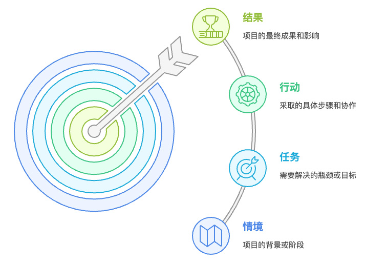
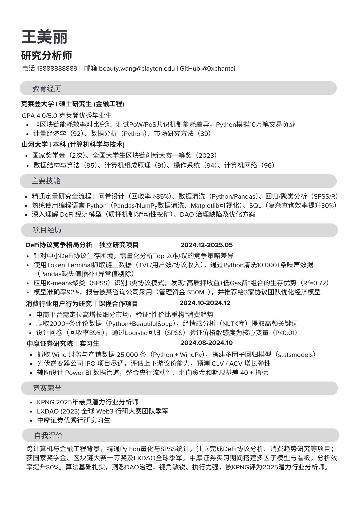

> 無論你是帥哥還是靚女，你的簡歷是都是招聘官見的第一面。見字如面，在競爭激烈的 Web3 行業當中，一份 **精準** 的 Web3 簡歷一定是你開啟職業之門的金鑰匙。一份優秀的 Web3 簡歷不僅需要傳統簡歷乾淨、簡潔的特點，更需突出與 Web3 行業的切合度。

## 一、為何 Web3 簡歷要“去中心化”思維

在 Web3 世界，由於行業處於早期，而且關注這個方向的人才不是很多，所以招聘看重的是 **可驗證的貢獻與持續參與度**，而非靜態的頭銜、學歷或流水賬式職責。你的鏈上資料、社群足跡、協作提案、駭客獎項、研究報告等都是你最好的“工作證明”。因此，一份優秀的 Web3 簡歷應像區塊鏈一樣，**透明、可追溯、可量化**。它不僅僅是一份個人履歷，更是一張 **“可驗證的個人品牌形象”**。總的來說有三點：

- **你的價值：** 取決於你持續產出的鏈上痕跡（運營 / 開發）和在社群中建立的信任度。
- **稀缺性：** 源於你獨一無二的組合技能（例如 DeFi 高手 / meme 圖高手 / 鏈上治理高手等等）。
- **貼合度：** 你的價值與技能與該職位需求的耦合程度。

## 二、簡歷結構示例

一份 Web3 簡歷的理想結構應能清晰、高效地展示你的 Web3 特質和貢獻。以下是一個推薦的結構示例：

| 模組                | 核心內容                                                                                                                  | 銜接要點                                                                                    |
| ------------------- | ------------------------------------------------------------------------------------------------------------------------- | ------------------------------------------------------------------------------------------- |
| **個人資訊**        | Telegram、Twitter / GitHub、Discord Tag、郵箱、電話、微信                                                                 | 方便專案方進行社交媒體瞭解，確保聯絡暢通。                                                  |
| 學歷                | 本科、研究生、博士等學習經歷，若與崗位相關，則應重點突出，不相關則應弱化                                                  | 若具有高度關聯，則應詳細展開所學課程與知識體系                                              |
| **詳細經歷**        | 選取 3 段以內最相關的經歷，採用 **STAR** 模型（情境 - 任務 - 行動 - 結果）進行描述。                                      | 強調你在 Web3 專案中的上鍊動作、對社群指標 / 開發的影響，以及你在去中心化環境中的協作能力。 |
| **技能棧 & 工具**   | 列出你掌握的 Web3 相關技能和工具，如 Solidity、Galxe、Dune 等。                                                           | 針對每項技能，最好能標註具體的產出示例或專案連結，證明你的實戰能力。                        |
| **社群與 DAO 角色** | 突出你在 DAO 或 Web3 社群中的參與角色，如 Delegate（代表）、Core Contributor（核心貢獻者）、Bounty Hunter（賞金獵人）等。 | 如果有，加入 Snapshot 投票連結或區塊高度，展示你的社群影響力。如投遞開發崗，則需要進行弱化  |
| 獎項                | 駭客松獎項等與 Web3 高度相關且有官方背書                                                                                  | 注意貼合度，如投遞運營崗，則需要進行弱化                                                    |

## 三、核心觀點：Web3 簡歷的“三板斧”

1. **鏈上戰績 > 宏大敘事**
   - **避免空泛描述：** 不要只寫“負責社群增長”。
   - **量化並驗證：** 應該改為“設計 3 條 Galxe 任務，使測試網跨鏈互動數 30 天內從 4,000 → 17,500（+337%），相關交易雜湊：`0xabc…123`。”
   - **提供證據：** 將你的 PR、提案、駭客松提交等附上鍊接，增加可信度。
2. **參與度曲線 > 從屬關係**
   - **Web2 強調公司任職：** 傳統 Web2 簡歷強調“在某某公司 / 部門任職”。
   - **Web3 看重持續貢獻：** Web3 更認可“在哪些 DAO / 專案持續貢獻”。
   - **展示進階路徑：** 用時間軸展示你從 **Ambassador（大使）→ Intern（實習）→ Staff（正式員工）** 的進階過程（例如：2023.02 貢獻第一次翻譯；2023.05 組織 AMA；2023.11 完成原創策劃併發布）。這展示了你的成長性。
3. **技能—結果 雙鏈路**
   - **技能與實戰結合：** 單純羅列技能不如“技能 + 實戰成果”更有說服力。
   - **示例：**
     - 熟練 Notion → 構建 Optimism 跨鏈流量儀表板（日活查詢量 1K+ / 周）
     - 會 Solidity → 釋出可升級 NFT 合約（並上傳至 GitHub）

## 四、關鍵 Web3 模組寫作要領

::: steps

1. 明確自己的定位
   - **公式：** 目標崗位 + 細分賽道 + 最大賣點。
   - **示例：** Layer 2 生態增長運營 / 雙語 AMA 主持人 / 負責 50+ 場跨鏈主題直播。
2. **關鍵貢獻（Key Achievements）**
   - **簡潔明瞭：** 每條內容控制在 2 行以內。
   - **要素：** 動作 + 量化結果 + 引證。
   - **寫法模板：** `【動作】+【指標變化】+【時間】`
   - **示例：** 設計 Optimism 跨鏈轉賬任務，使測試網活躍地址 30 天內 1,267 → 4,389
3. **經歷段落（STAR 模型）**

   - **S（情境 / Situation）：** 用一句話交代專案所處的階段或市場背景。
   - **T（任務 / Task）：** 明確你在該情境下需要解決的瓶頸或達成的目標。
   - **A（行動 / Action）：** 聚焦你在其中採取的具體行動，突出個人貢獻和在去中心化環境中的協作。
   - **R（結果 / Result）：** 展示最終的成果，最好是鏈上 / 社群指標、媒體提及、投票透過率等可量化的資料。

   

4. **技能 & 工具**
   - **技能旁邊直接掛“作品”：** 證明你不僅僅是會用，而且能用出成果。
   - **示例：**
     - `Hardhat` – 編寫並部署 `x` 個可升級合約（附 GitHub）
     - `Subgraph` – 自建跨鏈查詢 API（附 API）
5. **社群 & DAO 角色**
   - **按“責任級別”排序：** Core Contributor（核心貢獻者）> Lead（負責人）> Contributor（貢獻者）> Bounty Hunter（賞金獵人）。
   - **附上證明：** 每條都應附上提案號、GitHub PR、Snapshot 投票結果或任務連結，以供驗證。

:::

## 五、量化指標參考

在 Web3 簡歷中，量化你的貢獻至關重要。以下是一些可供參考的量化維度：

| 類別   | 細分         | 可量化維度                                                                                      | 舉例                                                                                                 |
| ------ | ------------ | ----------------------------------------------------------------------------------------------- | ---------------------------------------------------------------------------------------------------- |
| 運營向 | **社群運營** | Telegram 新增成員數、Discord 留存率、AMA 同時線上人數、社群活動參與率                           | 2025 年 5 月 1–7 日，官方群從 12,350 人漲到 13,200 人，新增 **850 名**成員。                         |
| 運營向 | **使用者增長** | 測試網錢包數、鏈上互動交易（Tx）數量、獨立合約呼叫數、Dapp 日 / 月活躍使用者數（DAU / MAU）       | Discord “Memecoin 表情包大賽”收到 **380 份**有效投稿，活動公告被 9,000 名成員瀏覽，參與率 **4.2%**。 |
| 運營向 | **內容傳播** | 推文曝光量、研報下載量、媒體引用次數、文章閱讀量、影片播放量                                    | YouTube 測試網教程影片上線 30 天內播放 **14,800 次**。                                               |
| 技術向 | **開發貢獻** | 合約部署次數、審計問題零 / 低階別（證明程式碼質量）、CI / CD 透過率、GitHub 程式碼提交量、PR 合併數 | 第三方審計報告共列出 **5 個**問題——4 個 Low、1 個 Info，無 Medium 及以上嚴重度。                     |

## 注意點

- **總長：** 建議控制在 1–2 頁，確保關鍵資訊一目瞭然。
- **重點前置：** 將“關鍵貢獻”模組放在簡歷首頁最顯眼的位置。
- **格式統一：** 統一使用動詞開頭，並高亮重要的數字和量化結果。

Web3 簡歷不僅僅是找工作的敲門磚，更是你個人在去中心化世界中貢獻和影響力的體現。掌握這些撰寫技巧，祝讓你的簡歷在眾多求職者中脫穎而出！

## 六、簡歷模版參考

推薦使用線上簡歷生成器（例如：<https://www.canva.com/templates/EAGO_l7bbes/>）來製作簡歷，方便填寫同時比較簡潔美觀。

簡歷要保持簡潔，不要過於花哨，重點突出跟崗位相關的技能和經驗，避免其他的喧賓奪主。以下為虛構的建立示例，內容並不完全嚴謹正確，僅作為參考使用。

**智慧合約工程師：陳大文**

**研究分析師：王美麗**

**社群運營師：姚大錘**

希望大家能夠根據自身情況，參考以上模版，製作出一份適合自己的簡歷。也歡迎加入社群分享自己的簡歷，聽取其他人的建議進行修改，增加透過的機率。

## ::ep:avatar /#32b2f0:: 文章貢獻者

作者：[Alex](https://x.com/0xAlexWu)  
排版：[Echo](https://x.com/Echo_liuchan)、[吃湯圓](https://x.com/web3_cty)   
校對：[Bruce](https://x.com/brucexu_eth)
