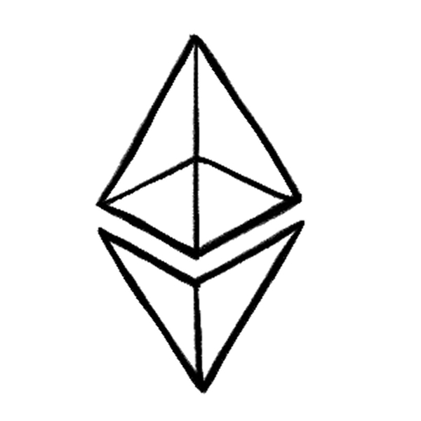

> 以太坊（Ethereum）被称为“区块链 2.0”，它不仅是一种加密货币（以太币 ETH），更是一台支持智能合约的“全球共享计算机”。通过代码自动执行规则，开发者可以在区块链上构建去中心化金融（DeFi）、数字艺术品（NFT）和去中心化自治组织（DAO）等创新应用，无需依赖银行或中心化平台。2022 年完成从“挖矿”（PoW）到更环保的“权益证明”（PoS）的升级（The Merge），并借助分片和 Layer 2 技术提升效率与扩展性。以太坊不仅是技术协议，更承载着去中心化的文化理念——用代码和社区协作重塑信任与价值分配，成为 Web3 时代的数字基础设施。

## 一. 以太坊的介绍

以太坊（Ethereum）是一个开源的去中心化区块链平台，通过其原生加密货币以太币（Ether，简称 ETH）提供去中心化的以太虚拟机（EVM）来处理点对点合约。它由程序员 ==维塔利克·布特林（Vitalik Buterin）== 于 2013-2014 年间提出，目标是构建“下一代加密货币与去中心化应用平台”。2014 年，以太坊正式启动，成为继比特币之后最重要的区块链项目之一。

以太坊的核心创新在于 ==智能合约（Smart Contracts）== 。智能合约是存储在区块链上的可执行代码，能够在满足预设条件时自动执行操作，无需人工干预。这一特性使得以太坊不仅是数字货币的载体，更是构建去中心化应用（Dapps）、去中心化金融（DeFi）、非同质化代币（NFT）等生态系统的基础设施。截至 2025 年，以太币（ETH）仍是全球市值排名第二的加密货币，仅次于比特币。自 The Merge 后，ETH 呈现轻微通缩趋势，年通胀率约为 0.2%-0.8%。

以太坊的定位是“区块链 2.0”的代表。如果说比特币是区块链 1.0 的象征（专注于货币属性），那么以太坊则通过智能合约和可编程性，推动区块链技术向更广泛的应用场景拓展。==其目标是成为全球范围内的“世界计算机”== ，为开发者提供构建复杂应用的工具和环境。

<!-- ::: card -->

{.full-width width="50%"}

**以太币（ETH）是以太坊的原生代币**

在以太坊上进行的任何操作或交易，都需要使用以太币（ETH）来支付相关费用。

由于区块链是去中心化的，因此在区块链上的操作都需要支付手续费给网络服务提供商。这个手续费通常称为燃料费（Gas Fee），正如你开车到达目的地时需要消耗汽油一样。

<!-- ::: -->

## 二、Ethereum 与 Bitcoin 的差异

尽管以太坊和比特币均基于区块链技术，但两者的设计目标、功能和技术路线存在显著差异：

|      维度      | 比特币（Bitcoin）                                            | 以太坊（Ethereum）                                          |
| :------------: | :----------------------------------------------------------- | :---------------------------------------------------------- |
| **目标与定位** | 去中心化的数字货币，强调安全、稳定和稀缺性（总量 2100 万枚） | 去中心化平台，支持智能合约和 Dapps，定位为“区块链 2.0”      |
|  **编程能力**  | 脚本语言有限，仅支持简单的交易验证逻辑                       | 图灵完备的编程语言（如 Solidity），可开发复杂智能合约       |
|  **共识机制**  | 工作量证明（PoW），矿工通过算力竞争记账权                    | 从 PoW 转向权益证明（PoS），通过 The Merge 实现能源效率优化 |
|  **交易速度**  | 每 10 分钟生成一个区块，交易确认较慢                         | 区块时间约 12 秒，交易确认更快，适合高频应用                |
|  **经济模型**  | 总量固定，强调抗通胀属性                                     | 供应灵活，通过 EIP-1559 等机制可能呈现通缩趋势              |

以太坊的灵活性使其能够支持更多应用场景，例如 DeFi（借贷、交易）、NFT（数字艺术品）、DAO（去中心化自治组织）等，而比特币则更专注于作为“数字黄金”存储价值。

## 三. 以太坊的定位与演进

以太坊是一个基于区块链的 ==去中心化计算平台== ，它的目标是成为“全球计算机”，让任何人无需依赖第三方即可进行交易、管理数据或运行应用。为了实现这一目标，以太坊经历了多次重大升级，其中最关键的是从 ==工作量证明（PoW）转向权益证明（PoS）== ，以及被称为 ==The Merge（合并）== 的里程碑事件。

### 1. 以太坊 1.0（PoW 阶段）

以太坊最初像比特币一样，使用 **PoW（工作量证明）** 机制来维护网络安全。简单来说：

- 矿工通过计算机算力“挖矿”，争夺打包交易的权利。
- 矿工需要消耗大量电力资源，竞争激烈。
- 成功打包区块的矿工会获得新生成的 ETH 奖励。

**问题**：

- **能耗高**：全球以太坊矿工的电力消耗相当于一个小国家的用电量。
- **扩展性差**：每秒只能处理约 30 笔交易（TPS），速度慢、费用高。

为了解决这些问题，以太坊启动了多次升级（如 Homestead、Metropolis），逐步优化网络性能和安全性，但核心的 PoW 机制仍未改变。

### 2. 以太坊 2.0 与 The Merge：从双链并行到完美合并

**The Merge 完整故事**：

::: steps

1. **2020 年 12 月：信标链启动**

   以太坊团队首先创建了一条全新的**信标链（Beacon Chain）**，专门运行 PoS 共识机制。此时：

   - 以太坊主网继续使用 PoW 挖矿
   - 信标链独立运行 PoS 验证
   - 两条链并行存在，互不干扰

2. **2022 年 9 月：历史性合并**

   2022 年 9 月 15 日，**The Merge** 发生：

   - 以太坊主网“关闭”了 PoW 挖矿引擎
   - 将共识机制“插接”到信标链的 PoS 系统
   - 从此，以太坊主网由信标链保护安全

3. **合并后的新架构**

   现在的以太坊实际上是两层结构：

   - **执行层**：处理交易、智能合约（原主网）
   - **共识层**：管理验证者、确定区块顺序（信标链）

:::

#### ==PoS 机制详解==

**验证者如何工作**：

- **准入门槛**：质押 32 ETH 成为验证者
- **工作方式**：系统随机选择验证者来提议和验证区块
- **奖励机制**：验证者获得新发行的 ETH + 交易费用
- **惩罚机制**：作恶者质押的 ETH 被销毁（Slashing）

**相比 PoW 的优势**：

- **能耗降低 99.95%**：无需大量电力和硬件
- **经济安全性**：攻击成本约需控制全网 67% 的质押 ETH（价值数百亿美元）
- **最终确定性**：区块确认更快、更可靠

### 3. 未来升级路线图

The Merge 只是起点，以太坊的“进化”还在继续！接下来的升级目标是：**让更多人用得起、用得快、用得安全**。以下是重点方向：
::: steps

1.  ==**分片技术演进——从执行分片到数据分片**=={.important}

    **原计划 vs 新策略**：

    - **原计划**：将以太坊分成 64 条分片链，每条独立处理交易
    - **策略调整**：专注于**数据分片**，配合 Layer 2 实现扩容

    **当前方案**：

    - **数据可用性分片**：为 Rollup 提供更多、更便宜的数据存储空间
    - **配合 Layer 2**：主网专注安全和数据可用性，Layer 2 负责大量交易处理
    - **EIP-4844 先行**：通过 Blob 交易为分片技术做准备

    **预期效果**：

    - Layer 2 成本进一步降低 90%+
    - 以太坊主网专注于做“结算层”和“数据可用性层”

    **时间表**：全面分片预计 **2025-2026 年** 启动，重点是 Proto-Danksharding
     
     

2.  ==**EIP-4844（Cancun 升级）——“省钱神器”**=={.important}

    **Layer 2 工作原理简述**：

    - Layer 2 在链下批量处理大量交易
    - 定期将交易数据“打包”提交到以太坊主网
    - 主网验证数据正确性，提供最终安全保障

    **EIP-4844 的突破**：

    - **问题**：以前 L2 提交数据需要使用常规交易，成本高昂
    - **解决方案**：引入专门的“Blob 交易”类型，数据存储成本大幅降低
    - **技术细节**：Blob 数据会在一定时间后自动删除，不会永久占用主网存储

    **实际效果**：

    - L2 交易费用降低 **70% - 90%**
    - Arbitrum、Optimism 等主流 L2 费用降至几美分
    - **状态**：**已于 2024 年 3 月 13 日上线主网**，运行稳定
       
       

3.  ==**ZK-Rollup 技术——“批量验证，一步到位”**=={.important}

    **ZK-Rollup 简单理解**：

    - 想象你是老师，需要检查 1000 份作业
    - 普通方法：一份份检查（慢且耗时）
    - ZK 方法：学生提交一个“证明”，证明所有作业都做对了

    **技术原理**：

    - **批量处理**：在链下一次性处理数百笔交易
    - **零知识证明**：生成一个简洁的“正确性证明”
    - **主网验证**：以太坊只需验证这个证明，无需重新执行所有交易

    **优势**：

    - **速度快**：主网只需验证一个证明而非数百笔交易
    - **成本低**：多笔交易分摊验证成本
    - **安全性高**：继承以太坊主网的安全性

    **代表项目**：zkSync Era、Polygon zkEVM、Scroll
     
     

4.  ==**其他重要升级方向**=={.important}

    - **EIP-1559 成果**：已实现基础费用机制，但 Gas 费仍受网络拥堵影响较大
    - **Verkle 树技术**：优化状态存储结构，减少节点同步所需的数据量
    - **执行环境优化**：提升 EVM 性能，支持更复杂的智能合约应用

:::

::: note **以太坊升级里程碑**

1. **The Merge（2022 年完成）**：从高能耗 PoW → 低能耗 PoS
2. **EIP-4844（2024 年完成）**：让 L2 更便宜，普通人用得起
3. **数据分片（2025-2026 年）**：进一步降低 L2 成本，提升整体扩展性

:::

## **四、以太坊生态概览：L1、L2、Sidechains 等**

以太坊的生态系统由多层架构组成，包括 ==**L1（主网）、L2（二层扩展解决方案）、侧链（Sidechains）**== 等，共同支持高吞吐量和低费用的交易处理。
::: steps

1. **Layer 1（L1）**
   - **以太坊主网**：核心区块链，负责最终安全性与共识。
   - **EVM**：以太坊虚拟机，执行智能合约代码。
   - **账户系统**：外部账户（EOA）与合约账户（CA）共同构成网络基础。
2. **Layer 2（L2）**
   - **Rollup**：通过将交易批量处理后提交至 L1，降低 Gas 费。
     - **Optimistic Rollup**：假设交易合法，仅在争议时验证。
     - **ZK Rollup**：通过零知识证明验证交易，无需链上争议。
3. **侧链（Sidechains）**：独立运行的链，通过桥接与主网交互。
4. **以太坊生态分层架构**

:::

以太坊生态可以分为以下几个层次：

### 1. **应用层（Application Layer）**

用户直接交互的应用和界面：

- **DeFi 应用**：Uniswap（去中心化交易所）、Aave（借贷协议）、Compound（借贷协议）
- **NFT 平台**：OpenSea、Foundation、SuperRare
- **钱包应用**：MetaMask、Coinbase Wallet、Rainbow
- **DAO 工具**：Snapshot、Aragon、Colony

### 2. **协议层（Protocol Layer）**

以太坊的核心基础设施：

- **共识层客户端**：Prysm、Lighthouse、Nimbus、Teku
- **执行层客户端**：Geth、Nethermind、Erigon、Besu
- **核心协议**：EVM、状态管理、Gas 机制

### 3. **扩展层（Scaling Layer）**

提升性能和降低成本的解决方案：

- **Layer 2 Rollups**：Arbitrum、Optimism、Polygon zkEVM、zkSync Era
- **侧链**：Polygon PoS、xDAI（Gnosis Chain）
- **状态通道**：Lightning Network for Ethereum

## **五、以太坊文化与价值观**

以太坊的文化深受 ==**密码朋克运动（Cypherpunk）**== 影响，体现了对技术赋权个人、重塑社会协作的愿景：

### **核心价值观**

1. **去中心化治理（Decentralization）**

   - 没有单一的控制者或权威机构
   - 社区通过公开讨论和 EIP（以太坊改进提案）机制共同决策
   - 验证者遍布全球，防止权力集中

2. **无需许可与开放性（Permissionless & Open）**

   - 任何人都可以使用、开发、部署智能合约
   - 开源代码，透明可审计
   - 无身份、地域、财富限制的参与门槛

3. **抗审查性（Censorship Resistance）**

   - 交易和智能合约不受政府或机构干预
   - 通过分布式验证确保网络弹性
   - 支持言论自由和经济自由

4. **密码朋克精神（Cypherpunk Ethos）**

   - 代码即法律：用算法和数学构建信任
   - 密码学保护隐私和自主权
   - 技术驱动的社会变革，而非政治手段

5. **公共物品导向（Public Goods Orientation）**

   - 优先考虑生态系统整体利益
   - 支持开源项目和基础设施建设
   - 通过各种资助计划推动创新

6. **可持续发展理念**

   - The Merge 体现了对环境责任的承诺
   - 长期主义思维，注重技术的可持续演进
   - 平衡创新速度与网络稳定性

这些价值观不仅塑造了以太坊的技术发展方向，也形成了独特的社区文化，吸引了全球开发者、研究者和用户的参与。

## 六、以太坊核心机制：从账户到执行的完整链路

在上面我们就了解到，以太坊不仅仅是一条区块链，更是一个全球共享的“分布式计算机”。它的核心价值在于通过代码实现无需信任的自动化规则（如智能合约），而这一切的背后依赖于三个关键机制：==**账户系统**、**Gas 模型** 和 **以太坊虚拟机（EVM）**=={.important}。

我们平时使用 **账户系统** 里面的 **外部账户（EOA）** 与区块链中的其他用户的 **外部账户（EOA）** 或者与智能合约所在的 **合约账户（CA）** 进行交互，而其中的 **Gas 模型** 是支撑整个网络的经济基础， **Gas 模型** 和其他经济来源支撑着全球的 **以太坊虚拟机（EVM）** 来实现以太坊网络。

### 1. 账户系统：你的数字身份

**账户系统** 包含由私钥控制的 ==**外部账户（EOA）**== 和由智能合约代码控制的 ==**合约账户（CA）**== 。

想象你第一次接触以太坊——你需要一个“数字钱包”来参与网络。这个钱包的核心是 ==**外部账户（EOA）**== ，它由一对密钥（私钥和公钥）生成，就像银行账户的密码和账号。私钥[+助记词]是你控制账户的“钥匙”，必须严格保密；公钥通过加密算法生成一个唯一的地址（如 `0xAbc...123`），你可以把它分享给朋友接收转账。

[+助记词]: 私钥的人类可读备份形式：**助记词（Mnemonic Phrase）**，由 12/24 个英文单词（如 `apple boat cat...`），组成，按 BIP-39 标准生成。

除了用户控制的 EOA，还有 ==**合约账户（CA）**== 。它们不像 EOA 那样受私钥控制，而是由代码驱动。比如，你部署一个智能合约（如一个 NFT 市场），区块链会自动生成一个 CA 地址（如 `0xDef...456`）。这个账户不能主动发起交易，只能通过 EOA 触发——比如你点击“购买 NFT”按钮时，EOA 向 CA 发送交易，CA 的代码自动执行出货逻辑。

每个账户都包含四个关键字段：

- **Nonce**：防止重复交易的计数器（EOA 记录发送次数，CA 记录创建合约次数）。
- **余额**：账户持有的 ETH 数量（单位为 Wei）。
- **CodeHash**：EOA 为空哈希，CA 存储合约字节码的哈希值。
- **StorageRoot**：记录账户数据的 Merkle 树根哈希（如 NFT 归属关系）。

### 2. Gas 模型：交易的燃料费

当你使用自己的 EOA 钱包发起一笔交易（比如转账或操作合约），这件事当然 **不会是免费的**，==你需要支付“燃料费”——也就是 **Gas**。==

Gas 是怎么计算的？

Gas 费用 = **用多少 × 每单位多少钱**，就像你打车一样：

- **Gas Limit（限额）**：你最多愿意“烧”多少燃料。
  比如你觉得最多可能需要 15 万单位，就设置 150,000。
- **Gas Price（单价）**：每单位燃料多少钱，用 Gwei 表示（1 Gwei = 0.000000001 ETH）。
  网络越拥堵，价格越贵，就像打车高峰期加价。

所以，**总费用 = Gas Limit × Gas Price**。

::: card
假设你设置 Gas Limit 为 150 000，Gas Price 为 100 Gwei，总费用就是 0.015 ETH。如果实际消耗 120 000 Gas，剩余 30 000 Gas × 100 Gwei = 0.003 ETH 会退还给你。
:::

Gas 的存在有两个目的：

- **激励矿工/验证者**：你给得越多（Gas Price 越高），他们越愿意优先处理你的交易。
- **防止资源滥用**：如果有人想让合约死循环，Gas 会用光，交易失败，系统不会被拖垮。

==在 EIP-1559 升级后，Gas Price 被拆分了：==

以前，Gas Price 全部给矿工。
现在，分成两部分：

- **基础费用（Base Fee）**：每个区块都会有，自动计算，直接销毁（直接消失）来帮助 ETH 通缩，毕竟物以稀为贵。
- **小费（Tip）**：你额外加的钱，用来鼓励矿工优先处理你。

---

### 3. 以太坊虚拟机（EVM）：代码的执行引擎

EVM（Ethereum Virtual Machine）是 **以太坊的“大脑”**，是专门用来**运行智能合约的虚拟计算机**。它运行在每个节点上，确保整个网络在处理代码时，**结果都一致、可信任**。

==EVM 的核心特点：=={.important}

- **图灵完备**：就像真正的电脑一样，EVM 可以执行各种逻辑，比如 if 判断、循环等。
- **全球同步**：每个矿工/节点都会自己执行一遍合约代码，保证结果一样。
- **隔离安全**：EVM 把合约“关”在一个小房间里运行，不允许它乱访问用户的数据和网络，保护隐私和安全。

## 七、一般流程与类比

### 1. 一般流程

::: steps

1. **用户通过 EOA 发起交易**（如调用合约与 **CA** 交互，或者转账与其他用户的 **EOA** 交互）。
2. **交易附带 Gas 参数**，矿工 / 验证者选择打包。
3. **EVM 执行合约代码**，修改存储（如更新 NFT 归属）。
4. **Gas 费用按 Gas Limit × Gas Price 扣除**，保障资源合理使用。
   :::

### 2. 相似类比

- **EOA = 个人钱包**：你用私钥“签名”来证明身份，可以主动发起任何交易
- **CA = 智能保险箱**：按照预设程序自动运行，只有满足条件才执行操作（如：收到正确密码后自动转账）
- **Gas = 计算资源费用**：
  - Gas Limit：你愿意支付的最大计算量
  - Gas Price：每单位计算的价格
  - 如果设置 1000 单位 ×10Gwei，实际用了 800 单位，退还 200 单位的费用
- **EVM = 全球共享计算机**：所有节点同时运行相同的程序，确保结果一致且可信

## ::eos-icons:application-outlined /#32b2f0::扩展阅读

- [MyFirstLayer2](https://layer2.myfirst.io/)：使用图文、动画的方式，帮助 Web3 的用户更好、更安全地理解 Layer 2 是什么
- [以太坊密码朋克宣言](https://hackmd.io/@pcaversaccio/the-ethereum-cypherpunk-manifesto)：深入了解以太坊的文化内核和价值观体系

## ::ep:avatar /#32b2f0::文章贡献者

作者：[吃汤圆](https://x.com/web3_cty)  
排版：[Echo](https://x.com/Echo_liuchan)  
校对：[Bruce](https://x.com/brucexu_eth)
