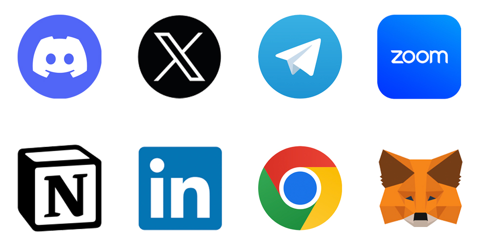
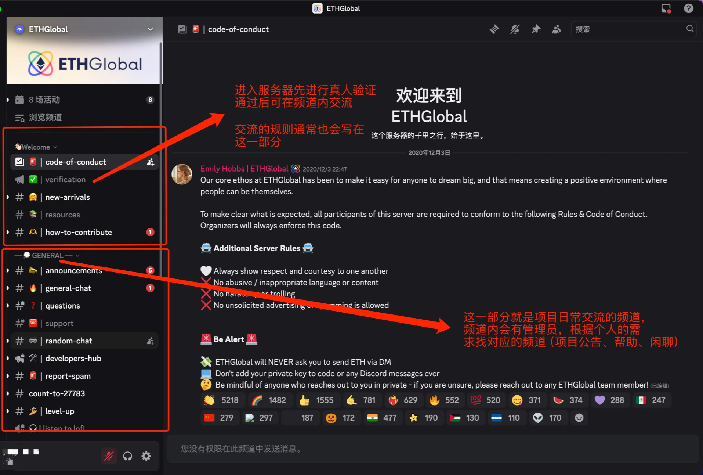
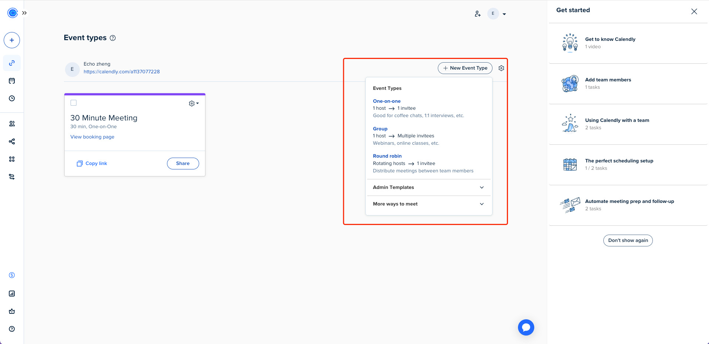

> 远程办公是 Web3 世界的生存法则，去中心化组织的基因决定了远程协作的必然性。典型 Web3 团队可能由美国的技术极客、新加坡的合规专家、东欧的智能合约开发者组成，这种地理分布要求成员必须具备远程协作能力。全球顶尖的 Web3 加速器如 Seed Club，其核心团队分布在 12 个时区，却通过异步沟通工具完成每周千万美元级项目的孵化。所以提前掌握一些基础的 Web3 工作习惯、方式会帮助你更好的适应这个行业。

## 一、Web3 常用工具及远程办公软件

### 1. Twitter

::: steps

1. ==工具介绍==

   Twitter（现名 X）是一家美国的社交媒体平台和微型博客服务，它允许用户发布并互动“推文”（短文本、图片或视频）。Twitter 是世界上访问量最高的社交网站之一，区块链和 Web3 相关项目常利用 Twitter 发布最新动态和公告，因此成为生态交流的重要渠道。

2. ==安装注册指南==

   - 打开浏览器，访问 Twitter 官网：[https://twitter.com](https://twitter.com/)
   - 点击页面上的“注册”或“Sign up”按钮开始新用户注册
   - 填写姓名和电子邮件（或手机号）及出生日期，然后按提示点击“下一步”
   - Twitter 会向所填邮箱/手机号发送验证码，输入验证码后点击“下一步”
   - 设置账户密码并完成注册。如果提示通过手机号验证，可稍后在账号设置中添加手机号
   - Twitter 官网也提供官方桌面应用（Windows 商店或 Mac App Store），下载安装后使用同一账户登录，可获得类似网页版的使用体验

:::

### 2. Telegram

::: steps

1. ==工具介绍==

   Telegram 是一款跨平台的即时通讯应用。它支持在手机、电脑等设备上运行，用户可通过互联网发送加密消息、图片、语音和视频等各种类型的文件。Telegram 提供个人聊天、频道（群发消息）和群组功能，因其安全性高、传输速度快而受到开发者和区块链社区的欢迎。

2. ==安装注册指南（以 Mac 系统为例）==

   - 在浏览器中访问 [https://desktop.telegram.org](https://desktop.telegram.org)。
   - 点击“Get Telegram for macOS”下载适用于 macOS 的安装包。
   - 打开下载的 `.dmg` 文件，将 Telegram 拖入“应用程序”文件夹中进行安装。
   - 安装完成后打开 Telegram 应用，使用手机号登录并按照界面提示输入验证码完成注册。具体操作指南可查看：[https://kerrynotes.com/telegram-tutorial/#google_vignett](https://kerrynotes.com/telegram-tutorial/#google_vignette) （带常见问题回答）

3. ==Telegram 常见的使用问题==
   ::: tabs

   @tab 手机号码隐私泄露

   问题：​ 默认情况下，注册和使用 Telegram 需要手机号。如果隐私设置不当，这个号码可能会被：

   - 你联系人列表中的所有人或部分人看到。
   - 任何知道你的手机号的人通过 Telegram 的“联系人同步”功能找到你的 Telegram 账号。

   ​ 风险：​​ 手机号是极其敏感的个人信息，泄露可能导致骚扰、垃圾信息、被添加到不需要的群组，甚至成为其他针对性攻击（如 SIM 卡交换攻击）的起点。

   ​ 防范：​​

   - ​ 立即检查并设置隐私权限：​​ 进入 设置 > 隐私和安全 > 手机号码。
     - 将`谁能看到我的手机号码`设置为 ​**无人 或 我的联系人**​ (根据你的信任级别谨慎选择)。
     - ​ 关键设置：​​ 将`谁能通过手机号码找到我`设置为 ​**我的联系人 (强烈推荐)。这意味着只有你主动保存在手机通讯录中并同时是 Telegram 联系人的人**才能通过手机号关联到你的账号。阻止了陌生人利用你的手机号搜索你。
   - 警惕共享二维码或用户名链接时可能间接暴露信息 (尽量使用用户名)。

   @tab ​ 钓鱼信息/诈骗 (极其常见且危险)​​

   ​ 问题：攻击者伪装成可信来源（Telegram 官方、朋友、招聘方、客服、投资专家等），发送包含恶意链接或要求敏感信息的消息。常见诱饵：

   - 账户安全问题：“您的账号存在异常活动/风险即将被封禁/需要验证身份，请立即点击此链接登录...”。
   - 虚假福利/中奖：“恭喜您被选中获得 Telegram 会员/礼品卡/奖金... 点击链接领取”。
   - 虚假招聘/兼职：主动联系你提供“高薪工作机会”，诱导你点击链接“填写资料/面试/培训”或下载有问题的应用。
   - 虚假好友求助：冒充你的联系人，声称需要验证码、金钱帮助等（通常会说手机坏了/丢了）。
   - 虚假客服：声称解决你的账号问题（你根本没提出过），索要验证码、密码等。
   - 恶意文件/应用：发送伪装成文档、图片、安装包的文件，内含病毒或木马。

   风险：导致账号被盗、资金损失、恶意软件感染、个人信息被窃。

   防范 (核心原则：保持怀疑，永远不轻信，不随意点击或提供信息)：​​

   - 官方永不私聊：​Telegram 官方 (@telegram 或 Telegram Support) 绝不会主动通过私聊消息联系用户讨论账户问题、发送奖品或招聘！​​ 所有官方通知只会通过系统通知频道 (带蓝色勾认证) 发布。
   - 警惕“需要立即行动”的消息：钓鱼信息惯用制造紧迫感（“账号将在 1 小时后关闭！”、“限时领取！”）让你来不及思考。
   - ​ 仔细检查发件人身份：​​
     - 查看对方用户名是否可疑？是真好友的常用账号吗？
     - 对方有`​蓝色官方认证勾`吗？（注意：普通蓝勾是付费订阅标记，​ 真正的官方账号旁边会明确标注为 Telegram 团队或 Telegram Tips/Security 等）。
     - 与朋友核实：如果“朋友”求助，换一种已知可靠的通讯方式（电话、其他即时通讯工具）直接联系该朋友确认。
   - ​ 绝不点击可疑链接：​​ 永远不要点击消息中的不明链接，​ 尤其是指向非 telegram.org 域名的“登录/验证”页面。如果你有怀疑，手动输入官网地址 https://telegram.org 或通过官方应用访问账户设置。
   - 绝不透露敏感信息：​​
     - ​Telegram 官方、任何银行或正规平台客服不会在消息中索要：​​
       - 你的登录密码/两步验证密码。
       - ​ 短信验证码 (这是关键)。​​
       - 你的完整银行卡号、CVV、有效期。
   - 不相信天上掉馅饼：​​ 对主动送上门的“高薪兼职”、“巨额奖金”、“免费会员”保持极度警惕。
   - ​ 注意文件后缀：​​ 不要随意打开或下载陌生人发来的 .exe, .apk, .bat, .scr, .jar 等可执行文件或脚本文件，即使看起来像文档（如 .doc.exe）。

:::

### 3. Discord

::: steps

1.  ==工具介绍==

    Discord 是一款面向社群的免费实时聊天和语音通信平台。用户可以创建或加入“服务器”（类似社区频道）来进行文本、语音和视频聊天。Discord 最初为游戏玩家设计，但现已广泛用于各种在线社群和项目讨论；其丰富的频道管理和权限系统适合团队协作。用户可以在不同频道中分享图片、文件，也可以进行语音通话或视频会议。

2.  ==操作指南==

    - 打开浏览器，访问 Discord 官网下载页面：[https://discord.com](https://discord.com/)。
    - 安装完成后打开 Discord，创建新账户或使用已有邮箱/手机号登录。
    - 官方新手指南：[https://support.discord.com/hc/zh-tw/articles/360045138571-Discord-新手指南](https://support.discord.com/hc/zh-tw/articles/360045138571-Discord-%E6%96%B0%E6%89%8B%E6%8C%87%E5%8D%97)

    

:::

### 4. MetaMask

::: steps

1.  ==工具介绍==

    ::token-branded:metamask:: MetaMask（小狐狸钱包）是一款常用的加密货币钱包浏览器扩展，使用户能够在浏览器中安全地访问以太坊等区块链网络中的去中心化应用。安装 MetaMask 后，你可以在浏览器工具栏中看到其图标，用于管理数字资产和身份。

    **注意安全**：务必通过官网或浏览器插件商店安装 MetaMask，不要从第三方渠道下载，避免安装到恶意伪装的克隆版。

2.  ==安装注册指南==

    - 详细安装、操作指南：<https://support.metamask.io/zh-cn/start/getting-started-with-metamask/>
    - macOS 用户安装流程与 Windows 类似：打开 Chrome 浏览器，同样通过 MetaMask 官网下载安装扩展。
    - 安装完成后登录 MetaMask 账号，或按提示创建并备份新的助记词钱包（与 Windows 流程相同）。
    - 如果使用 Safari 浏览器，请注意 MetaMask 暂无 Safari 版本，需使用支持的 Chromium 内核浏览器。

    

:::

### 5. LinkedIn

::: steps

1. ==工具介绍==

   LinkedIn（领英）是全球领先的职业社交平台，专注于帮助用户建立职业身份、拓展行业人脉、获取求职机会以及分享专业知识。通过 LinkedIn，用户可创建个人职业档案，连接企业、同事和行业伙伴，并访问海量职位招聘信息与行业动态。

2. ==安装注册指南==

   - [2025 年 LinkedIn 新账号注册官方教程](https://www.linkedin.com/help/learning/answer/a1338223?lang=zh-CN)

   

### 6. Notion

::: steps

1.  ==工具介绍==

    Notion 是一款功能强大的在线协作平台，将笔记、文档、数据库和任务管理整合在一个工作区中。你可以在 Notion 中创建页面，用于记录项目计划、知识库、团队 Wiki 等内容，并通过多种内容模块（如文本、图片、表格）自由排版。Notion 支持多人实时协作，共享与评论功能便于团队交流与知识积累。

2.  ==安装注册指南（以 Mac 系统为例）==

    - 在浏览器中访问 [https://www.notion.com/desktop](https://www.notion.com/desktop)。
    - 点击“Download for macOS”下载 Mac 版安装包。
    - 下载后，打开 `.dmg` 文件并将 Notion 应用拖动到“应用程序”文件夹中完成安装。
    - 具体的工具指南请阅读：[https://www.notion.com/zh-cn/help/guides](https://www.notion.com/zh-cn/help/guides)

:::

### 7. Zoom

::: steps

1.  ==工具介绍==

    **Zoom** 是一款广泛使用的在线视频会议软件，类似于国内的腾讯会议，支持视频会议、语音通话、屏幕共享、聊天、录制等功能。它适用于远程办公、在线教育、团队会议等多种场景。

2.  ==安装注册指南==

    - 具体安装细节请参考：[https://zoom.us/zh-cn/download](https://zoom.us/zh-cn/download)
    - 安装完成后，打开 Zoom 客户端：如果已有 Zoom 账号，可点击“登录”输入邮箱和密码；也可使用 **Google、Apple、Facebook 或企业邮箱（SSO）** 登录。

3.  ==常用功能演示==

    

    

    

    

:::

### 8. Calendly

::: steps

1.  ==工具介绍==

    Calendly 是一款智能日程调度工具，通过自动化预约流程提高约会效率，让用户轻松共享个人可用时间并同步管理多平台日历，适用于跨团队协调会议、对外交流（如合作方、客户）、面试安排等场景，能够满足 Web3 远程工作的一些需求。

2.  ==操作指南==

    - 访问官网：<https://calendly.com/>，用邮箱或 Google / Microsoft 账号注册（公司用户建议使用公共邮箱）
    - 验证邮箱后进入仪表盘，系统会引导完成基础配置
    - 设置你的可预约时间段（如：工作日 9:00–17:00）
      

    - 可选择会议类型：如 15 / 30 分钟通话、产品演示、一对一会议、组群会议等
      

    - 自动生成预约链接，可分享给对方
      

3.  ==使用建议==

    - 预约前自动检查冲突，避免双重预订
    - 支持时区自动转换，对方看到的是自己的本地时间
    - 可集成 Zoom / Google Meet 自动生成会议链接
      

:::

### 9. Figma

::: steps

1.  ==工具介绍==

    Figma 是一款基于浏览器的矢量设计工具，支持 UI/UX 设计、原型制作与团队实时协作。支持实时协作，可多人同时编辑同一文件，设计稿自动保存云端。同时附带 AI 增强功能，支持通过自然语言生成交互原型（Figma Make），自动生成响应式代码。

2.  ==使用指南==

    - Figma 官方入门指南：<https://help.figma.com/hc/en-us/sections/4403932712087-Getting-started>
    - 官方下载：<https://www.figma.com/downloads/>
      

:::

### 10. GitHub

::: steps

1.  ==工具介绍==

    GitHub 是全球最大的代码托管平台，基于 Git 版本控制系统构建。它为开发者提供了一个集中的地方来存储、管理和协作开发代码项目。通过 GitHub，你可以：

    - **版本控制**：追踪代码的每次修改，轻松回滚到之前的版本
    - **协作开发**：多人同时参与项目开发，通过分支（branch）和合并（merge）功能实现并行开发
    - **代码审查**：通过 Pull Request 功能让团队成员审查代码变更
    - **项目管理**：使用 Issues 追踪 bug 和功能请求，使用 Projects 管理开发进度
    - **开源贡献**：参与全球开源项目，贡献代码并学习最佳实践

2.  ==安装注册指南==

    - GitHub 官方入门指南：<https://docs.github.com/zh/get-started/quickstart>
    - Git 官方安装指南：<https://git-scm.com/book/zh/v2/起步-安装-Git>
      

:::

## 二、远程协作习惯

### 1. OKR 写法与最佳实践

在远程工作中使用 OKR（目标与关键结果）不仅是一种管理工具，更是解决分布式团队核心痛点的系统性方案。远程团队因缺乏物理接触易陷入目标碎片化。OKR 要求目标（Objectives）全团队公开可见，关键结果（Key Results）量化可追踪，例如字节跳动 5 万员工通过 OKR 系统实时查看公司级目标到个人 KR 的完整链路，避免远程协作中“各自为战”。并且在远程办公中常引发管理者“失控焦虑”，而 OKR 聚焦结果产出而非工作时长。例如携程远程团队设定 KR “客户满意度达 92% ”而非“ 每日在线 8 小时”，员工可自主安排工作节奏，效率反提升 40%。
::: steps

1. **目标设定原则**

   - **聚焦关键目标**：每季度设定 3-5 个目标，避免分散精力。
   - **野心与可行平衡**：目标应“令人不适但可达”，理想完成率在 60%-70%（Google 标准）。
   - **结果导向**：聚焦成果而非产出（例：“提升客户留存率” 而非 “发送 10 份调研”）。

2. **关键结果（KR）设计**

   - **递进式量化**：避免二进制（完成/未完成），采用里程碑式量化：

     ::: card
     目标：提升产品国际化能力

     KR1：完成 3 个语言版本开发（40%）

     KR2：用户测试通过率 ≥90%（70%）

     KR3：新市场用户增长 25%（100%）

     :::

   - **SMART 标准**：确保 KR 可衡量、有时限（例：“Q3 北美市场营收增长 15%”）。

3. **评分与复盘**

   - **评分规则**：5 分（卓越贡献）→ 1 分（完成度 ＜ 50%）；
   - **复盘要点**：分析低分 KR 原因（目标过高/资源不足），高分则反思挑战性是否不足。

   _表：OKR 评分标准参考_

   | **得分** | **完成度** | **意义**       |
   | -------- | ---------- | -------------- |
   | 1.0      | 100%+      | 目标过于简单   |
   | 0.7      | 70%        | 理想挑战水平   |
   | 0.3      | 30%        | 需重新规划策略 |

4. **智能合约团队 OKR 示例**
   ::: card
   **Objective** : 提升协议安全性至机构级标准

   **Key Results** :

   - [ ] 通过 Certora 形式化验证（主网部署前）
   - [ ] 漏洞赏金计划覆盖率 100%（Immunefi 平台）
   - [ ] 平均审计发现项 ≤2 个（对比 OpenZeppelin 基准）

:::

### 2. 远程会议注意事项

#### 2.1 如何预约远程会议

1. **明确目标**
   - 会议目的：明确会议议题、期望输出（如：决策、同步信息、头脑风暴等）
   - 参与人：邀请关键决策者或信息相关人，避免冗余参会；明确回复的截止时间（如：24 小时内回复）
   - 预计时长：根据议程合理控制会议时长（15/30/60 分钟）
2. **使用日历工具（Google Calendar / Outlook Calendar）**
   - 创建事件：
     - 标题应简洁明了（如：Weekly Sync、产品评审会）
     - 添加会议描述（议程、会议链接、预阅读材料）
     - 设置提醒（提前 10~30 分钟）
   - 添加参与者邮箱：自动发送会议邀请与提醒
   - 注意时区设定：确认所有与会者的时区正确识别
   - 嵌入视频会议链接（如 Google Meet、Zoom）方便直接在 Calendar 上面打开
3. **推荐时间的技巧**
   - 避开：中午用餐时间、当地清晨或深夜
   - 尽量安排在团队 "工作核心时段"（Overlapping Hours）
   - 使用"建议时间"功能：Google Calendar 会自动匹配参会人的可用时间

#### 2.2 会议中的注意事项

1. **沟通禁忌**
   - ❌ 发送模糊需求（如“请尽快处理”）；
   - ✅ 改为：“需在 **6 月 10 日 18:00 UTC+8 前**提交方案，参考**附件 A 数据模板**”
2. **决策痕迹留存**
   - 准备会议纪要，关键结论标红加粗
   - ✅ 决策事项 + 行动项明确 **DRI**（直接责任人）+ **Deadline**（精确到时区）

### 3. 职场软技能

#### 3.1 排版的知识

1. **字体选择**

   - **数量控制**：全文不超过 3 种字体（标题+正文+强调），否则显乱。
   - **场景匹配**：
     - 正式报告 → 黑体
     - 轻松文案 → 微软雅黑/思源柔黑

2. **间距是呼吸感的关键**
   - **行间距**：1.5 倍行距（12 磅字用 18 磅行距），避免文字窒息。
   - **段落间距**：段前段后空 0.5 行（约 6-8 磅），用按`Enter`空一行太粗暴。
   - **页边距**：默认 2.54 厘米，图文多时缩至 1.5 厘米。
      
3. **标点与空格（细节控必备）**
   - 中英文混排时加空格：
     - ✅ “在 LeanCloud 上创建 AVObject”
     - ❌ “在LeanCloud上创建AVObject”
   - 全角中文标点：用“”代替 ""，用。代替.。
   - 数字用半角：写“500 元”而非“５００元”。
   - 详细排版规则请参考：[https://github.com/sparanoid/chinese-copywriting-guidelines](https://github.com/sparanoid/chinese-copywriting-guidelines)

#### 3.2 效率翻倍工具技巧

- **AI 工具：**
  - ChatGPT：<https://chatgpt.com/>
  - DeepSeek：<https://chat.deepseek.com/>
  - 豆包：<https://www.doubao.com/chat/>
- **媒体工具：**
  - Iconfont 阿里巴巴矢量图标库：<https://www.iconfont.cn/>
    - 包含海量图标、矢量插画、动态特性、可变字体等，是职场汇报的好帮手。
  - SmartArt 一键图表化
    - 在 Word / PPT 中选中文字 → 插入“智能图形” → 自动生成流程图 / 组织架构图。
      
  - 秀米：<https://xiumi.us/#/>
    - 图文排版、H5 制作、图片设计，原创模板素材，精选风格排版，独一无二的排版方式，设计出只属于你的图文，打动你的人群。
  - MD2Card：<https://md2card.com/zh>
    - MD2Card 是一个简单易用的 Markdown 转知识卡片工具，支持多种精美风格，帮助你快速创建漂亮的知识卡片。无论是学习笔记、知识整理还是内容分享，都能轻松搞定。
- **Web3 常用工具：**
  - CoinMarketCap 全球最值得信赖的加密货币数据、洞见和社区来源：<https://coinmarketcap.com/>
  - CoinGecko 是世界上最大的独立加密货币数据聚合器：<https://www.coingecko.com/>
  - DefiLlama 是 DeFi（去中心化金融）领域最大的 TVL 聚合器：<https://defillama.com/>
  - RootData 是一个 Web3 资产数据平台：<https://www.rootdata.com/zh/Projects?influenceSort=2>
  - 媒体：
    - 律动 BlockBeats：<http://theblockbeats.info/>
    - PANews：<https://www.panewslab.com/zh>
  - 免费发推抽奖工具：<https://apidance.pro/twitter_giveaway>
  - 查看链上持仓：<https://pummmm.com>
  - 查看持币地址、筹码分布：<https://bubblemaps.io/>
  - 即将启动的加密项目 IDO、IEO、ICO 列表：<https://www.coincarp.com/zh/upcoming-ido/>

#### 3.3 注意事项

- **承诺管理法：**
  - 接任务时立即确认 3 要素：
    ::: card
    明白！周三下班前提交方案初稿（交付物），优先采用 X 框架（方向），如需调整请周四 10 点前反馈（反馈节点）。
    :::
  - 超预期交付技巧：
    ::: card
    交报告时附加"执行要点清单"，比如："此方案落地需重点监控 3 个环节：① 预算红线 ② 法务风险点 ③ 技术依赖项"。
    :::
- **万能汇报结构：**

  - 向上汇报：
    - 公式：进展 + 卡点 + 建议 + 需支持（例："目前完成 80%，遇到 XX 问题，我建议尝试 A 方案，需要您协调技术组确认可行性"）。
  - 跨部门协作：

    - 提前了解对方 KPI（如市场部关注转化率），用共同利益点推动合作（例："这次优化可能帮你们提升 XX 指标"）。
      ::: card
      【项目 xxx 进度】

      ✅ 已完成：A 模块上线（比计划提前 1 天） 
      🚧 进行中：B 测试（完成 70%，明天下班前交付） 
      ⚠️ 卡点：C 接口权限未获批（已联系 `@李四`，最晚周四答复） 
      🔜 下一步：周四同步测试报告（初稿已发附件） 
      :::

- **埋点式复盘**
  - 建立**个人 SOP 库**（如：用 Notion 存"活动策划检查清单"），尽量详细记录每一个步骤
  - 对工作留痕
  - 交接文件包：含操作指南 / 联系方式 / 踩坑记录
- **沟通案例**

  - 需求沟通模板

    - 当同事说：“这个功能尽快做出来！”
    - ❌ 回答：“现在排期满了” → 制造对立
    - ✅ 结构化回应：
      ::: card

      - 理解需求：您需要解决 X 问题，对么？（确认真实诉求）
      - 给选项：
        - Option A：简化版周五交付（缺 Y 功能）
        - Option B：完整版下周三交付
      - 建议：如果急用推荐 A，我能协调资源加急

      :::

  - 冲突化解话术
    - 当被甩锅时：
    - ❌ “这明明是你的责任！”
    - ✅ “从流程看我这部分周三已完成（附邮件截图），目前卡在 QA 环节，咱们一起找测试负责人碰下？”
    - 要点：用事实代替情绪，拉对方成“战友”而非对手
  - 向上沟通技巧
    - 接收模糊任务时：您希望优先保证速度还是质量？如果有参考案例更好~
    - 领导意见矛盾时：上次您提到重点控成本，这次营销预算超标是否意味着策略调整？求确认方向

## 三、行业黑话

### 1. 基础类

| 黑话          | 含义                                                               |
| ------------- | ------------------------------------------------------------------ |
| **DYOR**      | Do Your Own Research，投资前请自行研究，项目方常用于免责           |
| **FOMO**      | Fear of Missing Out，害怕错过，指因贪婪而追高的情绪                |
| **FUD**       | Fear, Uncertainty, Doubt，恐慌、不确定、怀疑，指唱衰情绪或舆论攻击 |
| **WAGMI**     | We're All Gonna Make It，大家都会发财，社区常用打气口号            |
| **NGMI**      | Not Gonna Make It，讽刺某人/项目做法不行                           |
| **REKT**      | 被"爆锤"，损失惨重，如投资失败、合约被黑等                         |
| **Airdrop**   | 空投，免费发放代币以激励用户参与项目                               |
| **Whale**     | 加密大户、巨鲸，能影响市场价格的人                                 |
| **Degen**     | "投机狗"，不问项目质量只冲高风险高回报机会的人                     |
| **Shill**     | 宣传、推销（常含贬义），如"shill 项目"指恶意安利                   |
| **Exit Scam** | 项目方跑路，携款失联                                               |

### 2. 技术类

| 黑话               | 含义                                                                 |
| ------------------ | -------------------------------------------------------------------- |
| **L1 / L2**        | Layer 1（主链，如以太坊）和 Layer 2（扩容方案，如 Arbitrum、zkSync） |
| **EVM**            | Ethereum Virtual Machine，以太坊虚拟机，运行智能合约的核心           |
| **Smart Contract** | 智能合约，自动执行合约逻辑的链上程序                                 |
| **Bridge**         | 跨链桥，用于在多条链之间转移资产                                     |
| **Oracle**         | 预言机，用于向链上提供链下数据                                       |
| **Fork**           | 分叉，指复制已有代码的项目，或区块链协议分裂                         |
| **Mint**           | 铸造，生成新的 NFT 或代币                                            |
| **Burn**           | 销毁代币，减少总量，用于通缩机制                                     |
| **Rugpull**        | 抽地毯，项目方卷款跑路（尤其在 DeFi 项目）                           |

### 3. 投资类

| 黑话           | 含义                                            |
| -------------- | ----------------------------------------------- |
| **Pump**       | 拉盘，代币价格快速上涨                          |
| **Dump**       | 砸盘，代币价格快速下跌                          |
| **HODL**       | 原为"Hold"打错，后来变成文化，意为坚定持币不卖  |
| **Bagholder**  | "接盘侠"，高位买入亏损后长期持币的人            |
| **Alpha**      | 内部消息/潜在机会，表示未公开但价值潜力大的信息 |
| **Tokenomics** | 代币经济学，研究代币发行、分配、用途等机制      |

### 4. 社区与文化类

| 黑话        | 含义                                                      |
| ----------- | --------------------------------------------------------- |
| **gm / gn** | good morning / good night，Web3 社区日常打招呼方式        |
| **Anon**    | 匿名者，社区中不透露真实身份的成员                        |
| **KOL**     | Key Opinion Leader，意见领袖，影响力人物                  |
| **CT**      | Crypto Twitter，加密行业活跃的信息与讨论来源              |
| **DAO**     | 去中心化自治组织，社区驱动型的组织管理形式                |
| **NFT PFP** | NFT 头像项目，如 CryptoPunks、BAYC，PFP = Profile Picture |

### 5. 开发类

| 黑话                         | 含义                                                 |
| ---------------------------- | ---------------------------------------------------- |
| **Hardhat / Foundry**        | 常用的智能合约开发框架                               |
| **RPC**                      | Remote Procedure Call，链上节点访问接口              |
| **Gas**                      | 交易费用，以太坊中以 Gwei 计费                       |
| **Etherscan**                | 区块浏览器，用于查看合约、交易、地址信息             |
| **Viem / Ethers.js / Wagmi** | Web3 前端交互库                                      |
| **ABI**                      | Application Binary Interface，合约调用所需的接口信息 |
| **Mainnet / Testnet**        | 主网 / 测试网，分别对应正式和测试环境                |

::: note 更多行业黑话请查看附录
:::

<!-- ## ::eos-icons:application-outlined /#32b2f0::扩展阅读

[1] -->

## ::ep:avatar /#32b2f0::文章贡献者

作者：[Echo](https://x.com/Echo_liuchan)  
排版：[Echo](https://x.com/Echo_liuchan)  
校对：[Bruce](https://x.com/brucexu_eth)
